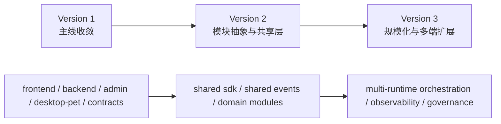

# ZFrog 未来三版本架构收敛图

## 一、文档目标

明确 Version 1 到 Version 3 的主线目录与演进边界，避免在开发中反复切换实施路径。

---

## 二、Version 1 主线目录（唯一认定）

1. `frontend/`
2. `backend/`
3. `admin/`
4. `desktop-pet/`
5. `contracts/`

---

## 三、Version 1 冻结目录（禁止接新功能）

1. `desktop_pet/`
2. `frontend/src-tauri/`
3. `src/renderer/`
4. `microservices/api-gateway/`
5. `microservices/badge-service/`
6. `microservices/wallet-observer/`

---

## 四、三版本收敛图

---

## 五、执行规则

1. Version 1 期间，冻结目录仅允许补说明文档。
2. 所有新需求与缺陷修复默认落到 Version 1 主线目录。
3. 任何涉及目录迁移的决策，必须在版本计划文档先完成评审后再执行。
