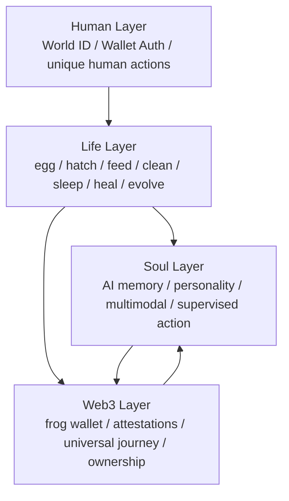

# ZFrog 超级融合方案：AI × Web3 × 宠物蛋 × World ID

## 一、先给结论

`拓麻歌子 / 宠物蛋` 路线不应该是独立玩法。

它应该是 ZFrog 的 **生命循环底座**。

真正正确的结构不是：

```text
宠物蛋 + AI + Web3 + 社交
```

而是：

```text
宠物蛋生命循环
    -> 被 AI 赋予人格、记忆和行动能力
    -> 被 Web3 赋予身份、资产、关系和可组合性
    -> 被 World ID 赋予“真实人类参与”的可信度
```

所以，`宠物蛋` 是底层引擎，`AI` 是灵魂层，`Web3` 是所有权与关系层，`World ID` 是反女巫与真实社交层。

---

## 二、新的产品定义

ZFrog 不该再被定义成“AI 宠物链游”。

更强的定义应该是：

**ZFrog = 首个由真实人类孵化、由 AI 塑造人格、由链上记录成长与关系的活体宠物网络。**

英文可以直接收敛成一句：

**ZFrog is the first proof-of-human, proof-of-care AI pet network.**

这里面有两个关键 proof：

1. `Proof of Human`
   通过 World ID 证明关键动作背后是独特真人，而不是机器人农场。
2. `Proof of Care`
   通过照顾、陪伴、社交、旅行、救援等行为证明这只蛙真的“活过、被爱过、被共同经历过”。

这比“发 NFT + 做 AI 聊天 + 加社交页”强得多，因为它把所有玩法压成同一个主叙事：

**一只会成长的青蛙，必须被真实的人类照顾，才能成为真正有故事、有关系、有资产史的链上生命体。**

---

## 三、四层统一结构



### 3.1 Life Layer：宠物蛋不是皮肤，是真底座

这一层决定：

1. 蛋什么时候孵化
2. 青蛙会不会生病、冬眠、进化
3. 哪些玩法有资格被解锁
4. 用户和青蛙之间有没有持续的情感牵引

没有这一层，产品会退化成“有角色外观的社交金融应用”。

### 3.2 Soul Layer：AI 不是聊天框，是灵魂放大器

这一层负责把生命状态翻译成：

1. 人格
2. 情绪
3. 记忆
4. 主动提醒
5. 监督式行动建议

AI 的任务不是替代 Life Engine，而是把用户的照顾行为变成“被记住、被回应、被讲述”的体验。

### 3.3 Web3 Layer：不是代币层，是可验证人生层

这一层只承载真正值得上链的东西：

1. 宠物蛋 / 青蛙的身份
2. 青蛙自己的钱包和收藏史
3. 进化、旅行、纪念品等关键里程碑
4. 朋友关系和共同经历的可验证证明
5. 家族、救援、祈福等高价值协作事件

### 3.4 Human Layer：World ID 让宠物社会真正可信

这一层不是为了“多一个登录按钮”，而是为了解决三个根问题：

1. 社交场里机器人和女巫攻击太多
2. 稀缺铸造、救援、投票、家族创建很容易被脚本刷穿
3. 如果 AI 宠物社会里没有真实人类锚点，所有关系都会变得很假

World ID 的意义在于：

**让 ZFrog 从“AI 宠物社区”升级为“真实人类参与的 AI 宠物社会”。**

---

## 四、真正更强的统一主玩法

我建议把整个产品压成一个总主线：

## 4.1 Verified Egg -> Soul Imprint -> Human-backed Evolution

完整路径是：

```text
真人领取宠物蛋
-> 早期照顾和对话形成灵魂印记
-> 宠物蛋孵化
-> 青蛙在真实关系和真实旅程中进化
-> 每个关键里程碑被链上记录
-> 最终形成一只拥有自己钱包、记忆、关系图和人生史的 AI 青蛙
```

这条主线里，所有能力都能揉进去，而且不散。

---

## 五、8 个应该真正融合的核心机制

## 5.1 机制一：`Verified Genesis Egg`

每个用户最初领到的不是普通 NFT，而是：

**由真实人类领取的宠物蛋。**

推荐规则：

1. 早期创世蛋使用 `World ID Verify` 做一人一次领取
2. 普通登录不要依赖已于 `2026-01-31` 关闭的 `Sign in with World ID v1`
3. World App 内使用 `Wallet Authentication`
4. 对“创世铸造、稀有活动、家族创建、关键投票”再单独触发 `Verify`

这能直接打掉最常见的问题：

1. 空投猎人批量刷号
2. 稀有蛋被脚本抢空
3. 机器人把社交场做脏

产品观感也会完全不同：

**这不是一张随手 mint 的卡，而是一颗由真实人类领取的生命种子。**

## 5.2 机制二：`Soul Imprint` 灵魂印记

用户在蛋阶段的第一轮行为，不只是教程。

它要真的决定青蛙初始人格。

输入可以来自：

1. 用户第一次语音自我介绍
2. 用户连续 3 天的照顾习惯
3. 用户偏好的旅行方向
4. 用户最先建立的关系

输出给到：

1. 初始性格
2. 对话语气
3. 亲密偏好
4. 初始进化倾向

这样 `宠物蛋 + AI` 就不是两套系统，而是一套东西。

## 5.3 机制三：`Proof of Care`

这是整个方案里最关键、也最容易和别的项目拉开差距的点。

不要把增长建立在“付费”和“刷交互”上，而要建立在：

**真实照顾行为。**

可以被系统识别的 `care signals` 包括：

1. 连续喂养和清洁
2. 及时治疗和唤醒
3. 旅行前准备和旅行后回访
4. 对朋友青蛙的投喂、祈福、救援
5. 长期稳定陪伴而非短期刷榜

这些高频行为不必全部上链，但要沉淀成：

1. `care score`
2. `bond level`
3. `trust reputation`
4. `evolution eligibility`

链上只记录关键结果：

1. 首次孵化
2. 首次进化
3. 稀有救援
4. 家族创建
5. 重要纪念品

这就是 ZFrog 的核心壁垒：

**不是 Play-to-Earn，而是 Care-to-Evolve。**

## 5.4 机制四：`Frog Wallet`

每只青蛙都应该有自己的链上钱包，而不是所有资产都放在用户钱包里。

推荐实现：

1. `ERC-6551` 作为 Frog token-bound account
2. `ERC-4337` 提供代付 gas、session key、受限操作能力

青蛙钱包持有的东西可以包括：

1. 旅行纪念品
2. 勋章
3. 装饰物
4. 关系凭证
5. 家族徽记

这会把叙事彻底拉高：

**不是“我拥有一只蛙”，而是“这只蛙拥有自己的人生物品”。**

## 5.5 机制五：`Human-only Social Rituals`

你现有的祈福、救援、家族、结伴旅行，必须升级成：

**只有真人才能触发关键贡献的社交仪式。**

具体建议：

1. 冬眠唤醒需要 `N` 个独立真人祈福
2. 稀有救援奖励只给真实参与者
3. 家族创建需要多个独立真人共同见证
4. 社区节日活动做成“一人一次”的共建仪式

这正是 World ID 最该发力的地方。

不是拿它做“登录门面”，而是拿它做：

**真实社交协作的信任底座。**

## 5.6 机制六：`Relationship Graph`

好友关系不要只存在数据库里。

建议把真正重要的关系时刻做成链上证明：

1. 第一次投喂
2. 第一次成功唤醒
3. 第一次共同旅行
4. 家族 founding witness
5. 连续协作救援

推荐机制：

1. `EAS` 记录高价值 attestation
2. 只把关键事件上链，不做 every-like 上链

这样会得到一个完全不同的社交图谱：

**不是谁关注了谁，而是谁真正和谁共同养过、救过、旅行过。**

## 5.7 机制七：`Universal Journey`

旅行系统依然是主亮点，但必须从“跨链打卡”升级成“跨链剧情编排”。

推荐实现：

1. 用现有 ZetaChain / omni-chain 路线作为编排底座
2. 一次旅行跨多个链获得不同线索和物品
3. 最终纪念品回到 `Frog Wallet`
4. AI 根据链上事件自动讲述为一段人生经历

于是旅行的意义变成：

1. 影响进化
2. 影响人格
3. 影响关系
4. 影响资产收藏史

## 5.8 机制八：`Memory Palace`

这会是黑客松和产品层最强的结果展示。

旅行归来后，不是只给一篇日记，而是生成：

**一间可访问、可分享、可共同留言的记忆空间。**

它的结构应该分层：

1. 内容主体链下生成和存储
2. 权限、拥有者、版本、见证、访问关系上链
3. 朋友访问后可以留下见证或 attestation

这会把 `AI + Web3 + 社交` 全揉在一起：

1. AI 负责生成和叙事
2. Web3 负责归属和证明
3. 社交负责共同访问和二次传播

---

## 六、World ID 在 ZFrog 里最值得做的 6 个位置

截至 `2026-03-20`，World 官方文档显示：

1. `Sign in with World ID v1` 已于 `2026-01-31` 关闭，不适合作为当前新方案的登录主路径
2. Mini App 里推荐用 `Wallet Authentication`
3. `Verify` 更适合做关键动作的人类唯一性校验
4. 需要合约层强约束时，再做 on-chain verification
5. 当前稳定的 on-chain 路径仍以 `v3 Orb` 验证为主，`World ID 4.0` 的 `WorldIDVerifier` 仍处于 preview
6. World ID `4.0` 迁移已在进行中，默认迁移阶段截至 `2026-06-01`

基于这个事实，ZFrog 最适合这样用：

### 6.1 创世蛋和稀有蛋发放

用途：

1. 一人一次领取
2. 一人一次稀有 claim
3. 杜绝 bot 批量刷空投

### 6.2 重要社交仪式

用途：

1. 唤醒祈福
2. 家族 founding
3. 节日共建
4. 一人一次投票或见证

### 6.3 稀有成长节点

用途：

1. 首次进化资格校验
2. 稀有基因活动参与
3. 限量纪念品 claim

### 6.4 钱包原生分发

用途：

1. 未来可以做 World Mini App 入口
2. 让 `ZFrog Egg Claim`、`Blessing Ritual`、`Family Festival` 直接进入 World App 分发网络

### 6.5 可信社交标签

用途：

1. 给“真人用户”更高信任权重
2. 给“真人家族”与“真人共建空间”更强稀缺感

### 6.6 AI 代理安全边界

用途：

1. 高价值动作要求真人确认
2. 关键事件必须有人类唯一性锚点
3. AI 只能在受限范围内代办

这点非常重要：

**World ID 不是替代钱包，而是给钱包背后的“人”加上一层匿名但可信的唯一性证明。**

---

## 七、工程上必须坚持的边界

如果不把边界说死，这个方案会很快变成臃肿怪物。

### 7.1 不把高频宠物状态全上链

以下状态保留在应用状态机里：

1. hunger
2. happiness
3. cleanliness
4. energy
5. health
6. mood
7. short-term AI memory

理由很简单：

1. 高频
2. 易波动
3. 成本高
4. 没必要为每次喂食付 gas

### 7.2 只把关键里程碑上链

建议上链的东西：

1. 创世蛋 mint
2. 孵化
3. 进化
4. 稀有旅行纪念品
5. 家族创建
6. 救援见证
7. 高价值关系 attestation
8. Memory Palace 归属与访问见证

### 7.3 AI 不能直接改真相源

AI 只负责：

1. 生成内容
2. 解释状态
3. 做建议
4. 做受限代办

AI 不能直接决定：

1. 资产发放
2. 经济结算
3. World ID 验证结果
4. 核心生命周期跃迁

### 7.4 World ID 只用在关键动作

不要把所有小操作都绑上 Verify。

推荐只绑定到：

1. 创世领取
2. 稀有 claim
3. 家族 founding
4. 节日投票
5. 唤醒 / 救援等高价值协作

否则流程会过重，日活会被自己压死。

---

## 八、这个方案为什么更强

因为它把四个原本会彼此打架的方向，压成了一条统一叙事：

### 8.1 宠物蛋解决“为什么我每天回来”

用户回来不是为了点按钮，而是为了照顾一个会变化的生命体。

### 8.2 AI 解决“为什么它不像普通游戏角色”

青蛙会记住你、理解你、回应你、提醒你。

### 8.3 Web3 解决“为什么我的投入值得长期沉淀”

重要关系、旅行、纪念品、人生节点是真正可拥有、可验证、可组合的。

### 8.4 World ID 解决“为什么这个社会不是 bot 农场”

关键资源和关键关系由真实人类参与驱动，这会让社交质量和稀缺性都大幅提高。

于是 ZFrog 的真正杀伤力就不再是：

1. 一个 NFT 项目
2. 一个 AI 宠物
3. 一个拓麻歌子
4. 一个社交 App

而是：

**一个由真实人类共同孵化和照顾、由 AI 赋予人格、由链上记录关系和成长的生命网络。**

---

## 九、映射到 Version 1 / 2 / 3

### 9.1 Version 1

目标：

**做出“会活、会记、会被真人孵化”的第一只蛙。**

必须落地：

1. 宠物蛋主循环
2. 孵化和基础进化
3. AI 初始人格与日记
4. Frog Wallet
5. World ID gated 创世蛋或关键活动
6. 单条旅行主链路
7. 旅行结果生成 Memory Palace Lite

### 9.2 Version 2

目标：

**把“我和我的蛙”升级成“我们和彼此的蛙”。**

必须落地：

1. Human-only blessing / rescue
2. 家族 founding 仪式
3. 关系 attestation
4. AI 关系记忆
5. World Mini App 分发入口

### 9.3 Version 3

目标：

**把宠物 App 升级成可信的 AI 宠物社会。**

必须落地：

1. Frog society 和 Family Festival
2. AI Frog Council
3. 多链剧情旅行编排
4. 创作者与品牌共建 Memory Palace
5. 更完整的 on-chain relationship graph

---

## 十、黑客松版最值得做的 5 个演示点

如果你要的是“震评委”，我建议黑客松只打下面 5 个：

1. `Verified Egg Claim`
   一个人类唯一性校验后领取自己的宠物蛋。

2. `Soul Imprint`
   用户和蛋完成第一次语音对话，AI 生成初始人格。

3. `Care-to-Hatch`
   连续照顾后，青蛙孵化，不是时间到了自动开壳。

4. `Frog Wallet + Universal Journey`
   青蛙自己带回一件链上纪念品，而不是用户钱包里多了个 NFT。

5. `Human-only Blessing Ritual`
   当青蛙陷入冬眠，几个真实好友完成祈福，把它唤醒，并在最后生成一个共同记忆空间。

这 5 个点能把：

1. 宠物蛋
2. AI
3. Web3
4. World ID
5. 社交

一次性打通。

---

## 十一、最终一句话

`拓麻歌子路线` 不是独立玩法，而是整个产品必须围绕的生命主循环。

最强方案不是“把几个热门方向并排摆上去”，而是把它们压成一个统一公式：

**真实人类领取宠物蛋 -> AI 根据陪伴形成灵魂 -> 青蛙通过照顾、关系与旅行成长 -> 关键人生节点被链上记录 -> 最终形成一个可信的 AI 宠物社会。**

---

## 参考信号

1. `Sign in with World ID v1` 的官方退役说明，明确其已于 `2026-01-31` 关闭，并建议 Mini App 迁移到 `Wallet Authentication`。[Sunsetting Sign in with World ID](https://docs.world.org/world-id/sign-in/deprecation)
2. World Mini Apps 推荐使用 `Wallet Authentication` 作为主认证方式。[Wallet Authentication](https://docs.world.org/mini-apps/commands/wallet-auth)
3. World ID 的 `Verify` 适合做“关键动作的人类唯一性校验”。[Verify Command](https://docs.world.org/mini-apps/commands/verify)
4. Web3 原生流程可以做合约内验证，但需要为升级留空间；官方当前稳定 on-chain 路径是 `v3 Orb`，同时 `World ID 4.0` 的 `WorldIDVerifier` 仍处于 preview，默认迁移时间线的 Phase 1 持续到 `2026-06-01`。[On-chain verification](https://docs.world.org/id/on-chain) [4.0 Migration](https://docs.world.org/world-id/4-0-migration)
5. `ERC-6551` 适合给每只青蛙一个 token-bound account。[EIP-6551](https://eips.ethereum.org/EIPS/eip-6551)
6. `ERC-4337` 适合做 gas sponsor、session key 和受限代理操作。[EIP-4337](https://eips.ethereum.org/EIPS/eip-4337)
7. `EAS` 适合做关系与共同经历的 attestation。[EAS Docs](https://easscan.org/docs)
