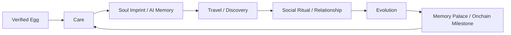

# ZFrog 超级融合版完整需求分析

## 一、文档目标

这份文档用于在 **现有 ZFrog 系统** 基础上，完成一份可执行的完整需求分析。

目标不是再写一份抽象愿景，而是回答 5 个问题：

1. 现有系统里什么能复用
2. 新方案到底要解决什么问题
3. `AI × Web3 × 宠物蛋 × World ID` 应该如何收敛成一个产品
4. 各模块的功能边界、优先级和依赖关系是什么
5. Version 1 / 2 / 3 各自应该交付什么

---

## 二、现有系统基线

从现有仓库和既有需求文档看，ZFrog 已经具备以下基础：

1. `青蛙资产主线`
   已有青蛙/NFT 概念、旅行、纪念品、跨链相关能力。
2. `Web 主产品`
   已有前端、后端、管理员后台三条主线。
3. `旅行系统`
   本地/跨链旅行、AI 日记、奖励、纪念品是当前最成熟的玩法骨架。
4. `社交基础`
   已有好友、礼物、消息、访问花园等需求定义。
5. `桌面宠物原型`
   已存在桌面宠物需求和可运行原型，但路线尚未收敛。
6. `宠物蛋/养成规划`
   已有生命状态、喂食、清洁、治疗、进化等需求设计，但尚未成为真正主线。

### 2.1 原系统的可复用资产

| 现有能力 | 当前价值 | 在新方案中的角色 |
|----------|----------|------------------|
| Frog / NFT 资产 | 用户已有身份锚点 | 升级为 `Verified Egg -> Frog Identity` 主链路 |
| Travel / OmniTravel | 最成熟核心玩法 | 升级为 `Universal Journey` |
| AI 日记 | 已有内容产出能力 | 升级为 `AI Soul` 的内容层能力 |
| 好友系统 | 已有社交入口 | 升级为 `Relationship Graph` 与社交仪式 |
| 桌面宠物 | 有陪伴入口潜力 | 升级为 `Desktop Companion` |
| Admin 后台 | 已有运营治理基础 | 升级为 feature flag、审核、补偿、活动系统 |

### 2.2 原系统的核心问题

原系统的问题不是“模块不够多”，而是“主叙事不够统一”：

1. 旅行是主线，但生命养成还没有真正进入主产品主链路
2. AI 主要停留在日记生成，尚未成为人格和记忆系统
3. 社交更多是辅助模块，尚未变成高价值协作关系
4. Web3 价值大多集中在 NFT 和跨链动作，缺少关系证明与可组合叙事
5. 桌面端、Web、未来 Mobile 的职责边界尚未彻底收敛
6. 缺少“真实人类层”，容易落回 bot 可刷的普通 Web3 社区

### 2.3 新方案对原系统的要求

新方案不能推倒重来，必须满足以下约束：

1. 复用现有旅行、资产、后端和后台能力
2. 把宠物蛋/生命状态嵌入原有青蛙体系，而不是另开平行宇宙
3. 保留原系统的 Web3 基因，但不把产品退化成简单链游
4. 让 AI、社交、桌面端服务同一条主线
5. 对上链范围保持克制，避免把高频状态硬塞进合约

---

## 三、产品重新定义

### 3.1 产品定义

ZFrog 的新定义应为：

**一个由真实人类领取和照顾、由 AI 塑造人格、由链上记录成长与关系的活体宠物网络。**

### 3.2 核心价值主张

| 维度 | 用户感知 | 系统价值 |
|------|----------|----------|
| 生命感 | “它是活的，需要我” | 建立日常回访和情感牵引 |
| 智能感 | “它记得我，懂我” | AI 成为陪伴与放大器 |
| 关系感 | “我和别人围绕它形成真实关系” | 社交成为留存引擎 |
| 拥有感 | “我的青蛙和故事是可拥有的” | Web3 成为长期资产层 |
| 可信感 | “这里的关键行为来自真人” | World ID 成为信任层 |

### 3.3 北极星指标

产品的北极星不应是单纯的链上交易数，而应是：

**每周完成至少一次“照顾 -> 互动 -> 旅行/社交 -> 记忆沉淀”的真实活体循环的用户数。**

---

## 四、需求设计原则

### 4.1 一条主叙事

所有功能必须服务同一条主线：

```text
Verified Egg -> Care -> Soul Imprint -> Travel / Social -> Evolution -> Memory / Ownership
```

### 4.2 宠物蛋是底座，不是子模块

宠物蛋/拓麻歌子路线必须成为生命循环底座，而不是独立小游戏。

### 4.3 AI 不是状态真相源

AI 可以生成内容、人格、建议、解释和受限代办，但不能直接改资产和关键状态。

### 4.4 上链只上关键里程碑

以下高频状态不直接上链：

1. hunger
2. happiness
3. cleanliness
4. energy
5. health
6. mood
7. short-term memory

以下关键里程碑优先上链：

1. 创世蛋 / 青蛙身份
2. 孵化
3. 进化
4. 稀有旅行纪念品
5. 救援 / 祈福见证
6. 家族创建
7. 高价值关系证明
8. Memory Palace 归属与见证

### 4.5 World ID 只用于关键动作

World ID 不应用于所有高频操作，只应用于：

1. 创世蛋领取
2. 稀有活动 claim
3. 家族 founding
4. 节日投票
5. 唤醒 / 救援等高价值协作

### 4.6 多端职责必须明确

1. `Web` 是主控制台
2. `Desktop` 是持续陪伴层
3. `Mobile` 是未来轻照护与召回层
4. `Admin` 是治理与运营层

---

## 五、用户角色与需求

### 5.1 陪伴型用户

特征：

1. 更看重宠物陪伴和日常反馈
2. 不一定是重度 Web3 用户
3. 希望每天花 3-10 分钟维护关系

核心需求：

1. 青蛙真的会变化
2. 操作简单，不要太肝
3. 能被记住和回应

### 5.2 社交型用户

特征：

1. 喜欢围绕宠物建立关系
2. 愿意参与祈福、救援、家族、社区活动
3. 希望从共同经历中获得认同感

核心需求：

1. 关系不是空点赞
2. 协作事件有价值
3. 社交行为值得被记录和展示

### 5.3 Web3 原生用户

特征：

1. 看重链上身份、资产、跨链和可组合性
2. 希望所有权和纪念品可验证
3. 对合约边界、钱包体验、gas 敏感

核心需求：

1. 真正拥有自己的青蛙和纪念品
2. 重要里程碑可以上链证明
3. 交互不能太重

### 5.4 运营与治理角色

特征：

1. 需要开关功能、配置活动、处理异常、执行补偿
2. 需要识别刷子、滥用、异常交易和内容风险

核心需求：

1. 清晰的后台和审计能力
2. 可灰度、可回滚、可补偿
3. 风控策略和审核路径

---

## 六、统一核心闭环

### 6.1 总闭环



### 6.2 每日闭环

```text
打开应用 -> 查看状态 -> 执行照顾 -> 收到 AI 反馈 -> 触发轻互动或提醒 -> 形成回访习惯
```

### 6.3 中周期闭环

```text
照顾积累 -> 解锁旅行/社交资格 -> 获得共同经历 -> 沉淀关系和纪念品 -> 推动进化
```

### 6.4 长周期闭环

```text
真实人类孵化 -> 进化分支形成 -> Frog Wallet 积累人生物品 -> 关系图谱扩大 -> 成为家族/社区中的独特个体
```

---

## 七、完整功能需求

## 7.1 身份与接入层

### 业务目标

在不牺牲钱包体验的前提下，为系统增加“真实人类唯一性”能力。

### 功能要求

1. `P0` 钱包连接与账户识别
   - 支持现有钱包接入主路径
   - 用户可绑定主钱包地址
   - 用户与 Frog、旅行、关系数据关联

2. `P0` World App 入口兼容
   - World 环境内使用 `Wallet Authentication`
   - 不依赖已退役的 `Sign in with World ID v1`

3. `P0` 关键动作的人类唯一性校验
   - 创世蛋领取
   - 稀有活动 claim
   - 家族创建
   - 节日一人一次投票
   - 高价值唤醒/救援

4. `P1` 可信人类标签
   - 允许展示匿名但可信的人类标识
   - 可在社交排序、家族可信度、活动资格中使用

5. `P1` 校验记录与审计
   - 后台记录验证时间、动作类型、使用结果
   - 可识别重复使用、异常验证和风控事件

### 验收标准

1. 普通用户不需要为所有高频操作重复校验
2. 关键动作可以做到一人一次或一人有限次
3. 验证失败不应污染已有宠物状态

---

## 7.2 Frog 身份与宠物蛋系统

### 业务目标

把原有“现成青蛙资产”升级为真正可孵化、可成长的生命起点。

### 功能要求

1. `P0` Verified Genesis Egg
   - 每个新用户先获得宠物蛋身份
   - 创世蛋支持一人一次领取
   - 蛋具有唯一 ID、归属关系、创建时间、稀有度种子

2. `P0` 蛋阶段引导
   - 引导首次照顾
   - 引导首次对话
   - 引导首次人格印记采集

3. `P0` 孵化规则
   - 孵化不能只靠时间自动触发
   - 需要满足照顾阈值和基础互动阈值
   - 孵化后进入青蛙正式生命周期

4. `P1` 蛋稀有度和初始倾向
   - 初始稀有度影响外观、背景故事或成长倾向
   - 不直接决定最终强弱，避免纯数值氪金

5. `P1` 领养补偿与老用户迁移
   - 原有青蛙资产需要映射到新生命体系
   - 老用户应获得迁移解释和补偿策略

### 验收标准

1. 新用户的首次体验围绕“孵化一只自己的蛙”展开
2. 老用户不会因新系统失去已有资产和旅行历史
3. 蛋阶段能自然引出 AI 和生命状态，不像教程页拼接

---

## 7.3 Life Engine：生命状态系统

### 业务目标

建立真正的日常照顾责任感，但不把产品做成高压打卡工具。

### 核心状态

1. hunger
2. happiness
3. cleanliness
4. health
5. energy
6. mood
7. dormancy state

### 功能要求

1. `P0` 状态衰减
   - 使用 UTC 统一计算
   - 支持前端实时展示值
   - 后端负责关键状态事件和兜底结算

2. `P0` 基础照顾动作
   - feed
   - clean
   - play
   - heal
   - rest

3. `P0` 状态联动
   - 饥饿、清洁、健康、活力之间要相互影响
   - 状态不足会影响旅行、社交、进化资格

4. `P0` 风险状态
   - 生病
   - 疲惫
   - 冬眠

5. `P1` 冬眠与唤醒
   - 长时间不活跃进入保护性冬眠
   - 支持本人唤醒与好友祈福唤醒
   - 冬眠期间不继续惩罚性扣减

6. `P1` 轻托管和保护机制
   - 未来允许低频玩家降低维护压力
   - 不能让用户因短期离开而永久损失核心资产

### 验收标准

1. 普通用户每天 1-2 次访问即可维持健康玩法
2. 状态系统确实影响行为资格，但不会造成频繁挫败
3. 冬眠是资产韧性机制，不是惩罚机制

---

## 7.4 Growth Engine：成长与进化系统

### 业务目标

让青蛙成长不只是升级数值，而是形成人格、能力和社交身份差异。

### 功能要求

1. `P0` 等级成长
   - 照顾、旅行、社交、AI 互动都能贡献成长值

2. `P0` 三分支进化
   - explorer
   - scholar
   - social

3. `P0` 进化资格
   - 至少同时满足照顾、互动、旅行或社交中的多个条件
   - 不能只靠单一付费或单一刷行为

4. `P1` 灵魂印记对进化倾向的影响
   - 初始人格和长期行为影响进化偏好

5. `P1` 外观与能力变化
   - 进化不仅改变标题
   - 应改变外观、文案、AI 语气或部分玩法能力

6. `P2` 基因与繁殖
   - 作为高阶玩法延后
   - 不进入 Version 1 的主路径

### 验收标准

1. 进化由多维行为驱动
2. 进化结果对体验有真实差异
3. 进化是成长奖励，不是数值门槛惩罚

---

## 7.5 AI Soul：人格、记忆与陪伴

### 业务目标

让 AI 从“旅行日记生成器”升级为会记住用户、会解释状态、会形成关系上下文的灵魂层。

### 功能要求

1. `P0` Soul Imprint
   - 在蛋阶段采集初始人格信号
   - 输入可包含首次语音、首次自我介绍、首次连续照顾、首次偏好选择
   - 输出初始性格、语气、偏好、进化倾向

2. `P0` 基础 AI 反馈
   - 喂食、清洁、休息、玩耍都能得到个性化反馈
   - 旅行生成 AI 日记
   - 状态变化能被解释成情绪化语言

3. `P1` 分层记忆
   - short-term context
   - user preference memory
   - relationship memory
   - milestone memory

4. `P1` 关系上下文
   - AI 记得谁喂过它、谁救过它、谁与它共同旅行
   - 关系记忆影响社交文案和回应方式

5. `P1` 多模态理解
   - 桌面端/未来端可以读取截图、屏幕上下文或输入图片
   - 仅在明确授权和边界下使用

6. `P2` 监督式代理动作
   - AI 可以起草、建议、代办轻任务
   - 所有高价值动作必须用户确认

### AI 边界

1. AI 不直接修改核心资产
2. AI 不决定奖励发放
3. AI 不替代 World ID 校验
4. AI 记忆必须可查看、可删除、可控

### 验收标准

1. 用户能明显感知到“这只蛙记得我”
2. AI 反馈与生命状态、旅行、关系真实相关
3. AI 功能不会越权破坏核心系统

---

## 7.6 Travel Engine：旅行与探索系统

### 业务目标

保留原系统最成熟的旅行优势，同时让旅行成为成长、关系和资产沉淀的放大器。

### 功能要求

1. `P0` 单一旅行主链路
   - 必须统一现有多入口和多实现路径
   - 发起、进行中、完成、奖励、纪念品、日记要基于同一状态机

2. `P0` 旅行前置条件
   - 活力达标
   - 健康达标
   - 饥饿/清洁状态满足最低要求
   - 必要物资与 gas 条件满足

3. `P0` 旅行结果
   - 奖励
   - AI 日记
   - 发现事件
   - 纪念品
   - 可能的关系事件

4. `P1` Universal Journey
   - 一次旅程可跨多个链完成不同片段
   - 最终结果回归 Frog Wallet

5. `P1` 旅行中的异常协作
   - 迷路
   - 救援
   - 公共救援广场
   - 结伴旅行

6. `P1` 旅行对成长与人格的反哺
   - 旅行不能只是奖励出口
   - 必须影响进化、记忆和关系

### 验收标准

1. 旅行依然是主亮点，但不再是孤立玩法
2. 旅行结果能明确回流到生命、AI、社交和资产层
3. 链上与链下结果的一致性可追踪

---

## 7.7 Social Graph：关系与社交仪式

### 业务目标

把原有好友系统从浅层互动升级为有共同经历和共同责任的关系网络。

### 功能要求

1. `P0` 好友基础能力
   - 添加好友
   - 接受/拒绝
   - 查看好友蛙状态
   - 留言
   - 访问
   - 礼物

2. `P0` 关系热度
   - 记录互动频次、共同旅行、投喂、祈福、救援
   - 形成 affinity / bond 指标

3. `P1` Human-only Social Rituals
   - 冬眠祈福
   - 救援协作
   - 节日共建
   - 家族 founding witness

4. `P1` Family / 社区
   - 家族图腾
   - 周常协作任务
   - 社区花园或公共空间

5. `P1` 关系证明
   - 对关键共同经历生成链上 attestation

6. `P2` AI Frog Council
   - 家族中的 AI 青蛙提出共同目标和建议

### 验收标准

1. 社交行为不只是点赞和送礼
2. 至少有一种“必须协作才成立”的高价值事件
3. 关系的深度能被系统量化和展示

---

## 7.8 Web3 资产层

### 业务目标

让 Web3 成为“可验证人生层”，而不是单纯的交易和发币层。

### 功能要求

1. `P0` Frog Identity
   - 蛋/蛙是核心链上身份或身份锚点

2. `P0` Frog Wallet
   - 每只蛙拥有自己的资产容器
   - 可持有纪念品、勋章、装饰物、关系凭证等

3. `P0` 关键里程碑上链
   - 孵化
   - 进化
   - 稀有旅行纪念品
   - 救援见证
   - 家族创建

4. `P1` Relationship Attestations
   - 记录共同旅行、共同唤醒、首次重要协作等事件

5. `P1` 链上纪念空间归属
   - Memory Palace 的访问权、拥有权、见证记录可上链

6. `P2` 更多可组合协议接口
   - 第三方活动、品牌合作、联名世界、插件玩法

### 验收标准

1. 链上资产与链下体验之间有清晰映射
2. 关键故事节点是可验证、可追溯的
3. 高频照顾行为不上链，避免经济与体验失衡

---

## 7.9 Home World / Memory Palace

### 业务目标

把原有家园和旅行结果展示升级成“可访问的记忆空间”。

### 产品决策更新（`2026-03-22`）

1. `V1` 不再保留“家园”作为独立一级功能，统一并入“记忆空间”。
2. 下线的是“家园”这一独立概念，不是其承载的空间与社交能力。
3. 原家园中的装饰、留言、礼物、照片、成就、访问等能力，必须继续保留并迁入记忆空间。
4. 旅行结果页是记忆空间的生成入口；好友访问与社交回访的统一落点也应是记忆空间。
5. 过渡期允许保留兼容入口与兼容路由，但产品文案和信息架构必须先收敛。

### 功能要求

1. `P0` 家园基础展示
   - 展示青蛙、状态、装饰、照片、纪念品

2. `P0` Travel Recap
   - 旅行结果页面不只显示奖励
   - 必须有故事化结果与分享能力

3. `P1` Memory Palace Lite
   - 每次重要旅行生成一个可访问的空间/页面
   - 包含日记、纪念物、关系留言、时间线

4. `P1` 可见证与可访问
   - 朋友访问后可留言、留下足迹、形成见证

5. `P2` 可组合记忆世界
   - 家族共建
   - 活动主题世界
   - 品牌联动世界

### 验收标准

1. 旅行结果具备可传播性
2. 家园和记忆空间能承接社交回访
3. 记忆空间是情感资产，不是纯素材堆叠
4. 用户不再需要理解“家园”和“记忆空间”是两个不同模块

---

## 7.10 多端体验层

### Web

1. `P0` 主控制台
   - 钱包
   - 蛋/蛙状态
   - 旅行
   - 家园
   - 好友
   - 活动

2. `P0` 高价值操作入口
   - 领取
   - 配置
   - 发起旅行
   - 查看纪念空间

### Desktop

1. `P0` 陪伴层
   - 悬浮宠物
   - 快捷照顾
   - 状态提醒
   - AI 对话

2. `P1` 多模态上下文
   - 在用户授权下读取屏幕或截图上下文

3. `P1` 离线缓存与补发

### Mobile Lite

1. `P1` 轻照护与召回
   - 快速喂食
   - 查看状态
   - 收通知
   - 快速祈福/救援

### Admin

1. `P0` 配置与开关
2. `P0` 审计与补偿
3. `P1` 内容审核与风险处理
4. `P1` 活动运营与人群分层

### 验收标准

1. Web 不复制桌宠交互
2. Desktop 不复制重资产全流程
3. 各端围绕同一事件骨架同步，不各自维护真相源

---

## 7.11 Notification / Recall

### 业务目标

通过状态变化、社交事件和旅行结果建立回访理由。

### 功能要求

1. `P0` 站内通知
   - 状态警告
   - 旅行完成
   - 礼物
   - 留言
   - 祈福/救援

2. `P0` 桌面提醒
   - 状态危险
   - 旅行归来
   - 好友互动

3. `P1` 钱包原生/协议通知
   - World/Farcaster/XMTP/Push 等后续分发能力

4. `P1` AI 主动提醒
   - 以人格化方式发出照顾建议或社交提醒

### 验收标准

1. 通知是召回机制，不是噪音
2. 用户可配置频率和关闭某类提醒
3. 不因通知系统问题污染核心状态

---

## 八、数据、状态与事件边界

### 8.1 真相源原则

1. 核心宠物状态由领域服务维护
2. AI 只读取上下文并生成内容
3. 合约只维护值得链上化的资产与证明
4. 前端和桌面端不维护独立真相源

### 8.2 关键实体

1. User
2. Wallet
3. HumanVerification
4. Egg
5. Frog
6. PetState
7. SoulProfile
8. Memory
9. Travel
10. Discovery
11. Souvenir
12. Friendship
13. Ritual
14. Family
15. MemoryPalace

### 8.3 必须定义统一事件骨架

关键领域事件建议至少包括：

1. `EggClaimed`
2. `SoulImprinted`
3. `PetStateUpdated`
4. `PetBecameIll`
5. `PetEnteredDormancy`
6. `BlessingStarted`
7. `BlessingCompleted`
8. `TravelStarted`
9. `TravelCompleted`
10. `SouvenirMinted`
11. `EvolutionUnlocked`
12. `EvolutionCompleted`
13. `FriendshipCreated`
14. `RelationshipMilestoneRecorded`
15. `MemoryPalaceCreated`

### 8.4 数据一致性要求

1. 旅行完成事件必须能追踪到奖励、纪念品和 AI 日记
2. 进化完成必须能追踪到外观、能力与 AI 人格调整
3. 祈福/救援必须能追踪到参与者、验证结果和收益/结果

---

## 九、非功能需求

### 9.1 可用性

1. 核心主链路可灰度发布
2. 关键外部依赖失败时要有降级策略
3. 旅行、World ID 校验、AI 调用要有明确失败反馈

### 9.2 性能

1. 状态面板首屏需快速可见
2. 高频状态展示优先使用本地计算 + 后端校验
3. 通知和提醒不阻塞核心页面操作

### 9.3 安全

1. World ID proof 必须在可信环境校验
2. 合约地址、RPC、链配置统一管理
3. AI 代理动作必须有授权与确认边界
4. 关键经济与奖励逻辑不可依赖纯前端判断

### 9.4 隐私与合规

1. AI 记忆需要可查看、可删除、可选择关闭
2. 多模态输入必须明确授权
3. 对未成年人和陪伴型 AI 风险要设置边界提示

### 9.5 可观测性

1. 关键领域事件可检索
2. 关键失败链路可追踪
3. 活动、验证、救援、进化有完整日志

---

## 十、成功指标

### 10.1 生命循环指标

1. 日均照顾行为次数
2. 连续照顾 3 天完成率
3. 孵化完成率
4. 冬眠后唤醒率

### 10.2 AI 指标

1. AI 对话触发率
2. AI 日记查看率
3. 记忆命中带来的会话满意度

### 10.3 社交指标

1. 好友建立率
2. 祈福/救援参与率
3. 家族加入率
4. 共同旅行占比

### 10.4 Web3 指标

1. 创世蛋 claim 完成率
2. 关键里程碑上链成功率
3. Frog Wallet 活跃持有率
4. 关系证明生成数

### 10.5 分发与召回指标

1. 旅行结果分享率
2. Memory Palace 访问率
3. 通知召回转化率

---

## 十一、版本范围定义

## 11.1 Version 1：可发布核心版

目标：

**做出第一只“会活、会记、会被真人领取和照顾”的青蛙。**

### 必须交付

1. Verified Egg
2. 蛋阶段引导
3. 基础生命状态
4. 基础照顾动作
5. 孵化
6. AI Soul Lite
7. 单一旅行主链路
8. Frog Wallet 基础版
9. 旅行日记和 Memory Palace Lite
10. 好友基础能力
11. Winter dormancy beta
12. 管理后台基础开关与审计

### 明确不进 Version 1

1. 复杂基因系统
2. 完整繁殖玩法
3. 全量 DAO 治理
4. 重度插件生态
5. 全量多链世界编排

## 11.2 Version 2：关系成立版

目标：

**把“我和我的蛙”升级成“我们和彼此的蛙”。**

### 必须交付

1. Human-only blessing / rescue
2. Family 基础能力
3. Relationship attestation
4. AI relationship memory
5. Desktop companion 强化
6. Mobile Lite
7. World Mini App / 钱包原生入口

## 11.3 Version 3：平台化版

目标：

**把宠物产品升级成可信的 AI 宠物社会。**

### 必须交付

1. Universal Journey 多链剧情化
2. AI Frog Council
3. 更开放的 Memory Palace 共建
4. 创作者和品牌合作能力
5. 更完整的 on-chain relationship graph

---

## 十二、明确排除项

以下方向不应抢占 Version 1 主路径：

1. 先发代币再找玩法
2. 把所有状态全量上链
3. 为了“全能”而让桌面端复制 Web 全功能
4. 只做一个聊天宠物壳然后把旅行和社交挂边上
5. 把 World ID 滥用于所有日常操作

---

## 十三、主要风险与前置条件

### 13.1 产品风险

1. 功能过多导致主线稀释
2. 宠物蛋、AI、Web3、社交各自成系统，无法形成统一体验
3. 日活机制做得过重，用户养不动

### 13.2 技术风险

1. 旅行系统现有实现需要统一
2. 桌面路线需要尽快收敛
3. 合约层、配置层、请求层需要继续清理
4. AI 记忆和多模态能力需要明确权限与成本边界

### 13.3 外部依赖风险

1. World ID 版本迁移中的接口变化
2. 链上 gas 和跨链不稳定
3. 外部 AI 服务可用性与成本

### 13.4 前置条件

1. 统一旅行状态机
2. 统一请求层
3. 统一配置管理
4. 确认桌面正式技术路线
5. 明确 Frog Wallet 合约策略

---

## 十四、最终结论

以原系统为基础，ZFrog 最合理的完整需求方向不是“继续扩更多模块”，而是把现有模块压成一个统一的生命叙事：

**真实人类领取宠物蛋，经过持续照顾和 AI 互动形成灵魂，再通过旅行和社交成长进化，最终把关键人生节点沉淀为可拥有、可见证、可传播的链上记忆。**

这份需求分析的核心意义在于：

1. 保留原系统最强的旅行和 Web3 基因
2. 把宠物蛋和拓麻歌子路线抬成主产品底座
3. 把 AI 从内容工具升级为人格层
4. 把社交从浅交互升级为真实协作关系
5. 用 World ID 给整个社会层加上可信的人类锚点
