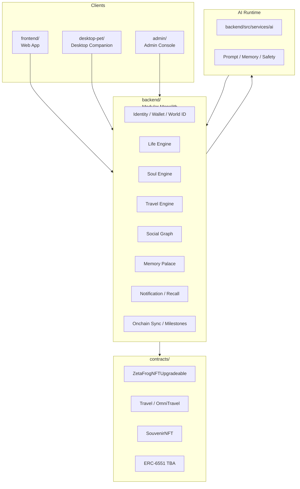
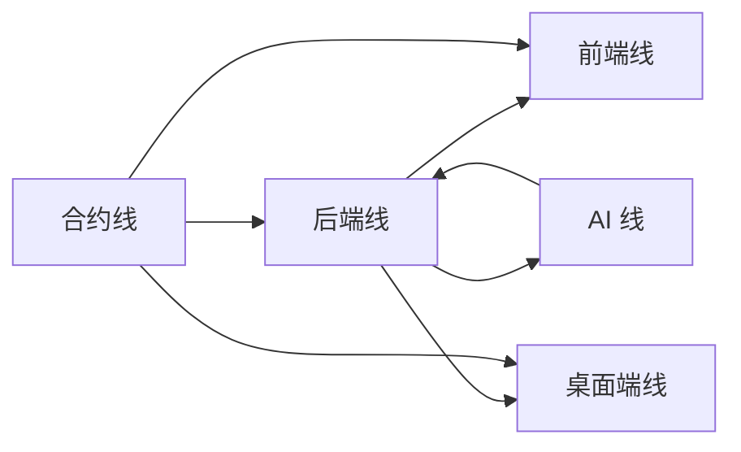

# ZFrog 超级融合版技术实施方案与开发计划

## 一、文档目标

这份文档是对 [ZFrog_超级融合版完整需求分析](/Users/sxlx/.gemini/antigravity/ZFrog/docs/01_需求设计/ZFrog_超级融合版完整需求分析.md) 的继续落地。

目标不是重复需求，而是把需求拆成五条真实工程线：

1. `前端`
2. `后端`
3. `桌面端`
4. `合约`
5. `AI`

并形成一份可以直接排期和拆任务的开发计划。

---

## 二、基于现有仓库的技术判断

### 2.1 当前主工程线

当前仓库的真实主线仍然是：

1. `frontend/`
2. `backend/`
3. `admin/`
4. `contracts/`
5. `desktop-pet/`

### 2.2 必须立刻定死的工程决策

为了让 Version 1 能落地，以下决策不应再摇摆：

1. `desktop-pet/` 作为正式桌面端主线
2. `desktop_pet/` 视为遗留原型，冻结
3. `frontend/src-tauri/` 不进入 Version 1 主路径，冻结
4. `backend/` 继续保持模块化单体，不拆微服务
5. `microservices/ai-service/` 不作为 Version 1 主路径，先以 `backend/src/services/ai` 为主
6. `contracts/contracts/upgradeable/` 作为后续主线，逐步替代 legacy 非升级合约

### 2.3 当前代码层面的主要技术问题

1. 前端请求层分散在 `frontend/src/services/api.ts` 和多个 `*.api.ts`
2. 后端入口 `backend/src/index.ts` 承担了过多启动职责
3. 路由层过多，领域边界还未彻底收敛
4. 桌面端 `desktop-pet/src/renderer/hooks` 中存在大量重复和实验性 hook
5. 合约层存在 legacy / upgradeable 双线并行
6. Hardhat 当前不适配 Node 25，必须回到 Node 20 LTS 作为合约开发基线
7. AI 微服务目录不完整，不适合做主实施路径

### 2.3 Version 1 基线与冻结声明（2026-03-20）

Version 1 正式实施仅认以下目录：

1. `frontend/`
2. `backend/`
3. `admin/`
4. `desktop-pet/`
5. `contracts/`

以下目录已冻结，不接收 Version 1 新功能：

1. `desktop_pet/`
2. `frontend/src-tauri/`
3. `src/renderer/`
4. `microservices/api-gateway/`
5. `microservices/badge-service/`
6. `microservices/wallet-observer/`

---

## 三、总体技术架构

### 3.1 Version 1 总体形态

### 3.2 Version 1 的核心技术原则

1. 保持单体后端，不在关键路径拆微服务
2. 统一旅行状态机，不接受多入口并存
3. 统一请求客户端，不接受前端和桌面端继续各自生长协议
4. 高频生命状态不上链，链上只承载关键里程碑
5. World ID 只进入关键动作，不压到日常交互
6. AI 先做人格、记忆、文案、recap，不先做全代理

---

## 四、跨线共识与基础设施

这些工作不是某一条线单独负责，而是全线共享的地基。

### 4.1 配置统一

必须处理：

1. 前端 API base URL fallback
2. 桌面端 API fallback
3. 后端 RPC / contract / CORS 配置
4. World ID / AI provider / storage 配置

目标：

1. 所有地址、密钥、链配置走统一环境配置
2. 生产环境不允许业务级硬编码 fallback

### 4.2 统一事件骨架

全线围绕以下事件同步：

1. `EggClaimed`
2. `SoulImprinted`
3. `PetStateUpdated`
4. `PetEnteredDormancy`
5. `TravelStarted`
6. `TravelCompleted`
7. `SouvenirMinted`
8. `EvolutionCompleted`
9. `BlessingCompleted`
10. `MemoryPalaceCreated`

### 4.3 环境基线

建议统一：

1. `Node.js 20 LTS` 作为主开发版本
2. 合约测试与部署固定在支持 Hardhat 的 Node 版本
3. 每条线都补齐 `.env.example`

### 4.4 版本控制策略

1. Version 1 期间不做大规模仓库搬迁
2. 先在现有目录内收敛结构
3. `packages/shared` 和 `packages/client-sdk` 放到 Version 2 再引入

---

## 五、五条技术实施线

## 5.1 前端实施方案

### 当前基础

现有前端已经具备：

1. 页面骨架：`MyFrog`、`FrogDetail`、`Friends`、`TravelHistory`、`TravelResult`
2. 组件骨架：`travel`、`friends`、`garden`、`chat`、`wallet`
3. 服务层：`api.ts`、`travel.api.ts`、`interaction.api.ts`、`hibernation.api.ts` 等

### 当前问题

1. 请求入口分裂
2. 错误处理和鉴权头逻辑分散
3. 页面按历史功能堆叠，缺少以 `Egg -> Care -> Travel -> Memory` 为主线的页面编排
4. `src-tauri` 会持续干扰正式主线判断

### 目标职责

前端负责：

1. 主控制台体验
2. Verified Egg 与孵化流程
3. 生命状态面板与照顾动作
4. 旅行配置、进行中、结果页
5. 好友、祈福、救援、家园与记忆空间展示
6. World / Wallet 关键动作入口

### 目标目录收敛

Version 1 建议在 `frontend/src/` 内收敛为：

1. `pages/`
   - 保留顶层页面路由
2. `features/egg/`
3. `features/life/`
4. `features/soul/`
5. `features/travel/`
6. `features/social/`
7. `features/memory-palace/`
8. `lib/api/`
9. `lib/auth/`
10. `lib/events/`
11. `stores/`

### 前端阶段任务

#### Phase 0：收敛基础设施

1. 统一 `api.ts` 与各 `*.api.ts` 的调用协议
2. 抽出统一错误模型、鉴权头、重试策略
3. 冻结 `src-tauri`
4. 梳理路由树和 feature flag 接入点

#### Phase 1：Egg + Life 主链路

1. 新增 `EggClaimPage` / `EggIntroFlow`
2. 新增 `PetStatePanel`、`CareActionPanel`
3. 接入孵化进度和灵魂印记引导
4. 把原 `MyFrog` 和 `FrogDetail` 统一为单主详情页

#### Phase 2：Travel + Memory

1. 收敛 `TravelStart`、`TravelStatus`、`TravelResult`
2. 重写 `TravelResultPage` 为 `Memory Palace Lite` 入口
3. 纪念品、日记、事件和关系见证统一进结果页

#### Phase 3：Social Rituals

1. 好友状态页升级
2. 祈福/救援入口接入
3. 家园访问与留言串接
4. World ID gated 行为的前端提示和验证反馈

### 前端交付物

1. 单一主详情页
2. 单一旅行流
3. Egg onboarding
4. Memory Palace Lite 展示流
5. 好友 + 祈福基础闭环

### 前端验收门槛

1. 所有请求必须经过统一客户端
2. 页面主链路不依赖桌面端才能成立
3. 关键动作有明确 loading / error / retry 反馈

---

## 5.2 后端实施方案

### 当前基础

现有后端已经具备：

1. Express API 骨架
2. 路由层：`frog`、`travel`、`friends`、`chat`、`interaction`、`nurture`、`hibernation`
3. AI 服务骨架：`backend/src/services/ai`
4. worker：`travelProcessor`、`eventListener`、`status cron`

### 当前问题

1. `backend/src/index.ts` 是典型巨石入口
2. 旅行、养成、社交、跨链、通知耦合较强
3. 路由命名和领域边界仍偏历史堆叠
4. 事件链路缺少统一骨架

### 总体策略

Version 1 后端继续走 `模块化单体`：

1. 不拆微服务
2. 不引入服务网格
3. 不做过早分库分表

### 目标模块边界

建议在 `backend/src/` 内逐步形成：

1. `modules/identity`
2. `modules/life`
3. `modules/soul`
4. `modules/travel`
5. `modules/social`
6. `modules/memory-palace`
7. `modules/web3`
8. `modules/notification`
9. `modules/admin`

如果不立即引入 `modules/`，至少要在 `services/` 和 `routes/` 上按以上边界收敛。

### 后端数据库改造

Version 1 新增或补强的数据模型建议包括：

1. `human_verifications`
2. `egg_profiles`
3. `pet_states`
4. `soul_profiles`
5. `milestone_memories`
6. `relationship_events`
7. `rituals`
8. `memory_palaces`
9. `onchain_milestones`
10. `domain_events`

### 后端阶段任务

#### Phase 0：基础收口

1. 统一配置来源
2. 把入口启动逻辑拆成 bootstrappers
3. 定义统一响应结构和错误结构
4. 定义统一领域事件类型

#### Phase 1：Identity + Egg + Life

1. Wallet + World ID 验证模块
2. 创世蛋领取与审计
3. 宠物状态表与状态计算服务
4. 照顾动作写入与状态联动
5. 孵化与初始人格触发逻辑

#### Phase 2：Soul + Travel

1. AI 上下文聚合服务
2. 旅行主状态机统一
3. 旅行结果事件统一出栈
4. 旅行完成后串联：奖励 -> 纪念品 -> 日记 -> 记忆空间

#### Phase 3：Social + Ritual

1. 关系热度模型
2. 祈福和救援路由与结算
3. 家园访问和留言事件
4. World ID gated 协作动作

### 后端必须重构的文件层

1. [index.ts](/Users/sxlx/.gemini/antigravity/ZFrog/backend/src/index.ts)
2. `api/routes/travel.routes.ts`
3. `api/routes/frog.routes.ts`
4. `api/routes/interaction.routes.ts`
5. `api/routes/nurture.routes.ts`
6. `api/routes/hibernation.routes.ts`
7. `services/ai/*`

### 后端验收门槛

1. 所有关键链路都以领域事件驱动串联
2. 旅行主线只有一套状态机
3. World ID 校验在可信环境完成
4. 后台可审计高价值动作

---

## 5.3 桌面端实施方案

### 当前基础

现有正式候选桌面端是 `desktop-pet/`，已经具备：

1. Electron 主进程与渲染进程
2. 快捷操作与状态展示组件
3. 状态、静音模式、链监听、孵化、通知等多套 hook 原型

### 当前问题

1. hook 数量过多，存在重复和实验分叉
2. API service 有 fallback 地址
3. 一部分逻辑仍偏 demo，而非正式陪伴层
4. 与 Web 主体验的数据一致性策略尚未收口

### 总体策略

桌面端只做 `陪伴层`，不做完整主控制台。

### 桌面端职责

1. 悬浮宠物
2. 快捷照顾
3. 状态提醒
4. 旅行完成提示
5. AI 轻对话
6. 后续多模态授权入口

### 目录收敛建议

在 `desktop-pet/src/renderer/` 内收敛为：

1. `features/pet-shell`
2. `features/life-actions`
3. `features/notifications`
4. `features/chat`
5. `features/travel`
6. `features/settings`
7. `services/api`
8. `services/ws`
9. `stores`

### 需要冻结或删除的桌面端分叉

1. `desktop_pet/` 不再继续扩功能
2. `useLifeCycle` / `useNewLifecycle` 选一条收敛
3. `useChainMonitor*` 多版本合并为一条正式集成
4. `useQuietMode*` 多版本合并为一条正式实现

### 桌面端阶段任务

#### Phase 0：主线收敛

1. 确认正式入口只剩 `desktop-pet/`
2. API / auth / storage 统一
3. 事件总线与后端 WebSocket 协议统一

#### Phase 1：陪伴基础版

1. 悬浮宠物 shell
2. 状态指示器
3. 快捷喂食 / 清洁 / 休息
4. 旅行归来通知

#### Phase 2：AI 陪伴

1. 轻聊天面板
2. 蛋阶段和孵化反馈
3. 旅行 recap 提示

#### Phase 3：离线与授权增强

1. 本地缓存
2. 离线补发
3. 多模态权限弹窗

### 桌面端验收门槛

1. 桌面端断网不破坏核心状态
2. 所有写操作通过后端主 API
3. 桌面端可以独立运行，但不复制 Web 的重资产流程

---

## 5.4 合约实施方案

### 当前基础

现有合约包括：

1. `ZetaFrogNFT.sol`
2. `Travel.sol`
3. `OmniTravel.sol`
4. `SouvenirNFT.sol`
5. 对应 upgradeable 版本

### 当前问题

1. legacy 和 upgradeable 双线并存
2. V1 目标状态与现有 NFT 语义还有差距
3. Frog Wallet、关键里程碑、关系证明都还未形成统一合约策略
4. 测试基线和 Node 版本不稳定

### Version 1 合约策略

#### 核心原则

1. 不新造一个完全平行的“宠物蛋宇宙”
2. 以现有 Frog NFT 为身份主锚点
3. 用元数据和 milestone event 扩展 Egg / Hatch / Evolve 语义
4. 旅行和纪念品继续沿用现有主线，但补强事件一致性

#### 具体落法

1. `ZetaFrogNFTUpgradeable`
   - 增加 egg / hatch / evolve 里程碑事件
   - 为 metadata 渲染保留生命周期字段

2. `TravelUpgradeable` / `OmniTravelUpgradeable`
   - 保证开始、完成、异常、跨链回调事件统一

3. `SouvenirNFT`
   - 与旅行完成保持可追踪因果关系

4. `ERC-6551`
   - 不自研 TBA 协议
   - 直接接入标准 registry / account 实现
   - Frog Wallet 以 tokenId 推导账户地址

5. `World ID`
   - Version 1 以 `backend verify` 为主
   - 不把 on-chain verification 放进关键阻塞路径

6. `Relationship Attestation`
   - Version 1 优先走 EAS 或后端记录 + 后续链上化
   - 不急着自研关系证明合约

### 合约阶段任务

#### Phase 0：环境与测试修复

1. 固定 Node 20
2. 修复现有测试
3. 明确 legacy / upgradeable 主从关系

#### Phase 1：身份里程碑

1. 加入 EggClaimed / Hatched / Evolved 事件
2. 设计 metadata 渲染策略
3. 与后端 `onchain_milestones` 表对齐

#### Phase 2：Travel / Souvenir 一致性

1. 收敛 TravelCompleted 事件
2. 补强 SouvenirMinted 因果关系
3. 与后端旅行状态机建立一致映射

#### Phase 3：Frog Wallet 接入

1. 集成 ERC-6551 registry
2. 后端维护 tokenId -> TBA 缓存与读取
3. 前端展示 Frog Wallet 资产

### 合约验收门槛

1. 所有关键里程碑都有稳定事件
2. Frog Wallet 地址可稳定推导
3. 旅行与纪念品事件链可回放
4. 合约测试在支持环境下稳定通过

---

## 5.5 AI 实施方案

### 当前基础

当前 AI 已有两条线：

1. `backend/src/services/ai`
2. `microservices/ai-service/`

其中 Version 1 应以第一条为主。

### 当前问题

1. AI 主要停留在旅行日记与聊天原型
2. 缺少明确的 memory layer
3. 缺少 provider abstraction、cost control、safety guardrail
4. 微服务目录不完整，不适合做关键路径

### Version 1 AI 目标

AI 先实现 4 个核心能力：

1. `Soul Imprint`
2. `Care Feedback`
3. `Travel Journal / Recap`
4. `Relationship-aware Response`

### AI 运行策略

Version 1 不拆独立微服务，先放在 `backend/src/services/ai`，理由：

1. 依赖用户状态、旅行状态、关系状态
2. 主上下文本来就在后端单体
3. 先把协议和成本稳定下来，再考虑抽微服务

### AI 目标目录

建议在 `backend/src/services/ai` 内形成：

1. `providers/`
2. `prompts/`
3. `persona/`
4. `memory/`
5. `journal/`
6. `safety/`
7. `adapters/`

### AI 记忆分层

#### Layer 1：Session Context

1. 当前会话上下文
2. 当前状态解释
3. 当前旅行或社交事件

#### Layer 2：User Preference Memory

1. 用户偏好
2. 对话风格
3. 常用称呼

#### Layer 3：Relationship Memory

1. 谁喂过它
2. 谁救过它
3. 和谁共同旅行

#### Layer 4：Milestone Memory

1. 首次孵化
2. 首次进化
3. 稀有救援
4. 重要旅行

### AI 阶段任务

#### Phase 0：AI 基础设施

1. Provider abstraction
2. Prompt versioning
3. Safety filters
4. Cost / latency logging

#### Phase 1：Soul Imprint

1. 蛋阶段人格分析
2. 初始语气和偏好生成
3. 人格结果入库

#### Phase 2：Care + Travel

1. 基础照顾反馈文案
2. 状态解释
3. 旅行日记
4. 旅行 recap

#### Phase 3：Relationship-aware AI

1. 关系记忆更新
2. 祈福 / 救援个性化回应
3. Memory Palace 文案和叙事生成

### AI 不进入 Version 1 的内容

1. 全自动代理链上操作
2. 长时间后台持续自主行动
3. 重度多模态常开监听
4. 独立 AI 微服务集群

### AI 验收门槛

1. 用户能感知到人格差异
2. AI 回应与真实状态和关系相关
3. AI 成本和时延可控
4. AI 不越权修改核心资产

---

## 六、五条线的依赖关系

### 6.1 关键依赖图

### 6.2 具体依赖说明

1. `前端` 依赖后端统一 API、统一事件、统一 World ID 验证结果
2. `桌面端` 依赖后端 API、WebSocket、通知协议
3. `后端` 依赖合约事件和 AI 上下文服务
4. `AI` 依赖后端提供结构化状态与关系数据
5. `合约` 与前后端共同依赖统一事件命名和 metadata 策略

### 6.3 并行原则

可并行推进的部分：

1. 前端和桌面端 UI shell
2. 后端数据模型与 AI provider 抽象
3. 合约测试修复与前端页面重构

不能并行跳过的部分：

1. 旅行主状态机收敛
2. World ID 验证路径定义
3. Egg / Hatch / Evolve 事件语义

---

## 七、Version 1 开发计划

以下计划按 `8 周 + 1 周 RC` 组织，适合小团队并行推进。

## 7.1 Phase 0：工程收敛周

### 目标

建立可开发、可测试、可灰度的统一工程地基。

### 五条线任务

| 线 | 任务 |
|----|------|
| 前端 | 统一 API client，清点页面主链路，冻结 `src-tauri` |
| 后端 | 统一响应模型、错误模型、配置模型，定义领域事件 |
| 桌面端 | 确认 `desktop-pet/` 为唯一主线，清点重复 hook |
| 合约 | 固定 Node 20，修复测试基线，确认 upgradeable 主线 |
| AI | 以 `backend/src/services/ai` 为主线，定义 provider 接口 |

### 阶段出口

1. 所有线都能本地启动
2. 合约测试环境稳定
3. 域事件列表冻结第一版

## 7.2 Phase 1：Egg + Life

### 目标

让用户可以领取宠物蛋、完成初次照顾、触发孵化前流程。

### 五条线任务

| 线 | 任务 |
|----|------|
| 前端 | Egg claim、蛋引导、状态面板、照顾动作页 |
| 后端 | egg_profiles、pet_states、care actions、World ID verify 路由 |
| 桌面端 | 悬浮宠物 shell、快捷照顾、状态指示 |
| 合约 | EggClaimed / Hatched 事件、metadata 预留 |
| AI | Soul Imprint、初始人格生成、基础照顾反馈 |

### 阶段出口

1. 新用户可完成 `Verify -> Claim Egg -> Care`
2. 老用户有迁移兜底策略
3. 前后端状态面板一致

## 7.3 Phase 2：Hatch + Travel

### 目标

完成孵化、进入统一旅行主链路，并生成 AI 旅行结果。

### 五条线任务

| 线 | 任务 |
|----|------|
| 前端 | 孵化动画、旅行发起、旅行结果页重构 |
| 后端 | 孵化触发逻辑、旅行状态机统一、结果事件出栈 |
| 桌面端 | 旅行开始/归来提醒、状态同步 |
| 合约 | TravelCompleted / SouvenirMinted 事件一致性 |
| AI | Travel Journal、Travel Recap、里程碑记忆写入 |

### 阶段出口

1. 旅行不再是并行多链路
2. 旅行完成后有稳定的日记和纪念品流
3. 桌面端可正确收到旅行结果

## 7.4 Phase 3：Frog Wallet + Memory Palace Lite

### 目标

把链上资产和情感结果展示真正接起来。

### 五条线任务

| 线 | 任务 |
|----|------|
| 前端 | Frog Wallet 展示、Memory Palace Lite 页面 |
| 后端 | onchain_milestones、memory_palaces、资产聚合接口 |
| 桌面端 | 稀有纪念品提醒、记忆空间入口提示 |
| 合约 | ERC-6551 接入、TBA 地址映射 |
| AI | 记忆空间文案、故事 recap、纪念物命名 |

### 阶段出口

1. 青蛙拥有自己的资产容器表达
2. 旅行结果可进入记忆空间
3. 关键里程碑可追踪

## 7.5 Phase 4：Social Rituals + Dormancy Beta

### 目标

把关系系统从浅互动升级为高价值协作。

### 五条线任务

| 线 | 任务 |
|----|------|
| 前端 | 祈福、救援、好友状态、留言入口 |
| 后端 | relationship_events、rituals、dormancy、唤醒结算 |
| 桌面端 | 冬眠提醒、祈福快捷响应 |
| 合约 | 重要见证事件与关系 attestation 预留 |
| AI | 关系记忆、祈福/救援个性反馈 |

### 阶段出口

1. 至少一条必须协作才成立的闭环成立
2. 冬眠机制进入 beta
3. 关系事件可以被审计和展示

## 7.6 Phase 5：RC 与硬化

### 目标

进入候选发布状态。

### 五条线任务

| 线 | 任务 |
|----|------|
| 前端 | 端到端主链路回归、空状态和异常页补齐 |
| 后端 | 性能压测、幂等性、补偿脚本、日志补齐 |
| 桌面端 | 多显示器、重启恢复、离线补发 |
| 合约 | 测试覆盖、部署脚本、事件回放校验 |
| AI | 成本压测、安全审查、memory control UI 对接 |

### 阶段出口

1. 主链路可完整演示
2. 可灰度上线
3. RC 期间只允许修 bug，不再加大功能

---

## 八、Version 2 / 3 的技术延展

## 8.1 Version 2

重点：

1. `packages/shared` 和 `packages/client-sdk`
2. Desktop companion 强化
3. Mobile Lite
4. Family / community
5. Relationship attestation 正式化

## 8.2 Version 3

重点：

1. Universal Journey 编排升级
2. 更完整的 AI memory / planner
3. Plugin runtime
4. 开放 Memory Palace 共建
5. 更开放的协议集成

---

## 九、各线 Definition of Done

### 前端线

1. 主链路页面完成
2. 请求统一
3. 主流程有 loading / error / retry
4. 与后端契约一致

### 后端线

1. 统一事件骨架
2. 统一旅行状态机
3. 审计和补偿可落地
4. 关键动作幂等

### 桌面端线

1. 不复制 Web 全功能
2. 写操作统一走 API
3. 通知、快捷操作、陪伴层成立

### 合约线

1. 支持环境下测试通过
2. 关键事件稳定
3. 旅行与纪念品可追踪
4. Frog Wallet 可被前后端消费

### AI 线

1. Soul Imprint 可用
2. Journal / Recap 可用
3. Relationship-aware 响应可用
4. 安全、成本、时延可控

---

## 十、Version 1 明确不做什么

Version 1 不进入主路径的内容：

1. 全量 DAO 治理
2. 复杂繁殖与基因博弈
3. 重度 Mobile 产品
4. 完整多链剧情世界
5. 全自动 AI agent
6. 自建 World ID on-chain verifier 主路径
7. 仓库级大迁移和大重构

---

## 十一、最终结论

这份实施方案的核心，是把 ZFrog 的五条开发线压到同一条产品主线下：

**前端做主控制台，后端做统一状态机，桌面端做陪伴层，合约做关键里程碑和 Frog Wallet，AI 做人格与记忆放大器。**

Version 1 只要把下面 5 件事做成，产品就成立：

1. `Verified Egg`
2. `Care + Hatch`
3. `Unified Travel`
4. `Frog Wallet + Memory Palace Lite`
5. `Blessing / Dormancy Beta`

只要这 5 件事没做成，就不要被更大的叙事带偏。
