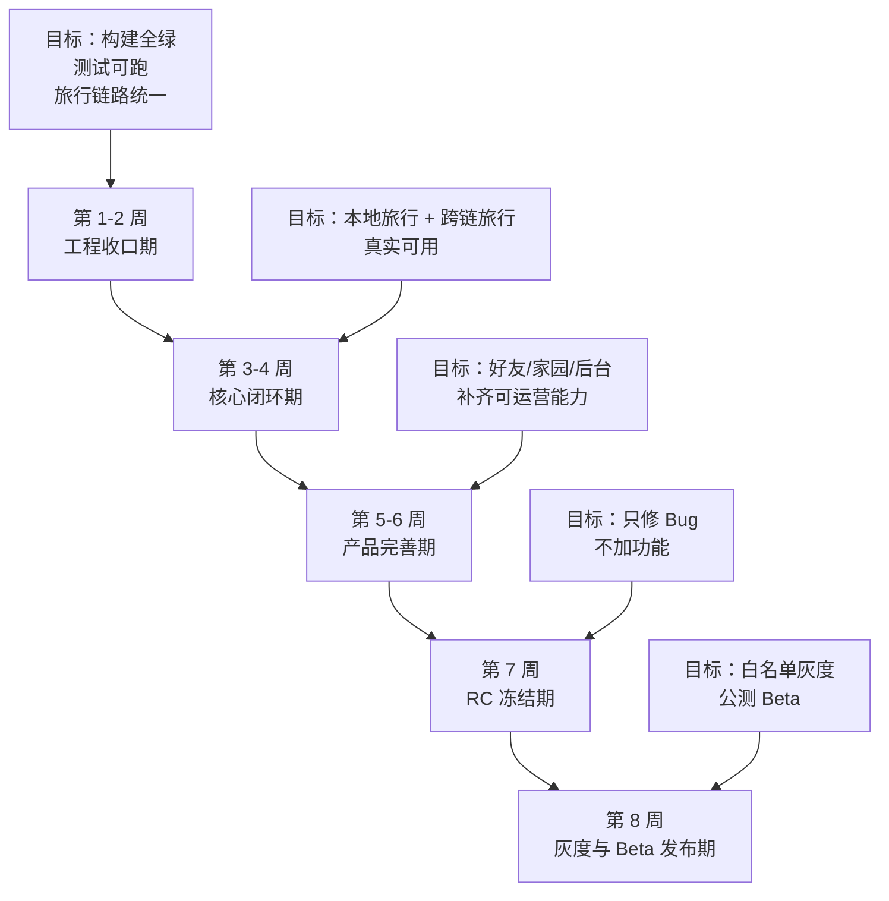
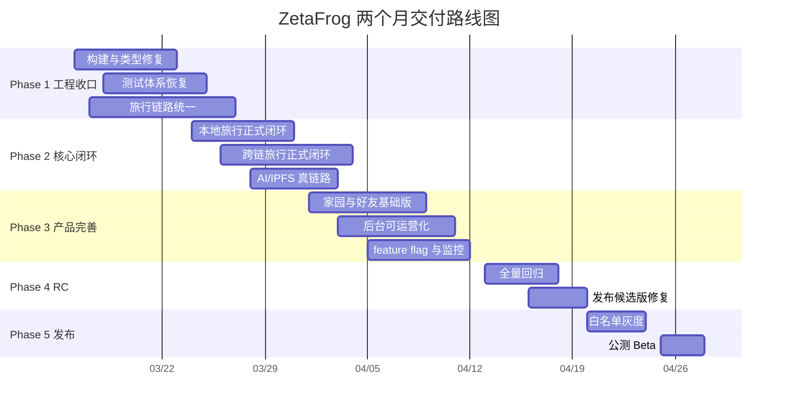
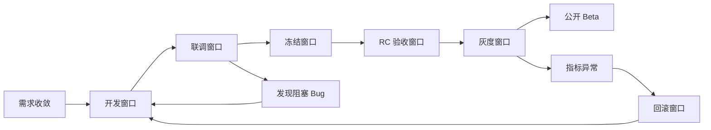
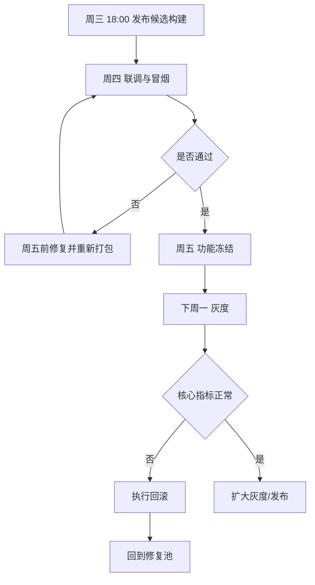
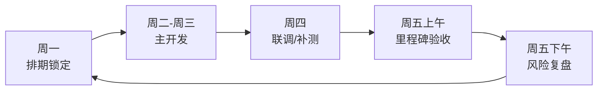
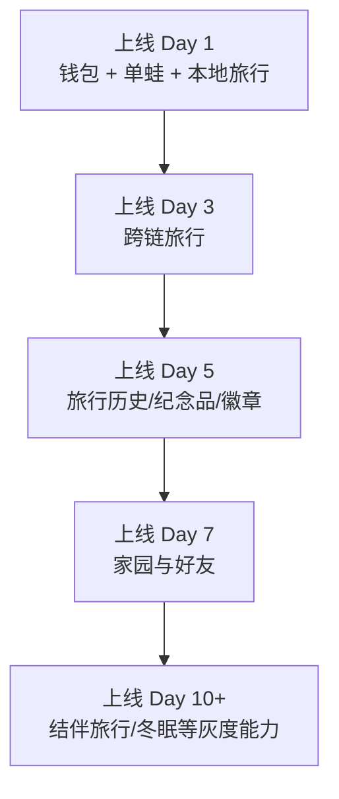

# ZetaFrog 两个月完整产品路线图

> 目标：在 8 周内将当前“功能已铺开、工程未完全收口”的状态，推进到“可灰度、可内测、可公开 Beta”的完整产品状态。

---

## 一、文档目的

本路线图用于解决 4 个问题：

1. 统一未来 8 周的交付目标，避免继续横向扩功能。
2. 将“开发完成”切换为“可发布完成”，把工程收口纳入主计划。
3. 明确每周里程碑、冻结窗口、灰度窗口和回滚窗口。
4. 给产品、前端、后端、合约、测试、运维一个共同的执行节奏。

---

## 二、两个月目标定义

### 2.1 两个月后要交付的“完整产品”

这里的“完整产品”不是所有设想中的高级功能全部开放，而是具备完整用户闭环、具备可维护运营能力、可灰度发布的版本。

**必须交付的正式能力**

- 钱包连接与单钱包单青蛙主流程
- 青蛙详情页、状态同步、基础养成
- 本地旅行完整闭环
- 跨链旅行完整闭环
- 旅行历史、旅行详情、旅行发现、旅行纪念品
- 基础徽章系统
- 基础家园展示与访问
- 好友系统基础流程
- 后台核心看板与旅行管理
- AI 日记与 IPFS 真链路
- 构建、测试、发布、回滚、监控链路

**两个月内可交付但建议按开关开放的能力**

- 结伴旅行
- 救援系统
- 家园互动留言
- 冬眠系统
- 桌宠端联动展示

**两个月内不作为公开上线阻塞项**

- 家族 DAO
- 繁殖系统大规模开放
- 社区系统大规模开放
- 高级链监控玩法
- 大规模经济系统联动

---

## 三、执行原则

### 3.1 总原则

1. 未来 8 周以“收口”为主，不再新增大模块。
2. 正式代码中禁止 mock、假 hash、假 IPFS URI、假后台数据进入发布包。
3. 所有核心功能只保留一条主链路，禁止并行实现长期共存。
4. 每周末必须有可演示结果，不接受只写了一堆代码但无法验证。

### 3.2 技术原则

1. Web、Backend、Contracts、Admin 必须进入统一发布门禁。
2. 所有旅行状态统一由单一状态机管理。
3. 所有上线能力必须有 feature flag。
4. 合约升级、数据库迁移、灰度发布必须提前进入窗口管理。

---

## 四、团队配置建议

如果希望 8 周内完成，推荐最小配置如下：

| 角色 | 人数建议 | 主要职责 |
|------|----------|----------|
| 产品/项目负责人 | 1 | 版本范围控制、验收、优先级 |
| 前端工程师 | 2 | Web 主站、管理后台、状态统一 |
| 后端工程师 | 2 | API、Worker、AI/IPFS、任务编排 |
| 合约工程师 | 1 | Travel/OmniTravel/Connector/脚本/Test |
| QA/测试 | 1 | 回归、E2E、灰度验证 |
| 兼运维/发布 | 1（可兼职） | 环境、监控、发布、回滚 |

如果实际团队少于 4 人，需要主动缩小范围：优先保证“单人旅行闭环 + 后台可运维 + 可灰度”，其余功能延后。

---

## 五、总路线图概览

### 5.1 八周总览

### 5.2 八周甘特图

---

## 六、关键窗口期设计

### 6.1 发布窗口总流程

### 6.2 各类窗口说明

| 窗口类型 | 时间安排 | 目标 | 负责人 |
|------|------|------|------|
| 合约变更窗口 | 第 2 周前半 + 第 4 周前半 | 完成必要升级、部署、验证 | 合约负责人 |
| 数据库迁移窗口 | 第 2 周后半 + 第 5 周前半 | Schema 收敛，之后尽量冻结 | 后端负责人 |
| 前后端联调窗口 | 第 3-6 周持续进行 | 每周闭环旅行/家园/好友流程 | 前后端负责人 |
| 功能冻结窗口 | 第 7 周开始 | 禁止新功能进入 RC | 项目负责人 |
| 灰度窗口 | 第 8 周前半 | 小流量真实验证 | 产品 + QA + 运维 |
| 回滚窗口 | 每次灰度当天保留 | 指标异常时快速回退 | 运维/后端 |

### 6.3 单次发布窗口流程图

---

## 七、分阶段详细计划

## Phase 1：工程收口期（第 1-2 周）

### 核心目标

把当前“能跑一些、但不稳定”的状态，收敛成“所有端都能构建、主链路可验证”的状态。

### 阶段交付物

- Web 前端 `build` 通过
- Backend `type-check` 通过
- Backend/Jest 可执行
- Contracts `compile/test` 至少主合约测试全绿
- Admin `build` 通过
- 本地旅行只保留一条正式链路

### 重点任务

#### Week 1：构建恢复与代码收口

**前端**

- 修复 `frontend` 应用构建错误
- 拆分 `app tsconfig` 与 `test tsconfig`
- 排除测试文件进入生产构建
- 删除重复导出、缺失依赖、过期类型引用

**后端**

- 修复 `type-check` 阻塞项
- 清理错误导入、缺失依赖、漂移服务
- 将实验性质服务标记为 `legacy` 或移出正式编译路径

**合约**

- 修复现有测试失败
- 校验 `Travel / OmniTravel / Connector` 接口一致性
- 固定 Node 与 Hardhat 推荐版本

**后台**

- 修复管理后台构建错误
- 禁止接口失败时使用 mock 数据替代正式数据

#### Week 2：旅行主链路统一

**统一本地旅行**

- 只保留一种旅行创建方式
- 明确前端职责：发起交易、显示交易中状态
- 明确后端职责：事件入库、状态推进、结果生成
- 明确 worker 职责：探索、AI、纪念品、奖励

**统一跨链旅行**

- 统一 `travelId / messageId / txHash` 关系
- 用唯一约束和幂等策略避免重复建单
- 补齐失败、超时、回滚逻辑

### 阶段验收标准

- `frontend npm run build` 通过
- `backend npm run type-check` 通过
- `admin npm run build` 通过
- `contracts npm test` 不再出现核心失败
- 旅行主链路文档更新完成

### 本阶段风险

- 现有代码中存在多条并行实现，容易在删除旧逻辑时误伤
- 测试夹具与合约接口已发生漂移，修复测试可能暴露更多问题

---

## Phase 2：核心闭环期（第 3-4 周）

### 核心目标

让“本地旅行 + 跨链旅行 + AI 日记 + 纪念品”成为真实用户可连续使用的主产品。

### 阶段交付物

- 本地旅行完整闭环
- 跨链旅行完整闭环
- IPFS 真上传
- AI 日记可稳定生成
- 旅行历史、详情、发现页面稳定

### 重点任务

#### Week 3：本地旅行正式闭环

- 完成从交易发起到事件入库的真实闭环
- 去除前端假 `travel:started` 业务依赖
- 只允许用真实后端记录驱动详情页
- 补本地旅行 E2E 测试
- 打通 XP、徽章、纪念品保存

#### Week 4：跨链旅行正式闭环

- 完成 `can-travel -> tx -> started -> arrived -> completed -> sync`
- 补齐目标链到达、返回链完成、异常超时处理
- 修复跨链数据与本地状态不同步问题
- 打通分享卡、探索发现、旅行轨迹页

### 阶段验收标准

- 连续执行 20 次本地旅行，记录无重复、无丢失、无假状态
- 连续执行 10 次跨链旅行，完成率达到预期
- 后端不再生成假 `txHash`
- 生产配置下不允许生成 mock IPFS URI

### 本阶段风险

- 链上事件监听延迟可能导致状态不同步
- AI/IPFS 失败会拖慢旅行完成时间
- 需要明确“同步中”与“失败”状态显示，不然用户误判很多

---

## Phase 3：产品完善期（第 5-6 周）

### 核心目标

补齐用户可持续使用所需的外围能力，让产品从“玩法 demo”变成“可运营产品”。

### 阶段交付物

- 好友系统基础版稳定
- 家园基础版稳定
- 管理后台核心可用
- feature flag 与监控接入
- 结伴旅行可灰度

### 重点任务

#### Week 5：好友 + 家园基础版

- 修复好友请求、好友列表、互动记录主流程
- 家园页接真实数据，不再用默认假状态兜底
- 完成访问、访客、基础留言、纪念品展示
- 若冬眠功能保留，先做只读状态展示和基础唤醒链路

#### Week 6：后台可运营化 + 灰度准备

- 后台看板接真实数据
- 旅行列表、详情、强制完成、配置页可用
- 接入 feature flags
- 接入核心监控：
  - 旅行创建成功率
  - 旅行完成率
  - AI 日记失败率
  - IPFS 成功率
  - 跨链超时数
  - 重复旅行数

### 阶段验收标准

- 后台不再展示 mock 数据
- 家园与好友至少通过一轮完整手工回归
- feature flag 能动态关闭高风险功能
- 结伴旅行若未成熟，默认关闭但不阻塞主发布

### 本阶段风险

- 外围模块交互复杂，最容易出现“页面有、数据不真”的假完成状态
- 若继续新增功能，会直接压缩 RC 时间

---

## Phase 4：RC 冻结期（第 7 周）

### 核心目标

停止功能扩张，只修复缺陷，拿到 Release Candidate。

### 阶段交付物

- RC1 构建
- 全量回归报告
- 阻塞 Bug 清单
- 上线清单与回滚清单

### 工作重点

- 全端联调回归
- 钱包、旅行、跨链、家园、好友、后台核心回归
- 合约地址、ABI、环境变量统一校验
- 发布脚本、数据库备份、回滚脚本准备

### 冻结规则

1. 第 7 周开始禁止新增页面和新接口。
2. 只允许修复 `P0/P1` 缺陷。
3. 所有变更必须附带验证结果。

### 阶段验收标准

- RC 包可部署
- 发布清单、回滚清单齐备
- 无新增未评审 schema 变更
- 无新增合约升级需求进入 RC

---

## Phase 5：灰度与 Beta 发布期（第 8 周）

### 核心目标

完成真实用户灰度，确认指标稳定后开放公开 Beta。

### 阶段交付物

- 白名单灰度版本
- 灰度日报
- 正式 Beta 版本

### 灰度节奏

#### Day 1-2：内部灰度

- 团队内部账号 + 指定测试钱包
- 验证关键链路是否稳定

#### Day 3-4：白名单灰度

- 小规模真实用户进入
- 记录漏斗与异常

#### Day 5-7：公开 Beta

- 放开主入口
- 高风险功能按 flag 渐进开放

### 发布验收指标

| 指标 | 目标 |
|------|------|
| 本地旅行创建成功率 | > 98% |
| 跨链旅行成功率 | > 90% |
| AI 日记生成成功率 | > 95% |
| IPFS 上传成功率 | > 95% |
| 页面致命错误率 | < 1% |
| 发布后 24 小时 P0 事故 | 0 |

---

## 八、每周里程碑表

| 周次 | 时间节点 | 里程碑 | 可演示结果 |
|------|------|------|------|
| Week 1 | 03/16 - 03/22 | 构建恢复 | Web/Backend/Admin 基本能构建 |
| Week 2 | 03/23 - 03/29 | 旅行链路统一 | 本地旅行只有一条主链路 |
| Week 3 | 03/30 - 04/05 | 本地旅行闭环 | 从发起到结果完整可用 |
| Week 4 | 04/06 - 04/12 | 跨链旅行闭环 | 跨链往返真实可演示 |
| Week 5 | 04/13 - 04/19 | 家园好友基础可用 | 访问与好友基础流程可跑 |
| Week 6 | 04/20 - 04/26 | 后台与监控就绪 | 管理后台可运维、监控可看 |
| Week 7 | 04/27 - 05/03 | RC 冻结 | 只剩 Bug 修复 |
| Week 8 | 05/04 - 05/10 | 灰度 + Beta | 完成白名单与公开 Beta |

---

## 九、每周例会与验收节奏

### 9.1 周节奏

### 9.2 每周固定输出

每周五必须提交：

- 本周完成项
- 未完成项
- 阻塞项
- 下周计划
- 当前风险等级
- 是否影响 Beta 时间点

---

## 十、任务拆分建议

## 10.1 前端任务池

### P0

- 修复构建与类型错误
- 旅行表单统一
- 旅行历史/详情只认真实数据
- 去除 mock 状态依赖

### P1

- 家园真实数据接入
- 好友流程打通
- 后台页面与主站共享类型
- feature flag 接入

## 10.2 后端任务池

### P0

- 修复 type-check
- 统一旅行状态机
- 统一事件入库与幂等策略
- AI/IPFS 真链路

### P1

- 管理后台真实数据 API
- 监控指标 API
- 定时任务与异常补偿
- feature flag 服务

## 10.3 合约任务池

### P0

- 修复测试失败
- 校验 Travel/OmniTravel/Connector 事件和字段
- 部署与升级脚本收敛

### P1

- 异常场景测试
- 回滚与 emergency path 测试
- Gas 与费用计算稳定化

## 10.4 QA 任务池

### 必测路径

- 钱包连接
- 单蛙查看
- 本地旅行
- 跨链旅行
- 旅行历史
- 纪念品/徽章
- 家园访问
- 好友请求
- 后台查看与强制完成

---

## 十一、Beta 前必须通过的质量门

### 11.1 工程门禁

- `frontend build` 通过
- `backend type-check` 通过
- `backend test` 通过
- `admin build` 通过
- `contracts compile` 通过
- `contracts test` 通过

### 11.2 产品门禁

- 旅行主链路无 blocker
- 不存在 mock 数据对真实用户可见
- 后台能查看并处理旅行异常
- 关键错误有告警

### 11.3 发布门禁

- 发布清单存在
- 回滚清单存在
- 环境变量检查完成
- ABI/合约地址核对完成
- 数据库迁移预演完成

---

## 十二、风险地图

| 风险 | 等级 | 出现阶段 | 应对方案 |
|------|------|------|------|
| 多套旅行实现继续并存 | 高 | Week 1-3 | 第 2 周强制收敛为单链路 |
| 合约与测试不一致 | 高 | Week 1-4 | 测试与 ABI 一起修，不只修脚本 |
| AI/IPFS 失败拖慢体验 | 中 | Week 3-5 | 异步任务、重试、状态提示 |
| 家园好友功能假完成 | 中 | Week 5-6 | 所有 fallback 逐项清理 |
| 第 7 周还在加新功能 | 高 | Week 7 | 项目负责人冻结范围 |
| 灰度当天指标异常 | 高 | Week 8 | 保留回滚窗口与降级开关 |

---

## 十三、建议的功能开放顺序

---

## 十四、最终交付定义

两个月结束时，项目应达到以下状态：

1. 主产品可真实用户连续使用。
2. 核心功能有统一主链路，不依赖假状态。
3. 所有正式端都能构建和发布。
4. 管理后台能支撑日常运营。
5. 有灰度能力、回滚能力、监控能力。

如果第 6 周结束时仍未达到“本地旅行 + 跨链旅行 + 后台可用”三项同时成立，则应及时调整目标，将公开 Beta 延后，只做白名单内测。

---

## 十五、执行建议

1. 第一周先不要讨论新需求，先把工程收口列为最高优先级。
2. 第二周结束时必须召开一次“是否按时进入 Beta 轨道”的里程碑评审。
3. 第六周必须强制做一次“预发布演练”，包括部署、迁移、告警、回滚。
4. 第七周开始任何新需求都必须经过项目负责人批准。

---

## 十六、结论

按当前基础判断，**两个月做出完整产品是有机会的，但前提不是继续扩功能，而是强制进入 8 周收口模式**。

最关键的成功条件只有三条：

1. 旅行链路收敛成单一可信实现
2. 构建、测试、发布门禁全部恢复
3. 第 7 周坚决冻结，不再横向扩展

只要这三条守住，8 周内做到可公开 Beta 是现实的。
