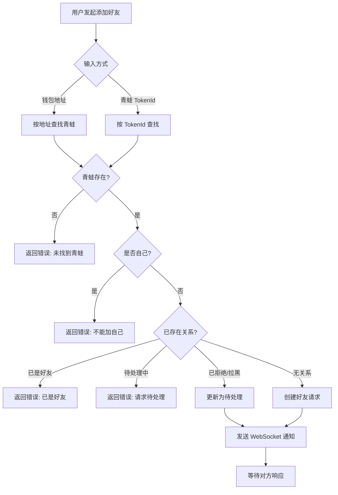
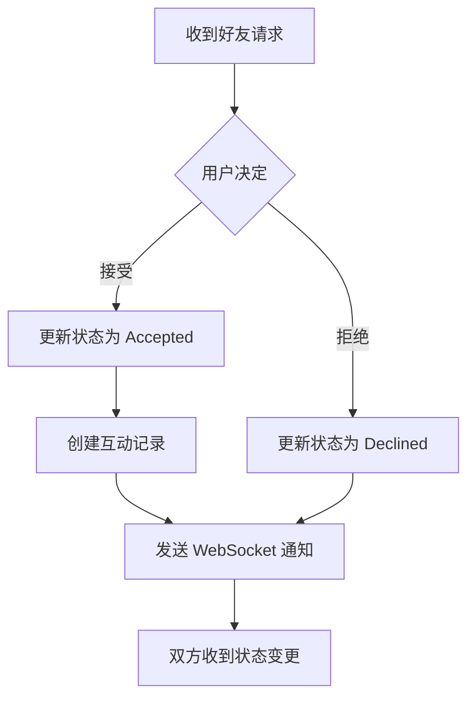
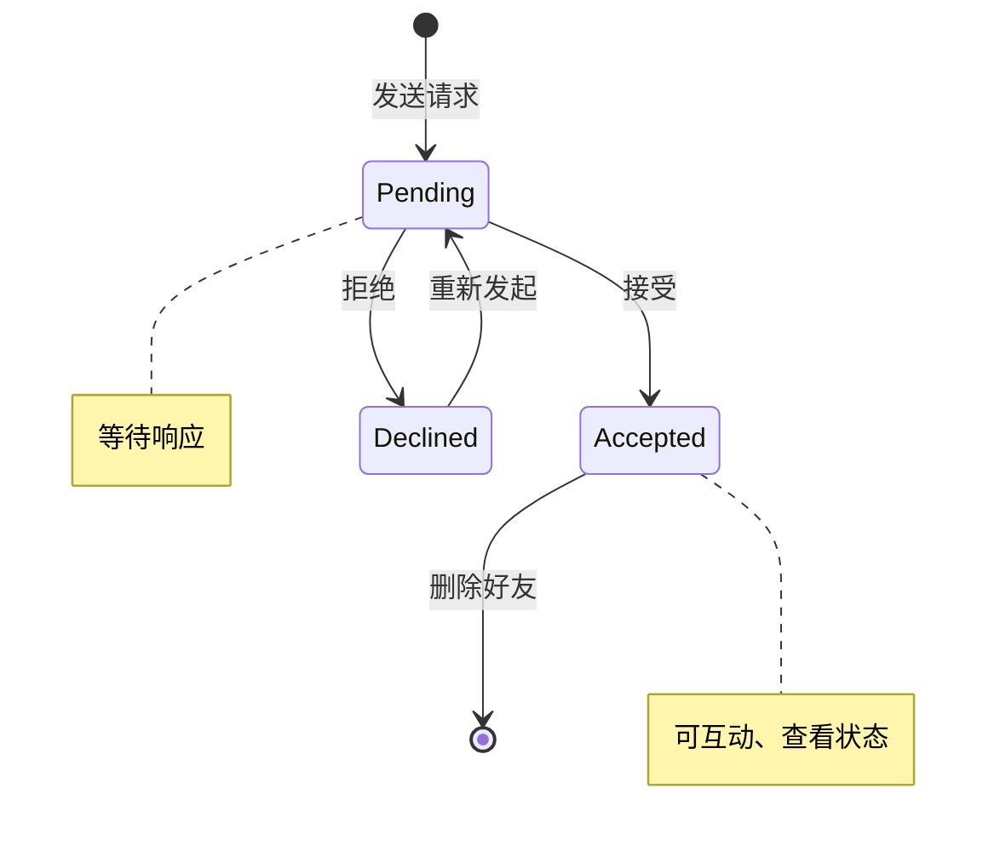
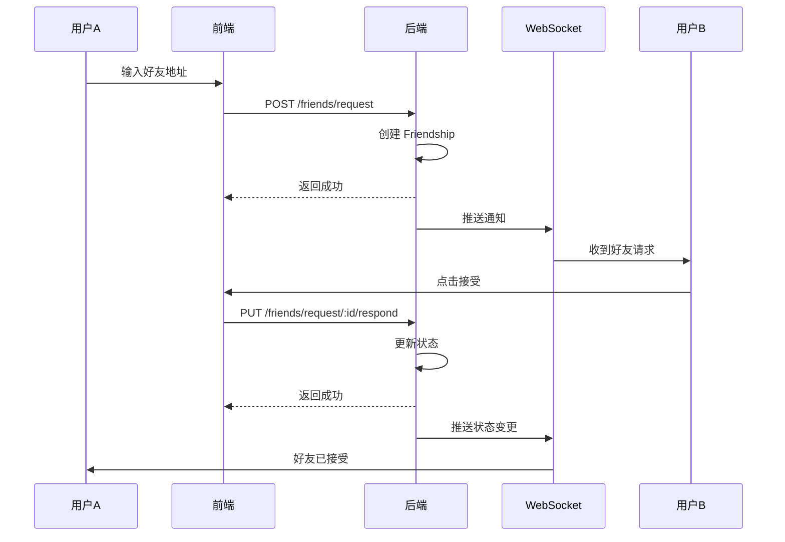
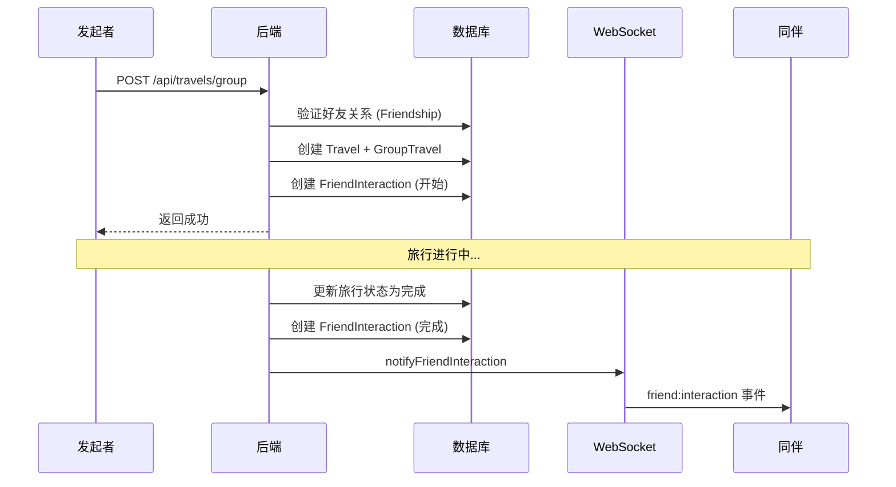

# 好友系统技术设计

> 本文档基于 `docs/01_需求设计/好友系统模块需求设计.md` 设计完整的技术方案。

## 一、系统概述

好友系统是 ZetaFrog 的社交核心模块，允许玩家之间建立好友关系、互动交流、查看动态。

---

## 二、业务流程图

### 2.1 好友请求流程



### 2.2 好友响应流程



### 2.3 好友状态机



---

## 三、数据模型设计

### 3.1 Prisma 数据模型

```prisma
model Friendship {
  id           Int                 @id @default(autoincrement())
  requesterId  Int                 // 发起者青蛙 ID
  addresseeId  Int                 // 接收者青蛙 ID
  status       FriendshipStatus    @default(Pending)
  createdAt    DateTime            @default(now())
  updatedAt    DateTime            @updatedAt
  interactions FriendInteraction[]
  addressee    Frog                @relation("FriendshipAddressee", fields: [addresseeId])
  requester    Frog                @relation("FriendshipRequester", fields: [requesterId])

  @@unique([requesterId, addresseeId])
  @@index([status])
}

model FriendInteraction {
  id           Int             @id @default(autoincrement())
  friendshipId Int
  actorId      Int             // 执行者青蛙 ID
  type         InteractionType
  message      String?
  metadata     Json?
  likesCount   Int             @default(0)
  createdAt    DateTime        @default(now())
  actor        Frog            @relation("InteractionActor", fields: [actorId])
  friendship   Friendship      @relation(fields: [friendshipId])

  @@index([friendshipId])
  @@index([actorId])
}

enum FriendshipStatus {
  Pending
  Accepted
  Declined
  Blocked
}

enum InteractionType {
  Visit    // 访问
  Feed     // 喂食
  Play     // 玩耍
  Gift     // 送礼
  Message  // 消息
  Travel   // 结伴旅行
}
```

---

## 四、服务架构设计

### 4.1 目录结构

```
backend/src/
├── api/
│   └── routes/
│       ├── friends.routes.ts      # 好友 API (419行)
│       └── message.routes.ts      # 消息 API
│
├── websocket/
│   └── index.ts                   # WebSocket 通知
│       ├── notifyFriendRequestReceived
│       ├── notifyFriendRequestStatusChanged
│       ├── notifyFriendInteraction
│       └── notifyFriendRemoved
│
└── database/
    └── prisma/schema.prisma       # 数据模型
```

### 4.2 核心功能

| 功能 | 路由 | 说明 |
|------|------|------|
| 发送好友请求 | `POST /api/friends/request` | 支持地址/TokenId |
| 响应好友请求 | `PUT /api/friends/request/:id/respond` | 接受/拒绝 |
| 获取好友列表 | `GET /api/friends/list/:frogId` | 含在线状态 |
| 获取请求列表 | `GET /api/friends/requests/:frogId` | 待处理请求 |
| 删除好友 | `DELETE /api/friends/:friendshipId` | 级联删除互动 |
| 创建互动 | `POST /api/friends/:friendshipId/interact` | 多种互动类型 |
| 获取互动历史 | `GET /api/friends/:friendshipId/interactions` | 分页支持 |

---

## 五、前端组件设计

### 5.1 组件结构

```
frontend/src/components/frog/
├── friend-system/          # 好友系统组件
│   ├── FriendsList.tsx     # 好友列表
│   ├── FriendRequests.tsx  # 请求列表
│   ├── AddFriend.tsx       # 添加好友
│   └── FriendInteraction.tsx # 互动组件
│
├── AddFriendByWallet.tsx   # 按钱包添加
└── FriendsList.tsx         # 好友列表主组件

frontend/src/hooks/
└── useFriendWebSocket.ts   # WebSocket Hook
```

### 5.2 交互时序



---

## 六、WebSocket 事件

| 事件 | 触发时机 | 数据结构 |
|------|----------|----------|
| `friend:request:received` | 收到好友请求 | `{ friendship }` |
| `friend:request:status` | 请求状态变更 | `{ status, requesterId, addresseeId }` |
| `friend:interaction` | 好友互动 | `{ friendshipId, actorId, targetId, interaction }` |
| `friend:removed` | 好友删除 | `{ requesterId, addresseeId }` |

---

## 七、验证计划

### 7.1 API 测试

| 测试项 | 验证内容 |
|--------|----------|
| 发送请求 | 正常发送 / 重复发送 / 加自己 |
| 响应请求 | 接受 / 拒绝 / 无效状态 |
| 好友列表 | 列表完整 / 在线状态 |
| 删除好友 | 级联删除互动记录 |

### 7.2 手动验证

1. 钱包A发送好友请求给钱包B
2. 钱包B实时收到WebSocket通知
3. 钱包B接受请求，双方成为好友
4. 验证好友列表显示正确
5. 测试互动功能

---

## 八、与旅行系统集成

### 8.1 结伴旅行

好友系统与旅行系统的结伴旅行功能紧密集成：

| 集成点 | 说明 | 实现位置 |
|--------|------|----------|
| 好友关系验证 | 结伴旅行必须是好友 | `travel.routes.ts:1036-1052` |
| 旅行开始互动 | 创建 Travel 类型互动记录 | `travel.routes.ts:1088-1101` |
| 旅行完成互动 | 创建 Travel 类型互动记录 | `travelProcessor.ts:666-710` |
| 完成通知 | WebSocket 通知好友 | `travelProcessor.ts:696-705` |

### 8.2 结伴旅行流程



### 8.3 互动记录示例

```json
{
  "friendshipId": 1,
  "actorId": 123,
  "type": "Travel",
  "message": "小蛙 和 好友 完成了前往 BSC Testnet 的冒险！",
  "metadata": {
    "travelId": 456,
    "chainId": 97,
    "chainName": "BSC Testnet",
    "completedAt": "2026-01-14T12:00:00.000Z",
    "journalHash": "Qm...",
    "souvenirId": null
  }
}
```

---

## 九、变更记录

| 日期 | 版本 | 内容 |
|------|------|------|
| 2026-01-14 | 1.0 | 初始技术设计文档 |
| 2026-01-14 | 1.1 | 新增与旅行系统集成说明 |

---
