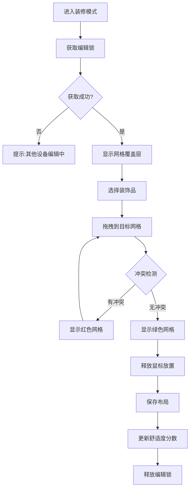
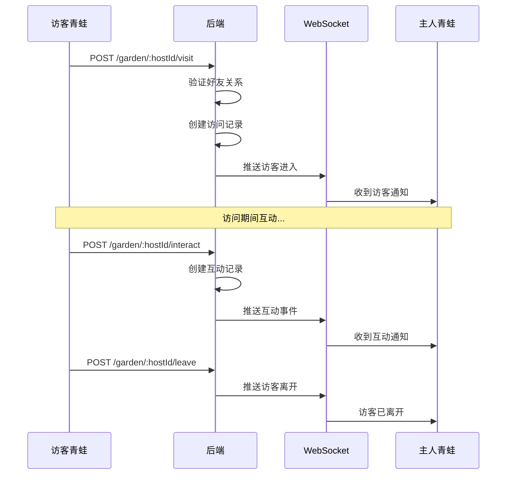

# 家园系统技术设计

> 本文档基于 `docs/01_需求设计/家园系统模块需求设计.md` 设计完整的技术方案。

## 一、系统概述

家园系统是青蛙的专属空间，包含装饰品管理、布局编辑、礼物系统、相册系统和成就系统。V2.0 版本引入格栅系统、环境影响因子和社交深度化功能。

---

## 二、功能模块

### 2.1 核心模块

| 模块 | 说明 | 路由 | 版本 |
|------|------|------|------|
| 布局管理 | 场景布局保存/恢复 | `homestead.routes.ts` | V1.0 |
| 装饰系统 | 装饰品库存管理 | `homestead.routes.ts` | V1.0 |
| 礼物系统 | 收发礼物 | `homestead.routes.ts` | V1.0 |
| 相册系统 | 照片管理与NFT铸造 | `homestead.routes.ts` | V1.0 |
| 成就系统 | 成就追踪与领取 | `homestead.routes.ts` | V1.0 |
| 家园访问 | 好友串门互动 | `garden.routes.ts` | V1.0 |
| **格栅系统** | 网格对齐与冲突检测 | `homestead.routes.ts` | **V2.0** |
| **舒适度系统** | Buff 计算与应用 | `comfort.service.ts` | **V2.0** |
| **寻宝系统** | 每日寻宝奖励 | `garden.routes.ts` | **V2.0** |
| **离线收益** | 离线产出计算 | `offline.service.ts` | **V2.0** |

---

## 三、业务流程图

### 3.1 装饰品放置流程（V2.0 格栅版）



### 3.2 好友访问流程



### 3.3 【V2.0】每日寻宝流程

```mermaid
flowchart TD
    A[进入好友家园] --> B[检查今日寻宝状态]
    B --> C{已寻宝?}
    C -->|是| D[显示"明日再来"]
    C -->|否| E[显示寻宝按钮]
    E --> F[点击寻宝]
    F --> G[随机生成奖励]
    G --> H[播放开宝动画]
    H --> I[奖励入账]
    I --> J[更新寻宝记录]
```

---

## 四、数据模型设计

### 4.1 装饰品模型（V2.0 增强）

```prisma
model Decoration {
  id            String           @id @default(cuid())
  name          String
  type          DecorationType
  assetUrl      String
  layer         Int              @default(0)
  isInteractive Boolean          @default(false)
  width         Int              @default(64)
  height        Int              @default(64)
  
  // V2.0 新增
  gridWidth     Int              @default(1)    // 占用网格宽度
  gridHeight    Int              @default(1)    // 占用网格高度
  buffType      String?                          // Buff 类型
  buffValue     Float?                           // Buff 数值
  weatherAnim   String?                          // 天气动画 ID
  rarity        Int              @default(1)    // 稀有度 1-5
  
  createdAt     DateTime         @default(now())
  userDecorations UserDecoration[]
}
```

### 4.2 放置物品模型（V2.0 网格版）

```prisma
model PlacedItem {
  id               String         @id @default(cuid())
  layoutId         String
  userDecorationId String
  
  // V2.0: 改为网格坐标
  gridX            Int            // 网格坐标 X (0-11)
  gridY            Int            // 网格坐标 Y (0-9)
  
  scale            Float          @default(1.0)
  rotation         Int            @default(0)    // 0, 90, 180, 270
  zIndex           Int            @default(1)
  
  // V2.0 新增
  state            String         @default("normal")  // normal | rain | snow
  
  createdAt        DateTime       @default(now())
  layout           RoomLayout     @relation(...)
  userDecoration   UserDecoration @relation(...)
}
```

### 4.3 布局模型（V2.0 增强）

```prisma
model RoomLayout {
  id        String       @id @default(cuid())
  frogId    Int
  sceneType String       // 'yard' | 'indoor'
  version   Int          @default(1)
  
  // V2.0 新增
  gridCols  Int          @default(12)         // 网格列数
  gridRows  Int          @default(10)         // 网格行数
  editLock  String?                           // 编辑锁 (sessionId:expiry)
  comfortScore Int       @default(0)          // 舒适度分数
  
  updatedAt DateTime     @updatedAt
  createdAt DateTime     @default(now())
  
  items     PlacedItem[]
  snapshots RoomLayoutSnapshot[]
  frog      Frog         @relation(...)
}
```

### 4.4 【V2.0】每日寻宝模型

```prisma
model DailyTreasure {
  id           String   @id @default(cuid())
  hostFrogId   Int      // 宝藏所在的家园
  visitorId    Int      // 发现者
  rewardType   String   // "token" | "material" | "decoration"
  rewardId     String?  // 奖励物品 ID
  rewardAmount Int      @default(1)
  foundAt      DateTime @default(now())
  
  @@unique([hostFrogId, visitorId, foundAt])
  @@index([hostFrogId])
  @@index([visitorId])
}
```

### 4.5 【V2.0】离线收益模型

```prisma
model OfflineBonus {
  id           String    @id @default(cuid())
  frogId       Int
  lastOnline   DateTime
  offlineHours Int
  comfortScore Int
  bonusType    String    // "luck" | "resource"
  bonusValue   Float
  claimedAt    DateTime?
  createdAt    DateTime  @default(now())
  
  @@index([frogId])
}
```

---

## 五、【V2.0】格栅系统设计

### 5.1 网格配置

| 配置项 | 值 | 说明 |
|--------|-----|------|
| gridCols | 12 | 网格列数 |
| gridRows | 10 | 网格行数 |
| cellSize | 64px | 单格尺寸 |
| 画布尺寸 | 768 × 640 | 12×64, 10×64 |

### 5.2 冲突检测算法

```typescript
interface GridPlacement {
  gridX: number;
  gridY: number;
  gridWidth: number;
  gridHeight: number;
}

function checkCollision(
  occupiedGrid: boolean[][],
  item: GridPlacement,
  excludeItemId?: string
): boolean {
  for (let x = item.gridX; x < item.gridX + item.gridWidth; x++) {
    for (let y = item.gridY; y < item.gridY + item.gridHeight; y++) {
      // 边界检查
      if (x < 0 || x >= 12 || y < 0 || y >= 10) return true;
      // 冲突检查
      if (occupiedGrid[y]?.[x]) return true;
    }
  }
  return false;
}
```

### 5.3 编辑锁机制

```typescript
// 获取编辑锁
async function acquireEditLock(layoutId: string, sessionId: string): Promise<boolean> {
  const layout = await prisma.roomLayout.findUnique({ where: { id: layoutId } });
  
  if (layout.editLock) {
    const [lockedSession, expiry] = layout.editLock.split(':');
    if (Date.now() < parseInt(expiry)) {
      return lockedSession === sessionId;
    }
  }
  
  // 获取锁（5分钟有效）
  await prisma.roomLayout.update({
    where: { id: layoutId },
    data: { editLock: `${sessionId}:${Date.now() + 5 * 60 * 1000}` }
  });
  return true;
}
```

---

## 六、【V2.0】舒适度系统设计

### 6.1 舒适度计算

```typescript
function calculateComfort(items: PlacedDecoration[]): number {
  let score = 0;
  
  for (const item of items) {
    // 基础分 = 稀有度 × 10
    score += item.decoration.rarity * 10;
    
    // Buff 加成
    if (item.decoration.buffType === 'comfort') {
      score += item.decoration.buffValue || 0;
    }
  }
  
  // 物品数量奖励
  score += Math.min(items.length, 20) * 2;
  
  return Math.min(score, 100); // 上限 100
}
```

### 6.2 Buff 类型定义

| Buff Code | 名称 | 效果 | 稀有度要求 |
|-----------|------|------|-----------|
| rest_reduce | 缩短休息 | 青蛙旅行归来休息时间 -10% | ≥3 |
| luck_boost | 幸运提升 | 旅行发现稀有物品概率 +5% | ≥4 |
| visitor_bonus | 访客奖励 | 来访好友互动友好度 +10% | ≥3 |
| treasure_boost | 寻宝提升 | 被寻宝时双方奖励 +20% | ≥5 |

---

## 七、服务架构设计

### 7.1 目录结构（V2.0 更新）

```
backend/src/
├── api/routes/
│   ├── homestead.routes.ts    # 家园主API (600+行)
│   └── garden.routes.ts       # 花园访问API (600+行)
│
├── services/
│   ├── decoration.service.ts  # 装饰品服务
│   ├── photo.service.ts       # 相册服务
│   ├── achievement.service.ts # 成就服务
│   ├── comfort.service.ts     # 【V2.0】舒适度服务
│   ├── treasure.service.ts    # 【V2.0】寻宝服务
│   └── offline.service.ts     # 【V2.0】离线收益服务
│
└── websocket/
    └── index.ts               # 家园相关WebSocket事件
```

### 7.2 API 概览（V2.0 新增）

| 类别 | 端点 | 方法 | 说明 | 版本 |
|------|------|------|------|------|
| 布局 | `/:frogId/layout/:sceneType` | GET | 获取布局 | V1.0 |
| 布局 | `/:frogId/layout/:sceneType` | POST | 保存布局 | V1.0 |
| 布局 | `/:frogId/layout/:sceneType/history` | GET | 布局历史 | V1.0 |
| **编辑锁** | `/:frogId/layout/:sceneType/lock` | POST | 获取编辑锁 | **V2.0** |
| **编辑锁** | `/:frogId/layout/:sceneType/lock/release` | POST | 释放编辑锁 | **V2.0** |
| 装饰 | `/:frogId/decorations` | GET | 装饰品库存 | V1.0 |
| 装饰 | `/:frogId/decorations/unplaced/:sceneType` | GET | 未放置装饰 | V1.0 |
| 礼物 | `/:frogId/gifts` | GET/POST | 礼物管理 | V1.0 |
| 相册 | `/:frogId/photos` | GET/POST | 相册管理 | V1.0 |
| 相册 | `/:frogId/photos/:photoId/mint` | POST | 铸造为NFT | V1.0 |
| 成就 | `/achievements` | GET | 成就列表 | V1.0 |
| 成就 | `/:frogId/achievements` | GET | 青蛙成就 | V1.0 |
| 访问 | `/garden/:frogId` | GET | 家园状态 | V1.0 |
| 访问 | `/garden/:frogId/visit` | POST | 发起访问 | V1.0 |
| 访问 | `/garden/:frogId/visitors` | GET | 访客列表 | V1.0 |
| 访问 | `/garden/:frogId/interact` | POST | 互动 | V1.0 |
| 访问 | `/garden/:frogId/leave` | POST | 离开 | V1.0 |
| 留言 | `/garden/:frogId/messages` | GET/POST | 留言板 | V1.0 |
| **舒适度** | `/:frogId/comfort` | GET | 获取舒适度和Buff | **V2.0** |
| **寻宝** | `/garden/:frogId/treasure` | GET | 今日寻宝状态 | **V2.0** |
| **寻宝** | `/garden/:frogId/treasure/claim` | POST | 领取寻宝奖励 | **V2.0** |
| **离线收益** | `/:frogId/offline-bonus` | GET | 获取离线收益 | **V2.0** |
| **离线收益** | `/:frogId/offline-bonus/claim` | POST | 领取离线收益 | **V2.0** |

---

## 八、WebSocket 事件

| 事件 | 触发时机 | 数据 | 版本 |
|------|----------|------|------|
| `garden:visit:request` | 访问请求 | `{ guestFrog, hostFrogId }` | V1.0 |
| `garden:visitor:entered` | 访客进入 | `{ guestFrog, hostFrogId }` | V1.0 |
| `garden:visitor:left` | 访客离开 | `{ guestFrogId, hostFrogId }` | V1.0 |
| `garden:interaction` | 互动事件 | `{ type, fromFrog, ... }` | V1.0 |
| **`garden:treasure:found`** | 寻宝成功 | `{ visitorFrog, reward }` | **V2.0** |

---

## 九、变更记录

| 日期 | 版本 | 内容 |
|------|------|------|
| 2026-01-14 | 1.0 | 初始技术设计文档 |
| 2026-01-14 | 2.0 | V2.0 增强：格栅系统、舒适度、寻宝、离线收益 |

---
