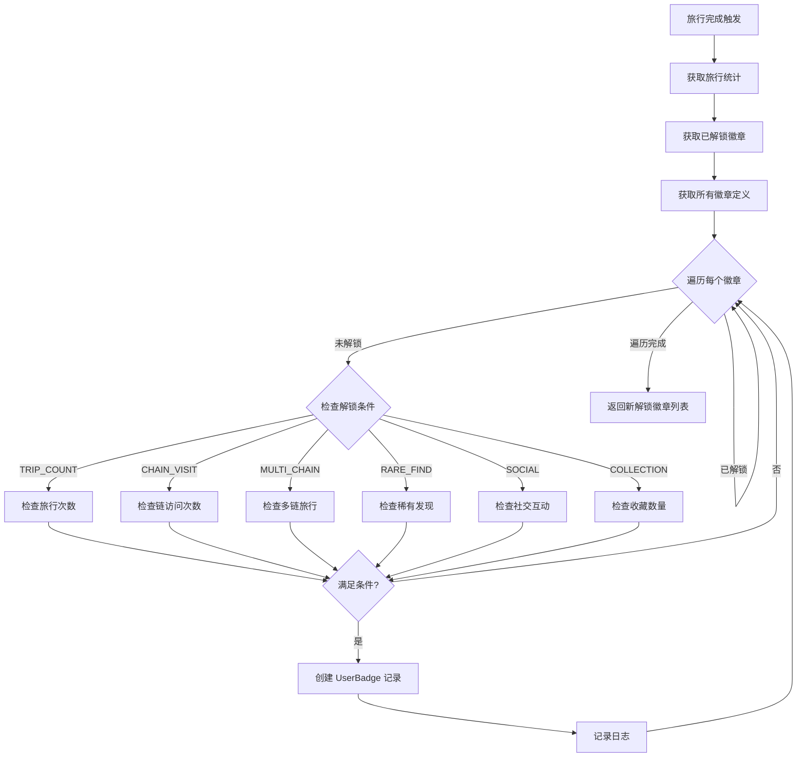
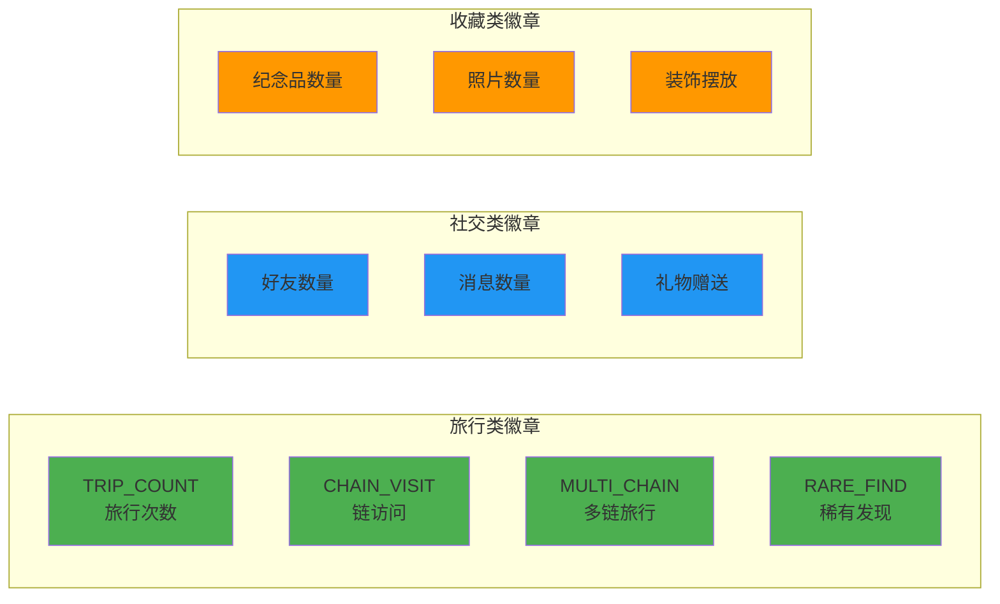

# 徽章成就系统技术设计

> 本文档基于 `docs/01_需求设计/徽章成就模块需求设计.md` 设计完整的技术方案。

## 一、系统概述

徽章成就系统激励玩家完成各种游戏目标，通过收集徽章展示成就，增加游戏粘性。

---

## 二、业务流程图

### 2.1 徽章检查与解锁流程



### 2.2 徽章类型关系图



---

## 三、数据模型设计

### 3.1 Prisma 数据模型

```prisma
model TravelBadge {
  id              String          @id @default(cuid())
  code            String          @unique    // 徽章代码
  name            String                     // 显示名称
  description     String                     // 描述
  icon            String                     // 图标
  unlockType      BadgeUnlockType            // 解锁类型
  unlockCondition Json                       // 解锁条件配置
  rarity          Int             @default(1) // 稀有度 1-4
  isHidden        Boolean         @default(false) // 隐藏徽章
  createdAt       DateTime        @default(now())
  userBadges      UserBadge[]
}

model UserBadge {
  id                 String      @id @default(cuid())
  frogId             Int
  badgeId            String
  unlockedAt         DateTime    @default(now())
  unlockedByTravelId Int?        // 触发解锁的旅行 ID
  badge              TravelBadge @relation(fields: [badgeId])
  frog               Frog        @relation(fields: [frogId])

  @@unique([frogId, badgeId])
  @@index([frogId])
}

enum BadgeUnlockType {
  TRIP_COUNT    // 旅行次数
  CHAIN_VISIT   // 访问特定链
  MULTI_CHAIN   // 多链旅行
  RARE_FIND     // 稀有发现
  SOCIAL        // 社交互动
  COLLECTION    // 收藏成就
  SPECIAL       // 特殊条件
}
```

### 3.2 解锁条件配置示例

```json
// TRIP_COUNT 类型
{ "threshold": 5 }

// CHAIN_VISIT 类型
{ "chain": "BSC_TESTNET", "threshold": 3 }

// MULTI_CHAIN 类型
{ "threshold": 2 }

// RARE_FIND 类型
{ "minRarity": 4 }

// SOCIAL 类型
{ "metric": "friend_count", "threshold": 5 }

// COLLECTION 类型
{ "metric": "souvenir_count", "threshold": 10 }
```

---

## 四、服务架构设计

### 4.1 目录结构

```
backend/src/
├── api/
│   └── routes/
│       └── badge.routes.ts       # 徽章 API (206行)
│
├── services/
│   ├── badge/
│   │   └── badge.service.ts      # 徽章检查服务 (208行)
│   ├── badge-checker.service.ts  # 旧版检查器
│   └── achievement.service.ts    # 成就服务
│
└── database/
    └── prisma/schema.prisma      # 数据模型
```

### 4.2 核心服务 BadgeService

| 方法 | 说明 |
|------|------|
| `checkAndUnlock(frogId, context)` | 检查并解锁徽章 |
| `checkCondition(type, condition, stats, context)` | 检查单个条件 |
| `checkSocialCondition(frogId, condition)` | 检查社交条件 |
| `checkCollectionCondition(frogId, condition)` | 检查收藏条件 |
| `getUserBadges(frogId)` | 获取已解锁徽章 |
| `getAllBadgesWithStatus(frogId)` | 获取全部徽章含状态 |

---

## 五、解锁条件检查逻辑

### 5.1 条件类型详解

| 类型 | 检查逻辑 | 数据来源 |
|------|----------|----------|
| TRIP_COUNT | `stats.totalTrips >= threshold` | FrogTravelStats |
| CHAIN_VISIT | `stats.[chainField] >= threshold` | FrogTravelStats |
| MULTI_CHAIN | `visitedChains >= threshold` | FrogTravelStats |
| RARE_FIND | `maxDiscoveryRarity >= minRarity` | 旅行发现列表 |
| SOCIAL | 好友/消息/礼物数量 | Friendship/Visitor/Gift |
| COLLECTION | 纪念品/照片/装饰数量 | Souvenir/Photo/PlacedItem |

### 5.2 社交条件指标

| metric | 说明 |
|--------|------|
| friend_count | 已接受的好友数量 |
| message_count | 发送的串门消息数 |
| gift_sent | 赠送的礼物数量 |

### 5.3 收藏条件指标

| metric | 说明 |
|--------|------|
| souvenir_count | 纪念品收集数量 |
| photo_count | 照片数量 |
| decoration_placed | 已摆放的装饰数量 |

---

## 六、前端组件设计

### 6.1 组件结构

```
frontend/src/pages/
└── BadgesPage.tsx              # 徽章页面 (18KB)

frontend/src/components/
└── badge/                      # 徽章组件目录
```

### 6.2 页面功能

- 展示所有徽章（已解锁/未解锁）
- 显示徽章进度统计
- 徽章稀有度筛选
- 徽章详情弹窗

---

## 七、验证计划

### 7.1 API 测试

| 测试项 | 验证内容 |
|--------|----------|
| 获取全部徽章 | 含解锁状态 |
| 获取已解锁 | 按时间排序 |
| 徽章统计 | 进度百分比计算 |

### 7.2 解锁测试

1. 完成第一次旅行 → 解锁 FIRST_TRIP
2. 完成5次旅行 → 解锁 FREQUENT_TRAVELER
3. 访问BSC 3次 → 解锁 BSC_VISITOR
4. 访问2条链 → 解锁 CHAIN_HOPPER

---

## 八、变更记录

| 日期 | 版本 | 内容 |
|------|------|------|
| 2026-01-14 | 1.0 | 初始技术设计文档 |

---
