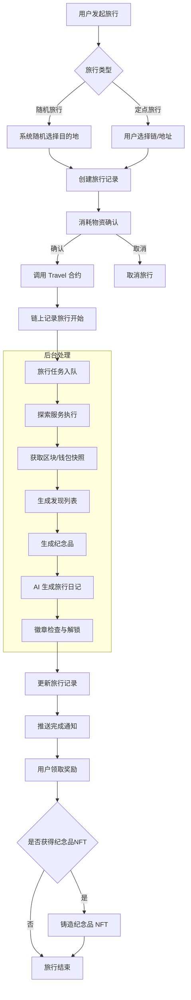
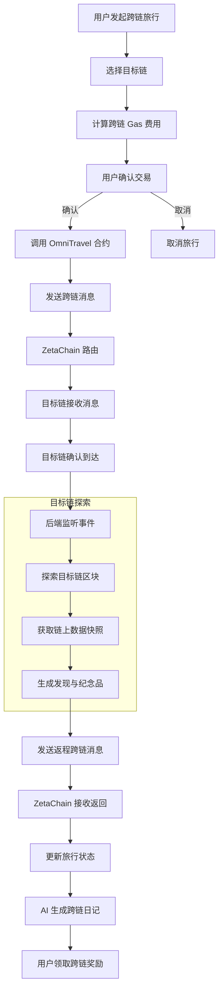
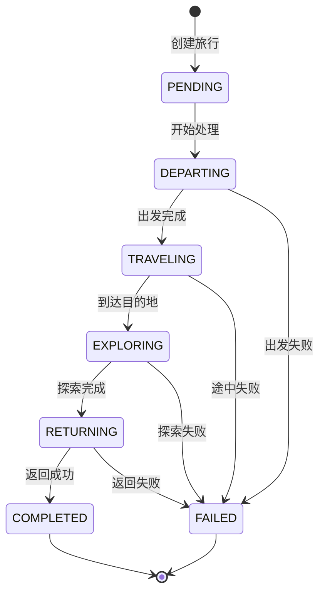
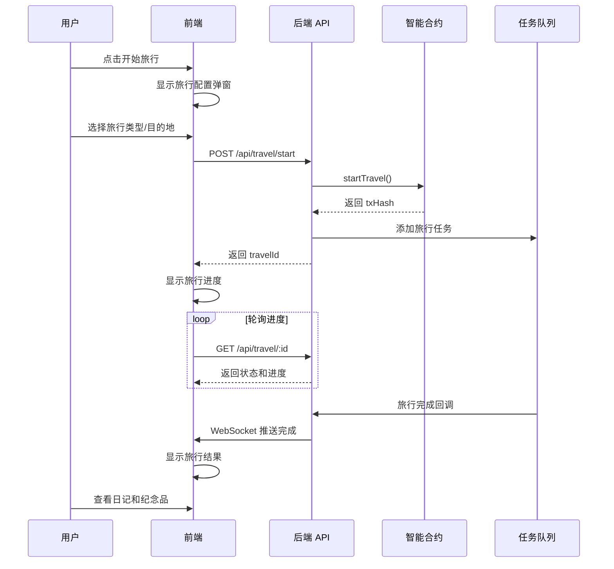

# 旅行系统技术设计

> 本文档基于 `docs/01_需求设计/旅行系统模块需求设计.md` 和 `docs/ZetaFrog 旅行系统.md` 设计完整的技术方案。

## 一、系统概述

旅行系统是 ZetaFrog 的核心玩法，支持两种旅行模式：
- **本地旅行**：青蛙在 ZetaChain 上进行探索，获取奖励和日记
- **跨链旅行**：青蛙穿越到其他区块链（BSC、ETH 等）进行冒险

---

## 二、业务流程图

### 2.1 本地旅行流程



### 2.2 跨链旅行流程



### 2.3 旅行状态机



---

## 三、数据模型设计

### 3.1 数据库模型扩展

基于现有 `Travel` 表进行扩展：

```prisma
model Travel {
  // ========== 现有字段 ==========
  id              String        @id @default(cuid())
  userId          String
  user            User          @relation(fields: [userId], references: [id])
  
  travelType      TravelType    // RANDOM / SPECIFIC / CELEBRITY
  targetChain     ChainType
  targetAddress   String?
  targetENS       String?
  
  status          TravelStatus  @default(PENDING)
  currentStage    TravelStage   @default(DEPARTING)
  progress        Int           @default(0)
  
  startedAt       DateTime?
  completedAt     DateTime?
  estimatedDuration Int
  
  createdAt       DateTime      @default(now())
  updatedAt       DateTime      @updatedAt
  
  // ========== P0 新增字段 ==========
  exploredBlock     BigInt?         // 探索的区块号
  exploredTimestamp DateTime?       // 探索的时间点
  exploredSnapshot  Json?           // 钱包快照数据
  
  diary             String?  @db.Text  // AI 生成的旅行日记
  diaryMood         DiaryMood?        // 日记心情
  
  souvenir          Json?             // 纪念品数据
  
  addressAnalysis   Json?
  statusMessages    TravelStatusMessage[]
  postcard          Postcard?
  
  @@index([userId])
  @@index([status])
  @@index([exploredBlock])
}

enum TravelType {
  RANDOM      // 随机旅行
  SPECIFIC    // 定点旅行
  CELEBRITY   // 名人钱包观察
}

enum TravelStatus {
  PENDING
  IN_PROGRESS
  COMPLETED
  FAILED
  CANCELLED
}

enum TravelStage {
  DEPARTING
  TRAVELING
  EXPLORING
  RETURNING
}

enum DiaryMood {
  HAPPY       // 开心
  CURIOUS     // 好奇
  SURPRISED   // 惊讶
  PEACEFUL    // 平静
  EXCITED     // 兴奋
  SLEEPY      // 困困的
}

enum ChainType {
  BSC_TESTNET
  ETH_SEPOLIA
  ZETACHAIN_ATHENS
  ETHEREUM
  ARBITRUM
  BASE
}
```

### 3.2 新增数据模型

```prisma
// 旅行徽章
model TravelBadge {
  id              String    @id @default(cuid())
  code            String    @unique
  name            String
  description     String
  icon            String
  unlockType      BadgeUnlockType
  unlockCondition Json
  rarity          Int       @default(1)
  isHidden        Boolean   @default(false)
  createdAt       DateTime  @default(now())
  userBadges      UserBadge[]
}

model UserBadge {
  id            String      @id @default(cuid())
  userId        String
  user          User        @relation(fields: [userId], references: [id])
  badgeId       String
  badge         TravelBadge @relation(fields: [badgeId], references: [id])
  unlockedAt    DateTime    @default(now())
  unlockedByTravelId String?
  
  @@unique([userId, badgeId])
  @@index([userId])
}

// 用户旅行统计
model UserTravelStats {
  id              String    @id @default(cuid())
  userId          String    @unique
  user            User      @relation(fields: [userId], references: [id])
  totalTrips      Int       @default(0)
  bscTrips        Int       @default(0)
  ethTrips        Int       @default(0)
  zetaTrips       Int       @default(0)
  totalDiscoveries Int      @default(0)
  rareFinds       Int       @default(0)
  earliestBlockVisited BigInt?
  oldestDateVisited    DateTime?
  updatedAt       DateTime  @updatedAt
}

enum BadgeUnlockType {
  TRIP_COUNT      // 旅行次数
  CHAIN_VISIT     // 访问特定链
  MULTI_CHAIN     // 多链旅行
  RARE_FIND       // 稀有发现
  SPECIAL         // 特殊条件
}
```

---

## 四、服务架构设计

### 4.1 目录结构

```
backend/src/
├── services/
│   ├── travel/
│   │   ├── travel.service.ts          # 旅行核心服务
│   │   ├── travel.executor.ts         # 旅行执行器
│   │   ├── exploration.service.ts     # 探索服务（链上数据获取）
│   │   ├── snapshot.service.ts        # 快照服务
│   │   └── souvenir.generator.ts      # 纪念品生成器
│   │
│   ├── ai/
│   │   ├── diary.generator.ts         # 日记生成服务
│   │   └── prompts/
│   │       └── travel-diary.prompt.ts # 旅行日记 Prompt
│   │
│   ├── badge/
│   │   ├── badge.service.ts           # 徽章服务
│   │   └── badge.checker.ts           # 条件检查器
│   │
│   └── omni-travel/
│       ├── omni-travel.service.ts     # 跨链旅行服务
│       └── cross-chain-listener.ts    # 跨链事件监听
│
├── routes/
│   ├── travel.routes.ts               # 旅行 API
│   ├── cross-chain.routes.ts          # 跨链 API
│   └── badge.routes.ts                # 徽章 API
│
├── config/
│   └── chains.ts                      # 链配置
│
└── queues/
    └── travel.queue.ts                # 旅行任务队列
```

### 4.2 核心服务职责

| 服务 | 职责 |
|------|------|
| `TravelService` | 旅行生命周期管理、启动/完成旅行 |
| `ExplorationService` | 链上数据探索、随机目的地选择 |
| `SnapshotService` | 获取钱包快照和区块数据 |
| `SouvenirGenerator` | 根据发现生成纪念品 |
| `DiaryGenerator` | 调用 AI 生成旅行日记 |
| `BadgeService` | 徽章检查和解锁 |
| `OmniTravelService` | 跨链旅行专用逻辑 |

---

## 五、智能合约设计

### 5.1 Travel.sol - 本地旅行合约

```solidity
// contracts/Travel.sol

pragma solidity ^0.8.20;

import "@openzeppelin/contracts/access/Ownable.sol";
import "./interfaces/IZetaFrogNFT.sol";

contract Travel is Ownable {
    IZetaFrogNFT public frogNFT;
    
    struct TravelRecord {
        uint256 tokenId;
        address traveler;
        uint256 startTime;
        uint256 endTime;
        TravelStatus status;
        bytes32 destinationHash;
    }
    
    enum TravelStatus {
        None,
        InProgress,
        Completed,
        Cancelled
    }
    
    mapping(uint256 => TravelRecord) public travels;
    mapping(uint256 => bool) public isTraveling;
    
    event TravelStarted(uint256 indexed tokenId, address indexed traveler, uint256 startTime);
    event TravelCompleted(uint256 indexed tokenId, address indexed traveler, uint256 endTime);
    event TravelCancelled(uint256 indexed tokenId, address indexed traveler);
    
    constructor(address _frogNFT) {
        frogNFT = IZetaFrogNFT(_frogNFT);
    }
    
    function startTravel(uint256 tokenId) external {
        require(frogNFT.ownerOf(tokenId) == msg.sender, "Not owner");
        require(!isTraveling[tokenId], "Already traveling");
        
        isTraveling[tokenId] = true;
        travels[tokenId] = TravelRecord({
            tokenId: tokenId,
            traveler: msg.sender,
            startTime: block.timestamp,
            endTime: 0,
            status: TravelStatus.InProgress,
            destinationHash: keccak256(abi.encodePacked(block.timestamp, msg.sender, tokenId))
        });
        
        emit TravelStarted(tokenId, msg.sender, block.timestamp);
    }
    
    function completeTravel(uint256 tokenId) external {
        require(travels[tokenId].traveler == msg.sender, "Not traveler");
        require(travels[tokenId].status == TravelStatus.InProgress, "Not in progress");
        
        travels[tokenId].endTime = block.timestamp;
        travels[tokenId].status = TravelStatus.Completed;
        isTraveling[tokenId] = false;
        
        emit TravelCompleted(tokenId, msg.sender, block.timestamp);
    }
    
    function cancelTravel(uint256 tokenId) external {
        require(travels[tokenId].traveler == msg.sender, "Not traveler");
        require(travels[tokenId].status == TravelStatus.InProgress, "Not in progress");
        
        travels[tokenId].status = TravelStatus.Cancelled;
        isTraveling[tokenId] = false;
        
        emit TravelCancelled(tokenId, msg.sender);
    }
    
    function getTravelStatus(uint256 tokenId) external view returns (TravelRecord memory) {
        return travels[tokenId];
    }
}
```

### 5.2 OmniTravel.sol - 跨链旅行合约

```solidity
// contracts/OmniTravel.sol

pragma solidity ^0.8.20;

import "@zetachain/protocol-contracts/contracts/zevm/interfaces/zContract.sol";
import "@zetachain/protocol-contracts/contracts/zevm/SystemContract.sol";

contract OmniTravel is zContract {
    SystemContract public systemContract;
    
    struct CrossChainTravel {
        uint256 tokenId;
        address traveler;
        uint256 sourceChainId;
        uint256 destChainId;
        uint256 startTime;
        CrossChainStatus status;
    }
    
    enum CrossChainStatus {
        None,
        Departed,
        Arrived,
        Exploring,
        Returning,
        Completed,
        Failed
    }
    
    mapping(bytes32 => CrossChainTravel) public crossChainTravels;
    
    event CrossChainTravelStarted(bytes32 indexed travelId, uint256 tokenId, uint256 destChainId);
    event CrossChainArrived(bytes32 indexed travelId, uint256 destChainId);
    event CrossChainReturned(bytes32 indexed travelId);
    
    constructor(address _systemContract) {
        systemContract = SystemContract(_systemContract);
    }
    
    function startCrossChainTravel(
        uint256 tokenId,
        uint256 destChainId
    ) external payable returns (bytes32) {
        bytes32 travelId = keccak256(abi.encodePacked(
            tokenId, msg.sender, block.timestamp, destChainId
        ));
        
        crossChainTravels[travelId] = CrossChainTravel({
            tokenId: tokenId,
            traveler: msg.sender,
            sourceChainId: block.chainid,
            destChainId: destChainId,
            startTime: block.timestamp,
            status: CrossChainStatus.Departed
        });
        
        // 发送跨链消息
        _sendCrossChainMessage(travelId, tokenId, destChainId);
        
        emit CrossChainTravelStarted(travelId, tokenId, destChainId);
        return travelId;
    }
    
    function onCrossChainCall(
        zContext calldata context,
        address zrc20,
        uint256 amount,
        bytes calldata message
    ) external override {
        // 处理跨链消息
        (bytes32 travelId, uint256 action) = abi.decode(message, (bytes32, uint256));
        
        if (action == 1) {
            // 到达目标链
            crossChainTravels[travelId].status = CrossChainStatus.Arrived;
            emit CrossChainArrived(travelId, context.chainID);
        } else if (action == 2) {
            // 返回源链
            crossChainTravels[travelId].status = CrossChainStatus.Completed;
            emit CrossChainReturned(travelId);
        }
    }
    
    function _sendCrossChainMessage(
        bytes32 travelId,
        uint256 tokenId,
        uint256 destChainId
    ) internal {
        // ZetaChain 跨链消息发送逻辑
    }
}
```

---

## 六、前端组件设计

### 6.1 组件结构

```
frontend/src/components/travel/
├── TravelPanel.tsx           # 旅行面板入口
├── TravelStartModal.tsx      # 发起旅行弹窗
├── TravelProgress.tsx        # 旅行进度显示
├── TravelResult.tsx          # 旅行结果展示
├── TravelHistory.tsx         # 旅行历史列表
├── TravelDiary.tsx           # 旅行日记卡片
├── SouvenirCard.tsx          # 纪念品卡片
├── ChainSelector.tsx         # 链选择器
└── hooks/
    ├── useTravel.ts          # 旅行状态 Hook
    ├── useTravelHistory.ts   # 历史记录 Hook
    └── useBadges.ts          # 徽章 Hook
```

### 6.2 关键交互流程



---

## 七、代码变更清单

### 7.1 后端新增文件

| 文件路径 | 说明 |
|----------|------|
| `src/services/travel/exploration.service.ts` | 探索服务 |
| `src/services/travel/snapshot.service.ts` | 快照服务 |
| `src/services/travel/souvenir.generator.ts` | 纪念品生成器 |
| `src/services/ai/prompts/travel-diary.prompt.ts` | 日记 Prompt |
| `src/services/badge/badge.service.ts` | 徽章服务 |
| `src/services/badge/badge.checker.ts` | 徽章条件检查 |
| `src/routes/badge.routes.ts` | 徽章 API 路由 |
| `src/config/chains.ts` | 链配置 |
| `src/queues/travel.queue.ts` | 旅行任务队列 |
| `prisma/migrations/xxx_travel_upgrade.sql` | 数据库迁移 |
| `scripts/seed-badges.ts` | 徽章种子数据 |

### 7.2 后端修改文件

| 文件路径 | 修改内容 |
|----------|----------|
| `src/services/travel/travel.service.ts` | 扩展旅行逻辑 |
| `src/services/travel/travel.executor.ts` | 扩展执行器 |
| `src/services/ai/diary.generator.ts` | 扩展日记生成 |
| `src/routes/travel.routes.ts` | 新增 API 端点 |
| `prisma/schema.prisma` | 新增数据模型 |

### 7.3 智能合约

| 文件路径 | 说明 |
|----------|------|
| `contracts/Travel.sol` | 本地旅行合约 |
| `contracts/OmniTravel.sol` | 跨链旅行合约 |
| `contracts/interfaces/ITravel.sol` | 接口定义 |

### 7.4 前端新增文件

| 文件路径 | 说明 |
|----------|------|
| `src/components/travel/TravelPanel.tsx` | 旅行面板 |
| `src/components/travel/TravelStartModal.tsx` | 发起弹窗 |
| `src/components/travel/TravelProgress.tsx` | 进度展示 |
| `src/components/travel/TravelResult.tsx` | 结果展示 |
| `src/components/travel/TravelDiary.tsx` | 日记组件 |
| `src/components/travel/SouvenirCard.tsx` | 纪念品组件 |
| `src/components/travel/ChainSelector.tsx` | 链选择器 |
| `src/hooks/useTravel.ts` | 旅行 Hook |
| `src/hooks/useTravelHistory.ts` | 历史 Hook |
| `src/hooks/useBadges.ts` | 徽章 Hook |

---

## 八、验证计划

### 8.1 单元测试

| 测试项 | 测试内容 | 运行命令 |
|--------|----------|----------|
| 探索服务 | 随机目的地选择逻辑 | `npm test -- exploration.service.test.ts` |
| 纪念品生成 | 纪念品生成逻辑 | `npm test -- souvenir.generator.test.ts` |
| 徽章检查 | 徽章解锁条件 | `npm test -- badge.checker.test.ts` |

### 8.2 集成测试

| 测试项 | 测试内容 |
|--------|----------|
| 完整旅行流程 | 从发起到完成的完整流程 |
| 跨链旅行流程 | 跨链消息发送和接收 |
| 徽章解锁 | 旅行完成后徽章自动解锁 |

### 8.3 手动验证

1. **发起本地旅行**
   - 登录后点击"开始旅行"
   - 选择随机旅行模式
   - 确认物资消耗
   - 等待旅行完成（约2分钟）
   - 验证日记和纪念品生成

2. **查看旅行历史**
   - 进入旅行历史页面
   - 验证历史记录显示正确
   - 点击查看详情验证数据

3. **徽章解锁验证**
   - 完成第一次旅行
   - 验证"第一次出门"徽章解锁
   - 查看徽章列表

---

## 九、风险与应对

| 风险 | 影响 | 应对措施 |
|------|------|----------|
| RPC 节点不稳定 | 无法获取链上数据 | 多 RPC 节点备份 |
| AI 生成日记超时 | 旅行完成延迟 | 设置超时和重试机制 |
| 跨链消息延迟 | 跨链旅行时间长 | 明确告知用户预期时间 |
| 徽章重复解锁 | 数据一致性问题 | 使用数据库唯一约束 |

---

## 十、好友系统集成

### 10.1 结伴旅行好友验证

结伴旅行必须验证双方是好友关系：

```typescript
// travel.routes.ts:1036-1052
const friendship = await prisma.friendship.findFirst({
    where: {
        OR: [
            { requesterId: leaderFrog.id, addresseeId: companionFrog.id },
            { requesterId: companionFrog.id, addresseeId: leaderFrog.id }
        ],
        status: 'Accepted'
    }
});

if (!friendship) {
    return res.status(403).json({ error: '只有好友才能一起结伴旅行' });
}
```

### 10.2 旅行互动记录

| 时机 | 创建位置 | 消息格式 |
|------|----------|----------|
| 旅行开始 | `travel.routes.ts` | `${leader} 和 ${companion} 一起踏上了冒险之旅！` |
| 旅行完成 | `travelProcessor.ts` | `${leader} 和 ${companion} 完成了前往 ${chain} 的冒险！` |

### 10.3 WebSocket 通知

旅行完成时通过 `notifyFriendInteraction` 推送 `friend:interaction` 事件：

```typescript
// travelProcessor.ts:696-705
notifyFriendInteraction(
    friendship.id,
    frog.id,
    travel.groupTravel.companionId,
    interaction
);
```

---

## 十一、变更记录

| 日期 | 版本 | 内容 |
|------|------|------|
| 2026-01-13 | 1.0 | 初始技术设计文档 |
| 2026-01-14 | 1.1 | 新增好友系统集成说明 |
| 2026-01-15 | 1.2 | 新增跨链实时探索功能（`startCrossChainExploration` 方法） |

---
