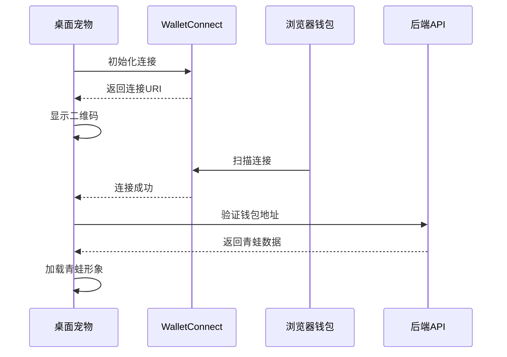
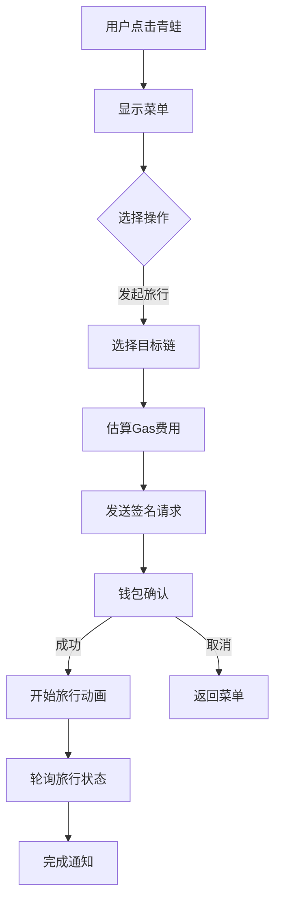
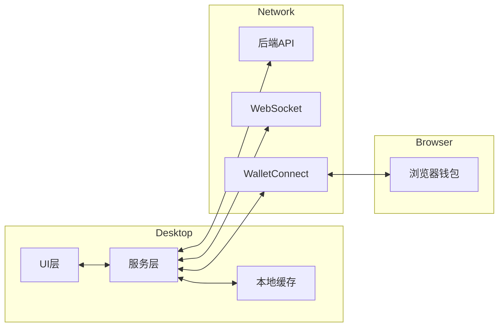

# 桌面宠物技术设计

> 本文档基于 `docs/01_需求设计/桌面宠物模块需求设计.md` 设计完整的技术方案。

## 一、系统概述

桌面宠物是 ZetaFrog 的特色功能，使用 Python + PyQt 实现跨平台桌面应用，让青蛙以桌面宠物形式陪伴用户。

---

## 二、技术栈

| 组件 | 技术 | 说明 |
|------|------|------|
| 语言 | Python 3.9+ | 主开发语言 |
| UI 框架 | PyQt6 | 跨平台桌面UI |
| 动画 | Lottie/GIF | 青蛙动画 |
| 钱包 | WalletConnect | 浏览器钱包连接 |
| 通信 | WebSocket | 实时消息 |
| 存储 | SQLite | 本地缓存 |

---

## 三、业务流程图

### 3.1 钱包连接流程



### 3.2 旅行触发流程



---

## 四、目录结构

```
desktop_pet/
├── main.py                    # 入口文件
├── config.py                  # 配置文件
├── requirements.txt           # 依赖
│
├── ui/                        # UI组件 (36个文件)
│   ├── pet_window.py          # 宠物主窗口
│   ├── tray_icon.py           # 系统托盘
│   ├── qr_dialog.py           # 二维码弹窗
│   ├── settings_dialog.py     # 设置界面
│   └── ...
│
├── services/                  # 服务层 (8个文件)
│   ├── api_service.py         # API通信
│   ├── wallet_service.py      # 钱包连接
│   ├── websocket_service.py   # WebSocket
│   ├── cache_service.py       # 本地缓存
│   └── ...
│
├── models/                    # 数据模型
│   └── frog.py                # 青蛙模型
│
├── assets/                    # 资源文件
│   └── animations/            # 动画资源
│
└── concept_demos/             # 概念演示
    └── ...
```

---

## 五、核心组件设计

### 5.1 PetWindow (宠物主窗口)

```python
class PetWindow(QWidget):
    """透明无边框宠物窗口"""
    
    def __init__(self):
        # 设置透明背景
        self.setAttribute(Qt.WA_TranslucentBackground)
        self.setWindowFlags(Qt.FramelessWindowHint | Qt.WindowStaysOnTopHint)
    
    def set_frog(self, frog_data: dict):
        """设置青蛙数据"""
        pass
    
    def play_animation(self, animation_name: str):
        """播放动画"""
        pass
    
    def on_click(self):
        """点击事件处理"""
        pass
```

### 5.2 WalletService (钱包服务)

```python
class WalletService:
    """WalletConnect 钱包服务"""
    
    async def connect(self) -> str:
        """建立连接，返回URI"""
        pass
    
    async def get_address(self) -> str:
        """获取连接的钱包地址"""
        pass
    
    async def sign_message(self, message: str) -> str:
        """请求签名"""
        pass
    
    async def send_transaction(self, tx: dict) -> str:
        """发送交易"""
        pass
```

### 5.3 APIService (API服务)

```python
class APIService:
    """后端API通信服务"""
    
    BASE_URL = "http://localhost:3001/api"
    
    async def get_frog(self, address: str) -> dict:
        """获取青蛙数据"""
        pass
    
    async def start_travel(self, token_id: int, chain_id: int) -> dict:
        """发起旅行"""
        pass
    
    async def get_travel_status(self, travel_id: int) -> dict:
        """获取旅行状态"""
        pass
```

---

## 六、功能模块

### 6.1 宠物显示

| 功能 | 说明 | 状态 |
|------|------|------|
| 透明窗口 | 无边框透明背景 | ✅ |
| 动画播放 | 支持多种动画状态 | ✅ |
| 拖拽移动 | 可拖拽到任意位置 | ✅ |
| 置顶显示 | 始终在最上层 | ✅ |

### 6.2 钱包功能

| 功能 | 说明 | 状态 |
|------|------|------|
| WalletConnect | 扫码连接浏览器钱包 | ✅ |
| 签名请求 | 发送签名请求到钱包 | ✅ |
| 交易发送 | 发送交易请求 | ✅ |

### 6.3 系统托盘

| 功能 | 说明 | 状态 |
|------|------|------|
| 托盘图标 | 系统托盘显示 | ✅ |
| 右键菜单 | 快捷操作菜单 | ✅ |
| 通知弹窗 | 系统通知 | ✅ |

---

## 七、数据流设计



---

## 八、变更记录

| 日期 | 版本 | 内容 |
|------|------|------|
| 2026-01-14 | 1.0 | 初始技术设计文档 |

---
