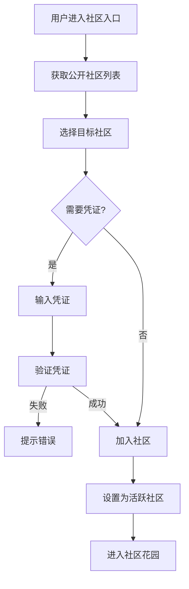
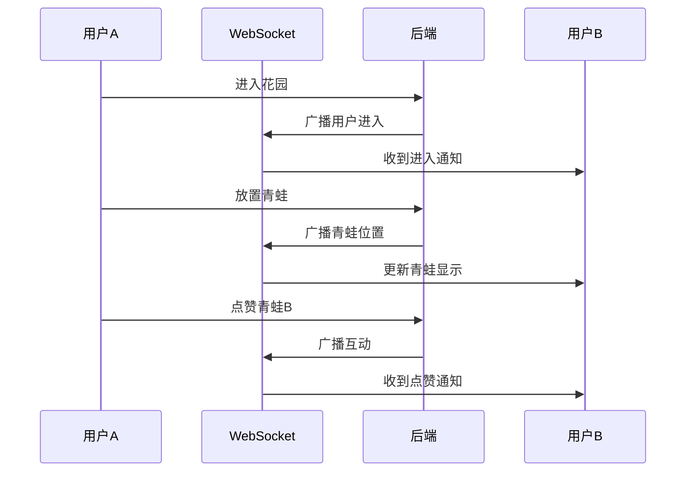

# 社区花园技术设计

> 本文档基于 `docs/01_需求设计/社区花园模块需求设计.md` 设计完整的技术方案。

## 一、系统概述

社区花园是公共社交空间，玩家可以在这里放置自己的青蛙与其他玩家互动。

---

## 二、核心功能

| 功能 | 说明 | 状态 |
|------|------|------|
| 公开社区 | 获取公开社区列表 | ✅ |
| 用户社区 | 获取用户加入的社区 | ✅ |
| 凭证验证 | 验证加入凭证 | ✅ |
| 设置活跃 | 切换活跃社区 | ✅ |
| 离开社区 | 退出社区 | ✅ |
| 社区详情 | 获取社区信息 | ✅ |
| 成员列表 | 获取社区成员 | ✅ |

---

## 三、业务流程图

### 3.1 加入社区流程



### 3.2 花园互动流程



---

## 四、数据模型设计

```prisma
// 社区定义 (存储于 community.service.ts)
interface Community {
  id: string;
  name: string;
  description: string;
  thumbnailUrl: string;
  isPresent: boolean;     // 是否公开
  requiredCredential: string; // 所需凭证
  memberCount: number;
  createdAt: Date;
}

// 用户社区关系
interface UserCommunity {
  userAddress: string;
  communityId: string;
  isActive: boolean;
  joinedAt: Date;
}

// 花园青蛙位置
interface GardenFrog {
  tokenId: number;
  owner: string;
  position: { x: number; y: number };
  joinedAt: Date;
  status: string;
}
```

---

## 五、服务架构设计

### 5.1 目录结构

```
backend/src/
├── api/routes/
│   └── community.routes.ts    # 社区API (142行)
│
├── services/
│   └── community.service.ts   # 社区服务 (7KB)
│
└── websocket/
    └── index.ts               # 花园实时事件
```

### 5.2 API 端点

| 端点 | 方法 | 说明 |
|------|------|------|
| `/communities/public` | GET | 公开社区列表 |
| `/communities/user/:address` | GET | 用户社区列表 |
| `/communities/verify-credential` | POST | 验证凭证 |
| `/communities/set-active` | POST | 设置活跃社区 |
| `/communities/leave` | POST | 离开社区 |
| `/communities/:id` | GET | 社区详情 |
| `/communities/:id/members` | GET | 社区成员 |

---

## 六、前端组件设计

### 6.1 组件结构

```
frontend/src/
├── pages/
│   └── GardenPage.tsx         # 花园页面 (21KB)
│
├── components/garden/
│   └── ...                    # 花园组件
│
└── hooks/
    ├── useGardenWebSocket.ts  # 花园WebSocket
    └── useGardenFrogMovement.ts # 青蛙移动逻辑
```

---

## 七、WebSocket 事件

| 事件 | 说明 |
|------|------|
| `garden:frog:enter` | 青蛙进入花园 |
| `garden:frog:move` | 青蛙移动 |
| `garden:frog:leave` | 青蛙离开 |
| `garden:interact` | 互动事件 |

---

## 八、变更记录

| 日期 | 版本 | 内容 |
|------|------|------|
| 2026-01-14 | 1.0 | 初始技术设计文档 |

---
