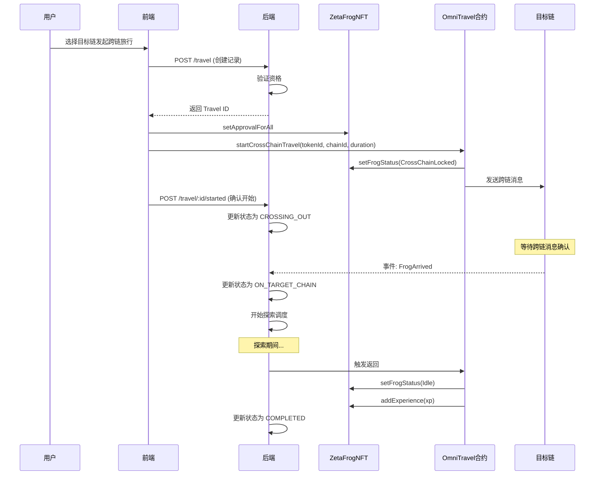
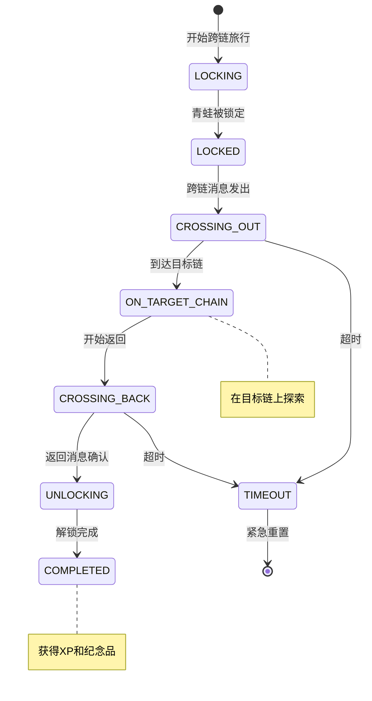

# 跨链交互模块技术设计

> 本文档基于 `docs/01_需求设计/跨链交互模块需求设计.md` 设计完整的技术方案。

## 一、系统概述

跨链交互模块基于 ZetaChain 的全链互操作性，支持青蛙跨链旅行、资产转移等功能，是 ZetaFrog 的核心特色功能。

---

## 二、支持的链

| 链名 | ChainId | 代码 | 状态 |
|------|---------|------|------|
| ZetaChain Athens (主链) | 7001 | ZETACHAIN_ATHENS | ✅ |
| BSC Testnet | 97 | BSC_TESTNET | ✅ |
| Ethereum Sepolia | 11155111 | ETH_SEPOLIA | ✅ |

---

## 三、业务流程图

### 3.1 跨链旅行完整流程



### 3.2 跨链状态机



---

## 四、数据模型设计

### 4.1 Prisma 数据模型

```prisma
// 跨链状态枚举
enum CrossChainStatus {
  LOCKING          // 锁定中
  LOCKED           // 已锁定
  CROSSING_OUT     // 跨链出发中
  ON_TARGET_CHAIN  // 在目标链上
  CROSSING_BACK    // 跨链返回中
  UNLOCKING        // 解锁中
  COMPLETED        // 完成
  TIMEOUT          // 超时
  FAILED           // 失败
}

// Travel 模型扩展字段
model Travel {
  // ... 基础字段
  
  // 跨链相关
  isCrossChain         Boolean               @default(false)
  crossChainStatus     CrossChainStatus?
  crossChainMessageId  String?               // 跨链消息ID
  lockTxHash           String?               // 锁定交易哈希
  unlockTxHash         String?               // 解锁交易哈希
  targetChainArrivalTime DateTime?           // 到达时间
  targetChainActions   Json?                 // 目标链操作记录
  returnMessageId      String?               // 返回消息ID
  crossChainXpEarned   Int?                  // 跨链XP
  refundAmount         String?               // 干粮返还 (wei)
}

// 跨链消息追踪
model CrossChainMessage {
  id              Int                @id @default(autoincrement())
  messageId       String             @unique
  tokenId         Int
  sourceChain     ChainType
  targetChain     ChainType
  direction       MessageDirection   // OUT / BACK
  status          CrossChainMessageStatus
  sendTxHash      String?
  receiveTxHash   String?
  payload         Json
  gasUsed         String?
  sentAt          DateTime
  confirmedAt     DateTime?
  createdAt       DateTime           @default(now())

  @@index([tokenId])
  @@index([status])
}
```

---

## 五、服务架构设计

### 5.1 目录结构

```
backend/src/
├── api/
│   └── routes/
│       ├── cross-chain.routes.ts         # 跨链 API (407行)
│       └── crosschain-transfer.routes.ts # 转账路由
│
├── services/
│   ├── omni-travel.service.ts            # 跨链旅行服务 (40KB)
│   ├── cross-chain-listener.service.ts   # 跨链事件监听 (22KB)
│   └── crosschain-transfer.service.ts    # 跨链转账服务
│
└── contracts/
    ├── OmniTravel.sol                    # 跨链旅行合约
    ├── FrogConnector.sol                 # ZetaChain连接器
    └── upgradeable/
        └── OmniTravelUpgradeable.sol     # 可升级版本
```

### 5.2 OmniTravelService 核心方法

| 方法 | 说明 |
|------|------|
| `getSupportedChains()` | 获取支持的链列表 |
| `canStartCrossChainTravel(tokenId, chainId)` | 检查资格 |
| `createCrossChainTravelRecord(...)` | 创建旅行记录 |
| `onCrossChainTravelStarted(travelId, messageId, txHash)` | 旅行开始回调 |
| `onFrogArrivedAtTarget(tokenId, messageId, arrivalTime)` | 到达目标链回调 |
| `onCrossChainTravelCompleted(tokenId, messageId, xp, txHash)` | 完成回调 |
| `getCrossChainTravelStatus(tokenId)` | 获取链上状态 |
| `checkVisitingFrogOnChain(tokenId, chainId)` | 检查访问状态 |
| `getActiveCrossChainTravels()` | 获取活跃旅行列表 |
| `syncCrossChainTravelState(tokenId)` | 同步链上状态 |
| `reconcileFrogStatus(tokenId)` | 状态协调检查 |

---

## 六、智能合约设计

### 6.1 OmniTravel.sol 核心函数

```solidity
// 开始跨链旅行
function startCrossChainTravel(
    uint256 tokenId,
    uint16 targetChainId,
    uint256 duration
) external payable;

// 处理跨链消息 (ZetaChain回调)
function onZetaMessage(ZetaInterfaces.ZetaMessage calldata message) external;

// 处理跨链回滚
function onZetaRevert(ZetaInterfaces.ZetaRevert calldata revert) external;

// 获取跨链旅行状态
struct CrossChainTravelInfo {
    bool isActive;
    uint16 targetChain;
    uint256 startTime;
    uint256 duration;
    bytes32 messageId;
}
function getCrossChainTravel(uint256 tokenId) external view returns (CrossChainTravelInfo);
```

### 6.2 FrogConnector.sol 核心函数

```solidity
// 接收跨链青蛙
function receiveVisitingFrog(uint256 tokenId, address owner, bytes calldata data) external;

// 青蛙返回
function sendFrogBack(uint256 tokenId) external payable;

// 检查访问中的青蛙
function isVisiting(uint256 tokenId) external view returns (bool);
```

---

## 七、验证计划

### 7.1 API 测试

| 测试项 | 验证内容 |
|--------|----------|
| 支持链列表 | 返回3条链配置 |
| 资格检查 | Idle状态可旅行 |
| 创建旅行 | 返回Travel ID |
| 状态查询 | 链上+数据库状态 |

### 7.2 端到端测试

1. 青蛙从 ZetaChain 发起跨链到 BSC
2. 验证青蛙状态变为 CrossChainLocked
3. 等待到达目标链（监听事件）
4. 在 BSC 上完成探索
5. 返回 ZetaChain，验证XP增加

---

## 八、Gas 估算

| 操作 | 预估 Gas | 费用 (测试网) |
|------|----------|---------------|
| startCrossChainTravel | ~300,000 | 0.003 ZETA |
| 跨链消息 | ~200,000 | ZetaChain 承担 |
| 返回消息 | ~200,000 | 包含在干粮中 |

---

## 九、变更记录

| 日期 | 版本 | 内容 |
|------|------|------|
| 2026-01-14 | 1.0 | 初始技术设计文档 |

---
