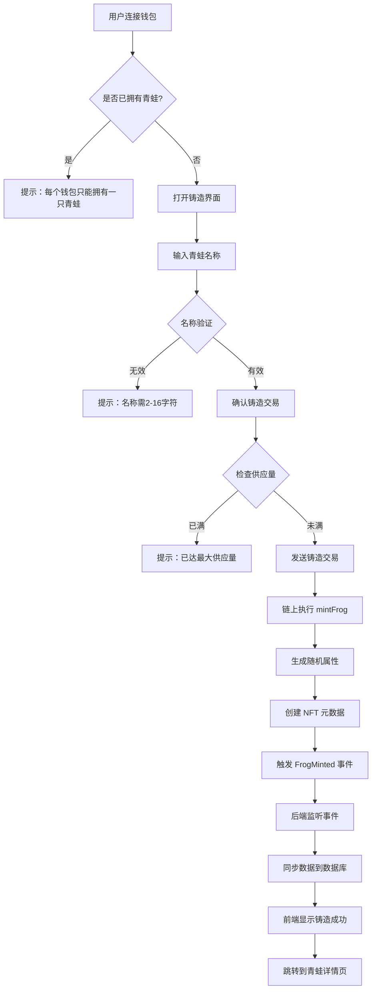
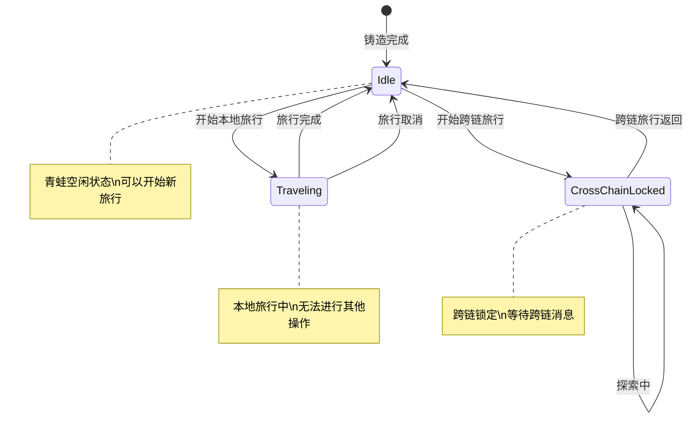
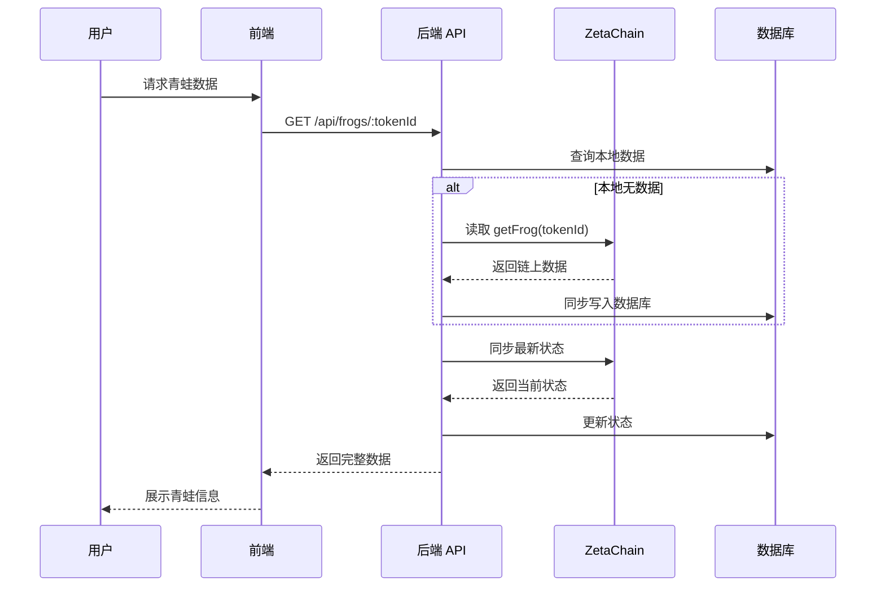
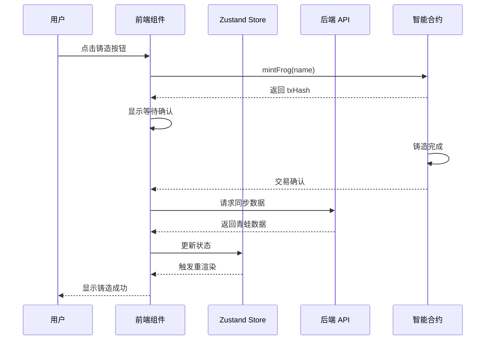

# 青蛙 NFT 模块技术设计

> 本文档基于 `docs/01_需求设计/青蛙NFT模块需求设计.md` 设计完整的技术方案。

## 一、系统概述

青蛙 NFT 模块是 ZetaFrog 项目的核心资产系统，负责管理青蛙 NFT 的铸造、属性维护、状态管理等功能。每只青蛙都是独特的 ERC-721 代币，拥有独特的外观和属性。

---

## 二、业务流程图

### 2.1 青蛙铸造流程



### 2.2 青蛙状态管理流程



### 2.3 链上数据同步流程



---

## 三、数据模型设计

### 3.1 智能合约数据结构

```solidity
// 青蛙状态枚举
enum FrogStatus {
    Idle,              // 空闲
    Traveling,         // 本地旅行中
    CrossChainLocked   // 跨链锁定
}

// 青蛙数据结构
struct Frog {
    string name;           // 青蛙名称 (2-16字符)
    uint64 birthday;       // 出生时间戳
    uint32 totalTravels;   // 总旅行次数
    FrogStatus status;     // 当前状态
    uint256 xp;            // 经验值
    uint256 level;         // 等级 (每100 XP升1级)
}
```

### 3.2 数据库模型 (Prisma)

```prisma
model Frog {
  id           String   @id @default(cuid())
  tokenId      Int      @unique
  name         String
  ownerAddress String   @unique  // 单钱包单青蛙
  birthday     DateTime
  status       FrogStatus @default(Idle)
  totalTravels Int      @default(0)
  xp           Int      @default(0)
  level        Int      @default(1)
  hunger       Int      @default(100)
  happiness    Int      @default(100)
  imageUrl     String?
  
  createdAt    DateTime @default(now())
  updatedAt    DateTime @updatedAt
  
  // 关联
  travels      Travel[]
  souvenirs    Souvenir[]
  badges       UserBadge[]
  
  @@index([ownerAddress])
  @@index([status])
}

enum FrogStatus {
  Idle
  Traveling
  CrossChainLocked
}
```

---

## 四、服务架构设计

### 4.1 目录结构

```
backend/src/
├── api/
│   └── routes/
│       └── frog.routes.ts          # 青蛙 API 路由
│
├── services/
│   └── frog/
│       ├── frog.service.ts         # 青蛙核心服务
│       ├── frog-sync.service.ts    # 链上同步服务
│       └── frog-status.service.ts  # 状态管理服务
│
├── workers/
│   └── eventListener.ts            # 链上事件监听
│
├── config/
│   └── contracts.ts                # 合约配置和ABI
│
└── abi/
    └── ZetaFrogNFT.json            # 合约ABI
```

### 4.2 核心服务职责

| 服务 | 职责 |
|------|------|
| `frog.routes.ts` | API 路由定义、请求处理 |
| `frog.service.ts` | 青蛙数据CRUD、业务逻辑 |
| `frog-sync.service.ts` | 链上数据同步、状态对账 |
| `eventListener.ts` | 监听 FrogMinted 等链上事件 |
| `omni-travel.service.ts` | 青蛙状态与旅行状态协调 |

---

## 五、智能合约设计

### 5.1 ZetaFrogNFT.sol - 核心 NFT 合约

```solidity
contract ZetaFrogNFT is ERC721URIStorage, Ownable, ReentrancyGuard, Pausable {
    
    // ============ 常量 ============
    uint256 public constant MAX_SUPPLY = 1000;
    
    // ============ 状态变量 ============
    uint256 private _tokenIdCounter;
    mapping(uint256 => Frog) public frogs;
    mapping(address => bool) public hasMinted;        // 单钱包限制
    mapping(address => uint256) public ownerToTokenId;
    
    address public travelContract;      // 旅行合约
    address public omniTravelContract;  // 跨链旅行合约
    
    // ============ 核心函数 ============
    
    /// @notice 铸造新青蛙 NFT
    function mintFrog(string calldata name) external returns (uint256);
    
    /// @notice 设置青蛙状态 (仅旅行合约可调用)
    function setFrogStatus(uint256 tokenId, FrogStatus status) external;
    
    /// @notice 增加经验值 (仅旅行合约可调用)
    function addExperience(uint256 tokenId, uint256 xpAmount) external;
    
    /// @notice 获取青蛙完整数据
    function getFrog(uint256 tokenId) external view returns (...);
    
    /// @notice 根据地址获取 TokenId
    function getTokenIdByOwner(address owner) external view returns (uint256);
    
    /// @notice 检查地址是否拥有青蛙
    function hasFrog(address owner) external view returns (bool);
    
    // ============ 管理函数 ============
    
    /// @notice 设置旅行合约地址
    function setTravelContract(address _travelContract) external onlyOwner;
    
    /// @notice 紧急重置青蛙状态
    function emergencyResetFrogStatus(uint256 tokenId) external onlyOwner;
    
    /// @notice 批量重置青蛙状态
    function batchResetFrogStatus(uint256[] calldata tokenIds) external onlyOwner;
}
```

### 5.2 可升级版本 ZetaFrogNFTUpgradeable.sol

可升级版本额外支持：
- UUPS 代理模式
- 数据迁移功能 (`migrateFrog`, `batchMigrateFrogs`)
- 迁移完成标记 (`completeMigration`)

---

## 六、前端组件设计

### 6.1 组件结构

```
frontend/src/
├── components/
│   └── frog/
│       ├── FrogCard.tsx           # 青蛙卡片
│       ├── FrogContainer.tsx      # 青蛙容器
│       ├── FrogMint.tsx           # 铸造组件
│       ├── FrogPet.tsx            # 宠物显示
│       ├── FrogPetAnimated.tsx    # 动画版宠物
│       ├── FrogScene.tsx          # 场景组件
│       └── FrogSvg.tsx            # SVG图形
│
├── pages/
│   ├── FrogDetail.tsx             # 青蛙详情页
│   └── MyFrog.tsx                 # 我的青蛙页
│
├── hooks/
│   ├── useFrogData.ts             # 青蛙数据 Hook
│   ├── useFrogInteraction.ts      # 交互 Hook
│   ├── useFrogState.ts            # 状态 Hook
│   ├── useFrogStatus.ts           # 状态检测 Hook
│   ├── useMyFrog.ts               # 我的青蛙 Hook
│   └── useZetaFrog.ts             # 合约交互 Hook
│
├── stores/
│   └── frogStore.ts               # Zustand 状态管理
│
└── types/
    └── frogAnimation.ts           # 动画类型定义
```

### 6.2 核心交互流程



---

## 七、代码变更清单

### 7.1 现有文件 (已实现)

| 类别 | 文件路径 | 说明 |
|------|----------|------|
| 合约 | `contracts/ZetaFrogNFT.sol` | 核心NFT合约 |
| 合约 | `contracts/upgradeable/ZetaFrogNFTUpgradeable.sol` | 可升级版本 |
| 后端 | `backend/src/api/routes/frog.routes.ts` | API路由 |
| 后端 | `backend/src/abi/ZetaFrogNFT.json` | 合约ABI |
| 前端 | `frontend/src/components/frog/*.tsx` | 青蛙组件 |
| 前端 | `frontend/src/hooks/useFrog*.ts` | 青蛙Hooks |
| 前端 | `frontend/src/pages/FrogDetail.tsx` | 详情页 |
| 前端 | `frontend/src/pages/MyFrog.tsx` | 我的青蛙页 |

### 7.2 依赖模块

| 模块 | 用途 |
|------|------|
| 旅行系统 | 青蛙旅行功能，状态切换 |
| 徽章系统 | 青蛙成就与徽章 |
| 好友系统 | 青蛙社交功能 |
| 跨链模块 | 跨链旅行锁定 |

---

## 八、验证计划

### 8.1 合约验证

| 测试项 | 测试内容 | 运行命令 |
|--------|----------|----------|
| 铸造测试 | 铸造功能、单钱包限制 | `npx hardhat test test/ZetaFrogNFT.test.js` |
| 状态测试 | 状态切换权限 | 同上 |
| 升级测试 | 可升级合约功能 | 同上 |

### 8.2 API 验证

| 测试项 | 测试内容 | 验证方式 |
|--------|----------|----------|
| 获取青蛙 | GET /api/frogs/:tokenId | 手动调用API |
| 搜索青蛙 | GET /api/frogs/search | 手动调用API |
| 我的青蛙 | GET /api/frogs/my/:address | 手动调用API |
| 同步功能 | POST /api/frogs/sync | 手动调用API |

### 8.3 手动验证

1. **铸造青蛙**
   - 连接钱包
   - 点击铸造按钮
   - 输入青蛙名称
   - 确认交易
   - 验证青蛙显示正确

2. **查看青蛙详情**
   - 进入青蛙详情页
   - 验证属性显示正确
   - 验证旅行历史显示

3. **单钱包限制**
   - 尝试用同一钱包再次铸造
   - 验证被正确拒绝

---

## 九、风险与应对

| 风险 | 影响 | 应对措施 |
|------|------|----------|
| RPC 节点不稳定 | 无法同步链上数据 | 多 RPC 节点备份 |
| 铸造失败 | 用户体验差 | 友好错误提示、重试机制 |
| 状态不同步 | 数据不一致 | 按需健康检查、紧急重置功能 |
| 合约升级风险 | 数据丢失 | 完善的迁移流程、测试 |

---

## 十、变更记录

| 日期 | 版本 | 内容 |
|------|------|------|
| 2026-01-14 | 1.0 | 初始技术设计文档 |

---
