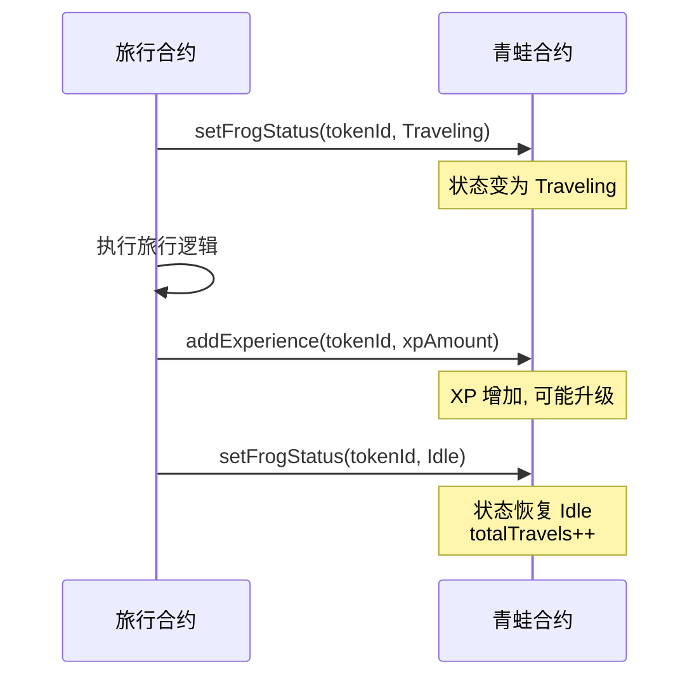
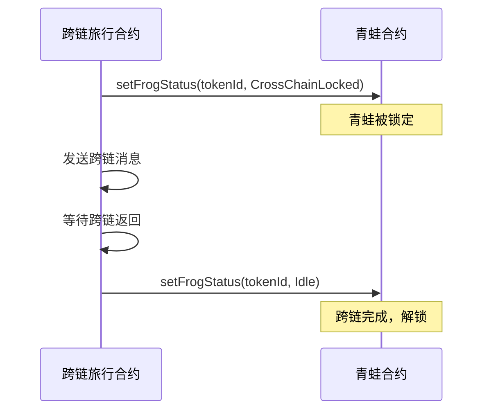

# 青蛙 NFT 模块规格

> 本文档定义青蛙 NFT 模块的技术规格和实现约定。

---

## 一、模块概述

青蛙 NFT 模块是 ZetaFrog 项目的核心资产系统，每只青蛙都是独特的 ERC-721 代币。

| 属性 | 值 |
|------|------|
| 模块名称 | 青蛙 NFT 系统 (Frog NFT System) |
| 依赖模块 | 用户系统、旅行系统、徽章系统、好友系统 |
| 技术栈 | Solidity + Node.js + TypeScript + React |
| 部署链 | ZetaChain Athens (测试网) |

---

## 二、核心功能

### 2.1 NFT 核心功能

| 功能点 | 说明 | 优先级 | 状态 |
|--------|------|--------|------|
| 铸造青蛙 | 用户铸造新的青蛙 NFT | P0 | ✅ 已实现 |
| 单钱包限制 | 每个钱包只能拥有一只青蛙 | P0 | ✅ 已实现 |
| 名称验证 | 青蛙名称 2-16 字符限制 | P0 | ✅ 已实现 |
| 查看详情 | 查看青蛙属性和状态 | P0 | ✅ 已实现 |
| 状态管理 | Idle/Traveling/CrossChainLocked | P0 | ✅ 已实现 |
| 经验等级 | 每 100 XP 升 1 级 | P0 | ✅ 已实现 |

### 2.2 管理功能

| 功能点 | 说明 | 优先级 | 状态 |
|--------|------|--------|------|
| 紧急重置 | 管理员重置青蛙状态 | P1 | ✅ 已实现 |
| 批量重置 | 批量重置多只青蛙状态 | P1 | ✅ 已实现 |
| 合约暂停 | 紧急情况暂停合约 | P1 | ✅ 已实现 |
| 可升级合约 | UUPS 代理模式支持升级 | P1 | ✅ 已实现 |

### 2.3 数据同步

| 功能点 | 说明 | 优先级 | 状态 |
|--------|------|--------|------|
| 事件监听 | 监听链上 FrogMinted 事件 | P0 | ✅ 已实现 |
| 按需同步 | API 调用时同步链上数据 | P0 | ✅ 已实现 |
| 健康检查 | 自动检测状态不一致 | P1 | ✅ 已实现 |

---

## 三、业务规则

### 3.1 铸造规则

| 规则 | 说明 |
|------|------|
| 最大供应量 | MAX_SUPPLY = 1000 |
| 单钱包限制 | 每个钱包地址只能拥有 1 只青蛙 |
| 名称长度 | 2-16 字符 (UTF-8) |
| Gas 费用 | 用户自付 (ZetaChain 原生代币) |

### 3.2 状态转换规则

```
         ┌──────────────────────────────────────┐
         │                                      │
         ▼                                      │
     ┌───────┐                            ┌─────┴─────┐
     │ Idle  │◀─────────────────────────▶│ Traveling │
     └───┬───┘    开始/完成本地旅行        └───────────┘
         │
         │ 开始/完成跨链旅行
         ▼
┌─────────────────┐
│ CrossChainLocked│
└─────────────────┘
```

### 3.3 经验值规则

| 等级 | 所需 XP | 累计 XP |
|------|---------|---------|
| 1 | 0 | 0 |
| 2 | 100 | 100 |
| 3 | 100 | 200 |
| 4 | 100 | 300 |
| 5 | 100 | 400 |
| ... | 100 | ... |

> 公式：`level = floor(xp / 100) + 1`

---

## 四、数据规格

### 4.1 青蛙属性

| 属性 | 类型 | 说明 | 存储位置 |
|------|------|------|----------|
| tokenId | uint256 | NFT Token ID | 链上 |
| name | string | 青蛙名称 (2-16字符) | 链上 |
| birthday | uint64 | 出生时间戳 | 链上 |
| status | FrogStatus | 当前状态 | 链上 |
| totalTravels | uint32 | 总旅行次数 | 链上 |
| xp | uint256 | 经验值 | 链上 |
| level | uint256 | 等级 | 链上 |
| hunger | int | 饥饿值 (0-100) | 数据库 |
| happiness | int | 快乐值 (0-100) | 数据库 |
| imageUrl | string | 图片链接 | 数据库/IPFS |

### 4.2 状态说明

| 状态 | 值 | 说明 |
|------|-----|------|
| Idle | 0 | 空闲，可以开始旅行 |
| Traveling | 1 | 本地旅行中 |
| CrossChainLocked | 2 | 跨链旅行锁定 |

---

## 五、接口约定

### 5.1 路由前缀

| 模块 | 前缀 |
|------|------|
| 青蛙 API | `/api/frogs` |

### 5.2 响应格式

```typescript
// 成功响应
interface SuccessResponse<T> {
  success: true;
  data: T;
  total?: number;  // 分页时使用
}

// 错误响应
interface ErrorResponse {
  success?: false;
  error: string;
}
```

---

## 六、服务依赖

| 服务 | 用途 | 必需 |
|------|------|------|
| PostgreSQL | 数据持久化 | ✅ |
| ZetaChain RPC | 链上交互 | ✅ |
| WebSocket | 在线状态推送 | ⚪ 可选 |

### 6.1 RPC 配置

| 环境变量 | 说明 | 默认值 |
|----------|------|--------|
| `ZETACHAIN_RPC_URL` | ZetaChain RPC 地址 | - |
| `ZETAFROG_NFT_ADDRESS` | NFT 合约地址 | - |

---

## 七、性能要求

| 指标 | 目标值 | 说明 |
|------|--------|------|
| 获取青蛙详情 | < 500ms | 包含链上同步 |
| 搜索响应 | < 200ms | 数据库查询 |
| 铸造交易确认 | < 30s | ZetaChain 出块时间 |
| 同步容差 | < 6 个区块 | 约 12 秒 |

---

## 八、安全要求

| 要求 | 说明 |
|------|------|
| 所有权验证 | 修改青蛙前验证 NFT 所有权 |
| 状态保护 | 仅授权合约可修改青蛙状态 |
| 重入保护 | ReentrancyGuard 防止重入攻击 |
| 暂停机制 | 紧急情况可暂停合约 |
| 输入验证 | 名称长度、地址格式验证 |

---

## 九、合约地址

### 9.1 测试网

| 合约 | 链 | 地址 |
|------|-----|------|
| ZetaFrogNFT | ZetaChain Athens | 部署时配置 |
| ZetaFrogNFTUpgradeable (Proxy) | ZetaChain Athens | 部署时配置 |

### 9.2 部署文件

| 文件 | 说明 |
|------|------|
| `contracts/deployments/ZetaFrogNFT-upgradeable-zetaAthens.json` | 可升级版本部署信息 |

---

## 十、扩展接口

### 10.1 与旅行系统的交互



### 10.2 与跨链模块的交互



---

## 十一、已知限制

| 限制 | 说明 | 应对方案 |
|------|------|----------|
| 最大供应量 | 1000 只青蛙 | 未来可通过升级调整 |
| 单钱包限制 | 一个钱包一只青蛙 | 设计决策，不可更改 |
| 不支持转移 | NFT 无法转移给他人 | 与单钱包限制配合 |
| 名称不可改 | 铸造后名称固定 | 设计决策 |

---

## 十二、变更记录

| 日期 | 版本 | 内容 |
|------|------|------|
| 2026-01-14 | 1.0 | 初始模块规格 |

---
