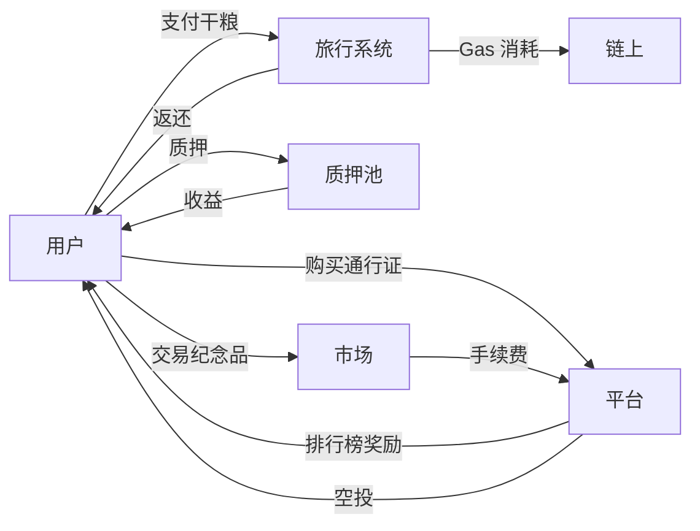

# ZetaFrog 旅行奖励系统设计文档

**版本**: v1.0  
**创建日期**: 2026-01-09  
**负责人**: ZetaFrog 产品团队  

---

## 📋 文档概述

本文档详细定义了 ZetaFrog 旅行奖励系统的完整设计方案，包括奖励类型、发放规则、稀有度设计、经济模型等核心内容。

---

## 🎯 设计目标

### 核心目标
1. **提升用户留存率**: 通过多层次奖励机制，让用户养成每日旅行习惯
2. **增强用户粘性**: 建立长期成长体系，提供持续的目标感
3. **促进社交裂变**: 通过社交奖励鼓励用户邀请好友
4. **构建经济闭环**: 奖励可交易、质押，形成内部经济系统

### 关键指标 (KPI)
- **日活跃用户 (DAU)**: 提升 50%
- **次日留存率**: 从 30% 提升至 60%
- **7 日留存率**: 从 15% 提升至 40%
- **月均旅行次数**: 从 5 次提升至 20 次
- **社交分享率**: 达到 25%

---

## 🎁 奖励体系架构

### 奖励分类矩阵

| 维度 | 即时奖励 | 累积奖励 | 周期奖励 | 社交奖励 | 特殊奖励 |
|------|---------|---------|---------|---------|---------|
| **发放时机** | 旅行完成时 | 达成条件时 | 每日/周/月 | 社交互动时 | 随机/节日 |
| **用户感知** | 即时满足 | 成就感 | 习惯养成 | 竞争/分享 | 惊喜/FOMO |
| **留存作用** | 短期 | 长期 | 中期 | 裂变 | 活跃度 |

---

## 一、即时奖励系统

### 1.1 经验值 (XP) 奖励

#### 基础规则
```
基础 XP = 旅行时长(小时) × 10
跨链加成 = 基础 XP × 2
首次访问新链 = +100 XP
```

#### 详细计算公式
| 旅行类型 | 时长 | 基础 XP | 加成 | 最终 XP |
|---------|------|---------|------|---------|
| 普通旅行 | 1h | 10 | - | 10 |
| 普通旅行 | 3h | 30 | - | 30 |
| 跨链旅行 | 1h | 10 | ×2 | 20 |
| 跨链旅行 | 3h | 30 | ×2 | 60 |
| 首次访问新链 | 任意 | 基础 | +100 | 基础+100 |

#### 特殊事件加成
- **发现合约地址**: +20 XP
- **发现稀有事件**: +50 XP
- **探索历史区块**: +100 XP
- **完成每日任务**: +50 XP
- **组队旅行**: 基础 XP × 1.5

### 1.2 干粮返还机制

#### 返还规则
```javascript
// 基础返还
未消耗干粮 = 支付干粮 - 实际消耗Gas
基础返还 = 未消耗干粮 × 20%

// 额外返还条件
if (发现节能路线) {
  额外返还 = 未消耗干粮 × 10%
}

if (提前结束旅行) {
  返还比例 = 50%
}

// 最终返还
总返还 = 基础返还 + 额外返还
```

#### 返还时机
- **旅行完成时**: 自动返还至用户钱包
- **紧急返回时**: 返还 50% 干粮
- **旅行失败时**: 返还 80% 干粮

### 1.3 纪念品 NFT 系统

#### 稀有度分级

| 稀有度 | 掉落概率 | 特征 | 示例 |
|--------|---------|------|------|
| **Common** | 70% | 普通链上快照 | "BSC 区块 #12345678" |
| **Uncommon** | 20% | 特定合约交互 | "PancakeSwap 交易记录" |
| **Rare** | 7% | 历史事件区块 | "The Merge 纪念" |
| **Epic** | 2.5% | 知名地址足迹 | "Vitalik 钱包快照" |
| **Legendary** | 0.5% | 限定事件 | "创世区块纪念品" |

#### 纪念品属性设计

```typescript
interface SouvenirNFT {
  id: string;
  name: string;
  rarity: 'Common' | 'Uncommon' | 'Rare' | 'Epic' | 'Legendary';
  chainType: ChainType;
  
  // 核心属性
  blockNumber: bigint;
  timestamp: Date;
  discoveryType: DiscoveryType;
  
  // 展示属性
  imageUrl: string;
  description: string;
  
  // 特殊属性
  isTradeble: boolean;
  套装ID?: string;
  特殊效果?: {
    干粮折扣?: number;  // 如 5% 折扣
    XP加成?: number;     // 如 10% 加成
  };
}
```

#### 套装系统

**套装示例**:
- **DeFi 探险家套装** (5件):
  - Uniswap 纪念品
  - AAVE 纪念品
  - Compound 纪念品
  - Curve 纪念品
  - Balancer 纪念品
  - **套装效果**: 干粮消耗 -15%, XP +20%

- **跨链先锋套装** (3件):
  - BSC 首次访问
  - ETH 首次访问
  - Polygon 首次访问
  - **套装效果**: 跨链旅行 XP +50%

---

## 二、累积奖励系统

### 2.1 徽章系统

#### 徽章分类

**探索类徽章** (12个):
| 徽章名称 | 解锁条件 | 稀有度 | 奖励 |
|---------|---------|--------|------|
| 🌍 链游者 | 访问 3 条链 | Common | +50 XP |
| 🌈 彩虹旅行家 | 访问 5 条链 | Uncommon | +100 XP |
| 🚀 全链探险家 | 访问所有链 | Epic | +500 XP + 称号 |
| 🏔️ 登峰造极 | 探索 10,000 区块 | Legendary | +1000 XP + NFT |

**发现类徽章** (10个):
| 徽章名称 | 解锁条件 | 稀有度 | 奖励 |
|---------|---------|--------|------|
| 🔍 侦探 | 发现 10 个合约 | Common | +50 XP |
| 🐋 鲸鱼追踪者 | 发现余额 >100 ETH | Rare | +200 XP |
| 💎 宝藏猎人 | 获得 5 个稀有纪念品 | Epic | +300 XP |
| 🎯 狙击手 | Gas 最低时旅行 | Uncommon | 干粮折扣券 |

**社交类徽章** (8个):
| 徽章名称 | 解锁条件 | 稀有度 | 奖励 |
|---------|---------|--------|------|
| 👥 好友达人 | 5 次结伴旅行 | Common | +50 XP |
| 💌 留言大师 | 收到 50 条留言 | Uncommon | 专属头像框 |
| 🎁 慷慨之蛙 | 赠送 10 个礼物 | Rare | +200 XP |

**时间类徽章** (6个):
| 徽章名称 | 解锁条件 | 稀有度 | 奖励 |
|---------|---------|--------|------|
| ⏰ 早起的蛙 | 连续 7 天旅行 | Uncommon | +100 XP |
| 📅 月度旅行家 | 单月 30 次旅行 | Rare | +500 XP |
| 🏆 年度探险家 | 全年 365 次旅行 | Legendary | 专属 NFT |

### 2.2 成就系统

#### 里程碑成就

```typescript
interface Achievement {
  id: string;
  name: string;
  description: string;
  category: 'milestone' | 'hidden' | 'special';
  
  // 解锁条件
  condition: {
    type: 'travel_count' | 'travel_duration' | 'discovery' | 'social';
    threshold: number;
  };
  
  // 奖励
  rewards: {
    xp: number;
    items?: string[];
    title?: string;
    nft?: string;
  };
  
  // 显示控制
  isHidden: boolean;
  icon: string;
}
```

**成就列表**:

| 成就名称 | 条件 | 奖励 | 类型 |
|---------|------|------|------|
| 初次旅行 | 完成 1 次旅行 | 100 XP | 里程碑 |
| 旅行新手 | 完成 10 次旅行 | 200 XP + Uncommon 纪念品 | 里程碑 |
| 旅行达人 | 完成 50 次旅行 | 500 XP + Rare 纪念品 | 里程碑 |
| 旅行大师 | 完成 100 次旅行 | 1000 XP + Epic NFT | 里程碑 |
| 传奇旅行家 | 完成 500 次旅行 | 5000 XP + Legendary NFT | 里程碑 |
| 午夜旅行者 | UTC 00:00 开始旅行 | 隐藏徽章 | 隐藏 |
| 幸运儿 | 单次获得 3 个稀有品 | 幸运称号 | 隐藏 |
| 时空旅行者 | 探索创世区块 | 限定 NFT | 隐藏 |

---

## 三、周期性奖励系统

### 3.1 每日宝箱

#### 解锁条件
- 当日完成至少 1 次旅行

#### 奖励内容
```javascript
每日宝箱 = {
  固定奖励: {
    XP: 50,
    ZETA: 0.001
  },
  
  概率奖励: [
    { 物品: 'Uncommon 纪念品', 概率: 10% },
    { 物品: '干粮折扣券 10%', 概率: 20% },
    { 物品: '家园装饰品', 概率: 5% }
  ]
}
```

#### 连续签到加成
| 连续天数 | 额外奖励 |
|---------|---------|
| 3 天 | +50 XP |
| 7 天 | +200 XP + Uncommon 纪念品 |
| 14 天 | +500 XP + Rare 纪念品 |
| 30 天 | +1000 XP + Epic 纪念品 + 专属称号 |

### 3.2 每周宝箱

#### 解锁条件
- 本周完成至少 5 次旅行

#### 奖励内容
```javascript
每周宝箱 = {
  固定奖励: {
    XP: 500,
    ZETA: 0.01,
    保底纪念品: 'Rare'
  },
  
  概率奖励: [
    { 物品: 'Epic 纪念品', 概率: 20% },
    { 物品: '限定装饰品', 概率: 15% },
    { 物品: '青蛙皮肤碎片', 概率: 10% }
  ]
}
```

### 3.3 月度宝箱

#### 解锁条件
- 本月完成至少 20 次旅行

#### 奖励内容
```javascript
月度宝箱 = {
  固定奖励: {
    XP: 2000,
    ZETA: 0.05,
    保底纪念品: 'Epic'
  },
  
  概率奖励: [
    { 物品: 'Legendary 纪念品', 概率: 5% },
    { 物品: '专属称号', 概率: 100% },
    { 物品: '高级家园主题', 概率: 30% }
  ]
}
```

### 3.4 赛季通行证

#### 赛季设置
- **赛季周期**: 30 天
- **赛季主题**: 每季更换（如"跨链探险家"、"合约猎人"）
- **等级上限**: 50 级
- **升级方式**: 旅行获得赛季积分

#### 积分规则
```javascript
赛季积分计算 = {
  普通旅行: 10 积分,
  跨链旅行: 20 积分,
  发现稀有事件: 30 积分,
  组队旅行: 15 积分,
  完成每日任务: 50 积分
}

升级所需积分 = 等级 × 100
```

#### 免费通道奖励

| 等级 | 奖励 |
|------|------|
| 5 | Common 徽章 |
| 10 | 家园装饰品 × 1 |
| 15 | Uncommon 纪念品 |
| 20 | Rare 纪念品 |
| 25 | 干粮折扣券 15% |
| 30 | 专属头像框 |
| 35 | Epic 纪念品 |
| 40 | 青蛙皮肤碎片 × 3 |
| 45 | 高级装饰品 |
| 50 | Epic 纪念品 + 赛季称号 |

#### 付费通道奖励 (额外)

| 等级 | 额外奖励 |
|------|----------|
| 5 | 干粮折扣券 20% |
| 10 | 独家青蛙皮肤 |
| 15 | Rare 纪念品 × 2 |
| 20 | Legendary 纪念品 |
| 25 | 限定表情包 |
| 30 | 高级家园主题包 |
| 35 | Epic 纪念品 × 2 |
| 40 | 限定 NFT 勋章 |
| 45 | 专属动画效果 |
| 50 | Legendary NFT + 永久称号 + VIP 特权 |

#### 定价策略
- **赛季通行证**: 0.1 ZETA (约 $5)
- **升级包** (直接升至 25 级): 0.2 ZETA
- **价值回报**: 付费通道总价值约 0.5 ZETA

---

## 四、社交奖励系统

### 4.1 排行榜系统

#### 排行榜类型
1. **旅行次数榜** (每周/每月)
2. **跨链探索榜** (每周/每月)
3. **稀有发现榜** (每月)
4. **社交达人榜** (每月)

#### 每周排行榜奖励

| 排名 | ZETA 奖励 | 纪念品 | 称号 |
|------|----------|--------|------|
| 🥇 1 | 0.1 | Legendary | "周冠军" (7天) |
| 🥈 2-10 | 0.05 | Epic | - |
| 🥉 11-50 | 0.01 | Rare | - |
| 51-100 | - | Uncommon | - |

#### 月度排行榜奖励

| 排名 | ZETA 奖励 | 纪念品 | 称号 |
|------|----------|--------|------|
| 🏆 1 | 1.0 | 专属 NFT | "月度传奇" (永久) |
| 2-5 | 0.5 | 限定皮肤 | "月度精英" (30天) |
| 6-20 | 0.2 | Epic | - |
| 21-50 | 0.05 | Rare | - |

### 4.2 推荐奖励系统

#### 推荐机制
```javascript
推荐流程 = {
  1. 用户生成专属推荐码,
  2. 好友使用推荐码注册,
  3. 好友完成首次旅行,
  4. 双方获得奖励
}
```

#### 奖励规则

| 里程碑 | 推荐人奖励 | 被推荐人奖励 |
|--------|-----------|-------------|
| 好友注册 | 0.005 ZETA | 0.005 ZETA |
| 好友首次旅行 | 100 XP + Rare 纪念品 | 100 XP + Rare 纪念品 |
| 推荐 5 人 | 专属徽章 + 0.05 ZETA | - |
| 推荐 10 人 | 限定装饰品 + 0.1 ZETA | - |
| 推荐 50 人 | Legendary 纪念品 + "布道者"称号 | - |

### 4.3 组队旅行奖励

#### 组队加成
```javascript
组队奖励 = {
  2人组队: {
    XP加成: 1.5倍,
    纪念品概率: +10%
  },
  
  3人组队: {
    XP加成: 2倍,
    纪念品概率: +20%,
    额外奖励: '组队宝箱'
  }
}
```

---

## 五、特殊奖励系统

### 5.1 节日限定奖励

#### 春节活动
- **时间**: 农历正月初一至十五
- **特殊纪念品**: 红包纪念品（可开出 0.001-0.1 ZETA）
- **限定装饰**: 灯笼、春联、鞭炮
- **活动任务**: 
  - 拜访 5 个好友 → 福字装饰
  - 完成 10 次旅行 → 龙年限定皮肤

#### 万圣节活动
- **时间**: 10月31日前后一周
- **特殊纪念品**: 幽灵合约纪念品
- **限定装饰**: 南瓜灯、蜘蛛网、墓碑
- **限定皮肤**: 幽灵青蛙、吸血鬼青蛙

#### 圣诞节活动
- **时间**: 12月24-26日
- **特殊纪念品**: 圣诞礼物盒
- **限定装饰**: 圣诞树、雪人、彩灯
- **活动任务**: 
  - 赠送 5 个礼物 → 圣诞老人帽子
  - 探索"雪链"(特定链) → 雪花纪念品

### 5.2 随机空投机制

#### 幸运旅行者
```javascript
每日空投 = {
  触发时间: '每天 UTC 12:00',
  抽取人数: 10,
  条件: '前一天完成至少 1 次旅行',
  奖励: '0.05 ZETA'
}
```

#### 神秘礼物
```javascript
旅行中触发 = {
  触发概率: 1%,
  触发时机: '旅行探索阶段',
  奖励: '双倍 XP + 保底 Rare 纪念品'
}
```

#### 链上彩蛋
```javascript
特殊区块奖励 = {
  '88888888': 'Legendary 纪念品 + 888 XP',
  '99999999': 'Epic 纪念品 + 999 XP',
  '创世区块': '限定 NFT + "创世见证者"称号'
}
```

### 5.3 成就解锁奖励

#### 收集图鉴奖励

| 完成度 | 奖励 |
|--------|------|
| 25% | 图鉴新手徽章 + 100 XP |
| 50% | 图鉴大师徽章 + 500 XP |
| 75% | Epic 纪念品 + 1000 XP |
| 100% | Legendary NFT + "完美收藏家"称号 + VIP 特权 |

---

## 六、长期投资奖励

### 6.1 质押奖励系统

#### 质押档位

| 质押量 | 每日收益 | 特权 |
|--------|---------|------|
| 10 ZETA | 0.001 ZETA | 干粮消耗 -10% |
| 50 ZETA | 0.006 ZETA | 干粮消耗 -10% + 稀有品概率 +20% |
| 100 ZETA | 0.015 ZETA | 干粮消耗 -20% + 稀有品概率 +30% + VIP 通道 |

#### VIP 特权
- 优先体验新功能
- 专属客服支持
- 每月赠送 1 个 Epic 纪念品
- 排行榜专属标识

### 6.2 持有者特权

#### Legendary 纪念品持有者
- 每周空投 0.01 ZETA
- 优先参与新赛季测试
- 社区治理投票权

#### 套装持有者
- 解锁隐藏旅行路线
- 获得"收藏家"永久称号
- 套装效果加成（干粮折扣、XP 加成）

---

## 七、经济模型设计

### 7.1 代币流转



### 7.2 奖励发放总量控制

#### 每日发放上限
```javascript
每日奖励池 = {
  宝箱奖励: 10 ZETA,
  排行榜奖励: 5 ZETA,
  随机空投: 0.5 ZETA,
  质押收益: 根据质押量动态计算,
  
  总计: 约 15-20 ZETA/天
}
```

#### 月度发放预算
```javascript
月度奖励池 = {
  每日宝箱: 300 ZETA,
  每周宝箱: 100 ZETA,
  月度宝箱: 50 ZETA,
  排行榜: 150 ZETA,
  赛季通行证: 200 ZETA,
  节日活动: 100 ZETA,
  
  总计: 约 900 ZETA/月
}
```

### 7.3 通缩机制

1. **纪念品销毁**: 合成高级纪念品时销毁低级纪念品
2. **干粮消耗**: 旅行消耗的 Gas 费用部分销毁
3. **市场手续费**: 纪念品交易手续费 5% 进入销毁池

---

## 八、实施优先级

### P0 (立即实施) - MVP
- ✅ 基础 XP 奖励
- ✅ 干粮返还机制
- ✅ 纪念品 NFT (Common/Uncommon/Rare)
- ✅ 基础徽章系统 (10 个)
- ✅ 每日宝箱

### P1 (短期 - 1-2 个月)
- 🔄 完整徽章系统 (36 个)
- 🔄 成就系统
- 🔄 每周/月度宝箱
- 🔄 赛季通行证
- 🔄 排行榜系统

### P2 (中期 - 3-6 个月)
- 📋 质押奖励
- 📋 节日活动
- 📋 随机空投
- 📋 套装系统
- 📋 纪念品交易市场

### P3 (长期 - 6+ 个月)
- 📅 持有者特权
- 📅 社区治理
- 📅 高级 VIP 系统
- 📅 跨项目联动奖励

---

## 九、数据监控指标

### 关键指标 (KPI)

| 指标 | 当前值 | 目标值 | 监控频率 |
|------|--------|--------|---------|
| 日均旅行次数 | - | 10,000 | 每日 |
| 宝箱开启率 | - | 80% | 每日 |
| 赛季通行证购买率 | - | 15% | 每周 |
| 纪念品交易量 | - | 1,000/天 | 每日 |
| 质押参与率 | - | 25% | 每周 |
| 排行榜参与率 | - | 40% | 每周 |

### 用户行为指标

| 指标 | 目标 |
|------|------|
| 平均每日旅行次数 | 2-3 次 |
| 徽章解锁率 | 60% 用户至少 5 个徽章 |
| 社交分享率 | 25% |
| 推荐转化率 | 10% |

---

## 十、风险控制

### 10.1 防刷机制

1. **旅行冷却时间**: 单个青蛙 1 小时内最多 1 次旅行
2. **IP 限制**: 同一 IP 每日最多 10 次旅行
3. **异常检测**: 
   - 连续 10 次相同路线 → 标记审查
   - 24 小时内超过 20 次旅行 → 限制奖励

### 10.2 经济平衡

1. **奖励衰减**: 单日第 5 次旅行后奖励递减 20%
2. **稀有品保护**: Legendary 纪念品每日全服发放上限 10 个
3. **通行证限购**: 每个钱包每赛季限购 1 次

### 10.3 应急预案

1. **奖励池不足**: 启动备用奖励池 (1000 ZETA)
2. **系统故障**: 补偿受影响用户双倍奖励
3. **恶意攻击**: 暂停奖励发放，调查后补发

---

## 附录

### A. 术语表

| 术语 | 定义 |
|------|------|
| XP | 经验值，用于青蛙升级 |
| 干粮 | ZETA 代币，用于支付旅行 Gas 费 |
| 纪念品 | 旅行获得的 NFT 收藏品 |
| 赛季 | 30 天为一个周期的活动期 |
| 套装 | 特定主题的纪念品组合 |

### B. 版本历史

| 版本 | 日期 | 变更内容 |
|------|------|---------|
| v1.0 | 2026-01-09 | 初始版本 |

---

**文档结束**
