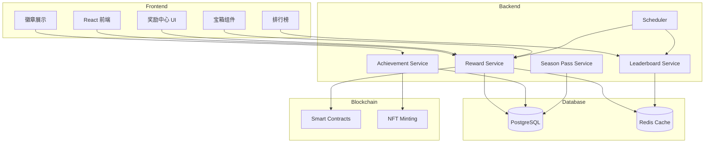

# ZetaFrog 旅行奖励系统技术需求文档 (PRD)

**版本**: v1.0  
**创建日期**: 2026-01-09  
**负责人**: ZetaFrog 技术团队  
**关联文档**: [奖励系统设计文档](./Reward_System_Design.md)

---

## 📋 文档概述

本文档详细说明了实现 ZetaFrog 旅行奖励系统所需的技术功能、数据模型、API 接口、前端组件等具体实施要求。

---

## 🎯 项目目标

### 业务目标
- 提升用户日活跃度 50%
- 提升次日留存率至 60%
- 实现月均旅行次数 20 次/用户

### 技术目标
- 构建可扩展的奖励系统架构
- 确保奖励发放的准确性和实时性
- 支持高并发场景（10,000+ 日活用户）
- 实现完整的数据追踪和分析能力

---

## 📊 系统架构

### 整体架构图



---

## 一、数据库设计

### 1.1 新增数据模型

#### 1. 宝箱系统 (Chest System)

```prisma
// 宝箱配置
model ChestConfig {
  id          String   @id @default(cuid())
  type        ChestType // DAILY, WEEKLY, MONTHLY
  name        String
  description String
  
  // 解锁条件
  unlockCondition Json  // { type: 'travel_count', value: 1 }
  
  // 固定奖励
  fixedRewards    Json  // { xp: 50, zeta: 0.001 }
  
  // 概率奖励池
  probabilityRewards Json // [{ item: 'souvenir', rarity: 'Uncommon', probability: 0.1 }]
  
  // 冷却时间（秒）
  cooldown    Int      @default(86400) // 24小时
  
  isActive    Boolean  @default(true)
  createdAt   DateTime @default(now())
  updatedAt   DateTime @updatedAt
}

enum ChestType {
  DAILY
  WEEKLY
  MONTHLY
  SPECIAL
}

// 用户宝箱记录
model UserChest {
  id           String      @id @default(cuid())
  frogId       Int
  chestType    ChestType
  
  // 开启记录
  openedAt     DateTime    @default(now())
  rewards      Json        // 获得的奖励详情
  
  // 连续签到
  streakDays   Int         @default(1)
  
  frog         Frog        @relation(fields: [frogId], references: [id])
  
  @@index([frogId, chestType])
  @@index([openedAt])
}

// 宝箱冷却状态
model ChestCooldown {
  id           String      @id @default(cuid())
  frogId       Int
  chestType    ChestType
  nextAvailable DateTime   // 下次可开启时间
  
  frog         Frog        @relation(fields: [frogId], references: [id])
  
  @@unique([frogId, chestType])
  @@index([frogId])
}
```

#### 2. 成就系统 (Achievement System)

```prisma
// 成就定义
model Achievement {
  id           String             @id @default(cuid())
  code         String             @unique
  name         String
  description  String
  category     AchievementCategory
  
  // 解锁条件
  unlockType   AchievementUnlockType
  unlockCondition Json            // { type: 'travel_count', threshold: 10 }
  
  // 奖励
  rewards      Json               // { xp: 200, items: ['souvenir_rare'] }
  
  // 显示控制
  isHidden     Boolean            @default(false)
  icon         String
  rarity       Rarity             @default(Common)
  
  createdAt    DateTime           @default(now())
  
  userAchievements UserAchievement[]
}

enum AchievementCategory {
  MILESTONE      // 里程碑
  EXPLORATION    // 探索
  DISCOVERY      // 发现
  SOCIAL         // 社交
  TIME_BASED     // 时间类
  HIDDEN         // 隐藏
  SPECIAL        // 特殊
}

enum AchievementUnlockType {
  TRAVEL_COUNT       // 旅行次数
  TRAVEL_DURATION    // 旅行时长
  CHAIN_VISIT        // 访问链数
  DISCOVERY_COUNT    // 发现数量
  SOCIAL_INTERACTION // 社交互动
  COLLECTION         // 收集
  SPECIAL_EVENT      // 特殊事件
}

// 用户成就记录（已存在，需扩展）
model UserAchievement {
  id             String      @id @default(cuid())
  frogId         Int
  achievementId  String
  
  unlockedAt     DateTime    @default(now())
  progress       Int         @default(0)  // 进度（如 50/100）
  isCompleted    Boolean     @default(false)
  
  // 解锁时的快照数据
  metadata       Json?
  
  achievement    Achievement @relation(fields: [achievementId], references: [id])
  frog           Frog        @relation(fields: [frogId], references: [id])
  
  @@unique([frogId, achievementId])
  @@index([frogId])
  @@index([isCompleted])
}
```

#### 3. 赛季通行证系统 (Season Pass)

```prisma
// 赛季配置
model Season {
  id           String      @id @default(cuid())
  name         String
  theme        String
  description  String
  
  startDate    DateTime
  endDate      DateTime
  
  maxLevel     Int         @default(50)
  
  // 奖励配置
  freeRewards  Json        // { 5: [{ type: 'badge', id: 'xxx' }], 10: [...] }
  premiumRewards Json      // 付费通道奖励
  
  // 定价
  price        String      @default("0.1") // ZETA
  
  isActive     Boolean     @default(true)
  createdAt    DateTime    @default(now())
  
  userSeasons  UserSeason[]
}

// 用户赛季进度
model UserSeason {
  id           String      @id @default(cuid())
  frogId       Int
  seasonId     String
  
  // 进度
  currentLevel Int         @default(1)
  currentXP    Int         @default(0)
  
  // 是否购买付费通道
  isPremium    Boolean     @default(false)
  purchasedAt  DateTime?
  
  // 已领取的奖励等级
  claimedLevels Int[]      @default([])
  
  createdAt    DateTime    @default(now())
  updatedAt    DateTime    @updatedAt
  
  season       Season      @relation(fields: [seasonId], references: [id])
  frog         Frog        @relation(fields: [frogId], references: [id])
  
  @@unique([frogId, seasonId])
  @@index([frogId])
  @@index([seasonId])
}

// 赛季积分记录
model SeasonPointLog {
  id           String      @id @default(cuid())
  frogId       Int
  seasonId     String
  
  points       Int
  source       String      // 'travel', 'quest', 'discovery'
  description  String
  
  createdAt    DateTime    @default(now())
  
  @@index([frogId, seasonId])
  @@index([createdAt])
}
```

#### 4. 排行榜系统 (Leaderboard)

```prisma
// 排行榜配置
model LeaderboardConfig {
  id           String           @id @default(cuid())
  type         LeaderboardType
  name         String
  description  String
  
  // 周期
  period       LeaderboardPeriod // WEEKLY, MONTHLY
  
  // 排名规则
  rankingRule  Json             // { metric: 'travel_count', order: 'desc' }
  
  // 奖励配置
  rewards      Json             // { 1: { zeta: 0.1, souvenir: 'legendary' }, ... }
  
  isActive     Boolean          @default(true)
  createdAt    DateTime         @default(now())
  
  entries      LeaderboardEntry[]
}

enum LeaderboardType {
  TRAVEL_COUNT      // 旅行次数
  CROSS_CHAIN       // 跨链探索
  RARE_DISCOVERY    // 稀有发现
  SOCIAL_ACTIVITY   // 社交活跃
}

enum LeaderboardPeriod {
  WEEKLY
  MONTHLY
  ALL_TIME
}

// 排行榜条目
model LeaderboardEntry {
  id              String            @id @default(cuid())
  leaderboardId   String
  frogId          Int
  
  // 排名数据
  rank            Int
  score           Int               // 分数（旅行次数、发现数等）
  
  // 周期标识
  periodStart     DateTime
  periodEnd       DateTime
  
  // 奖励状态
  rewardClaimed   Boolean           @default(false)
  rewardClaimedAt DateTime?
  
  createdAt       DateTime          @default(now())
  updatedAt       DateTime          @updatedAt
  
  leaderboard     LeaderboardConfig @relation(fields: [leaderboardId], references: [id])
  frog            Frog              @relation(fields: [frogId], references: [id])
  
  @@unique([leaderboardId, frogId, periodStart])
  @@index([leaderboardId, rank])
  @@index([frogId])
}
```

#### 5. 推荐系统 (Referral System)

```prisma
// 推荐关系
model Referral {
  id              String      @id @default(cuid())
  referrerFrogId  Int         // 推荐人
  refereeFrogId   Int         // 被推荐人
  
  referralCode    String      // 推荐码
  
  // 状态
  status          ReferralStatus @default(PENDING)
  
  // 奖励发放
  referrerRewarded Boolean    @default(false)
  refereeRewarded  Boolean    @default(false)
  
  createdAt       DateTime    @default(now())
  completedAt     DateTime?   // 被推荐人完成首次旅行时间
  
  referrer        Frog        @relation("ReferrerFrog", fields: [referrerFrogId], references: [id])
  referee         Frog        @relation("RefereeFrog", fields: [refereeFrogId], references: [id])
  
  @@index([referralCode])
  @@index([referrerFrogId])
  @@index([refereeFrogId])
}

enum ReferralStatus {
  PENDING       // 待完成
  COMPLETED     // 已完成
  REWARDED      // 已发放奖励
}

// 推荐里程碑
model ReferralMilestone {
  id              String      @id @default(cuid())
  frogId          Int
  
  totalReferrals  Int         @default(0)
  
  // 里程碑奖励领取记录
  milestone5      Boolean     @default(false)
  milestone10     Boolean     @default(false)
  milestone50     Boolean     @default(false)
  
  updatedAt       DateTime    @updatedAt
  
  frog            Frog        @relation(fields: [frogId], references: [id])
  
  @@unique([frogId])
}
```

#### 6. 奖励发放记录 (Reward Log)

```prisma
// 奖励发放日志
model RewardLog {
  id           String      @id @default(cuid())
  frogId       Int
  
  // 奖励类型
  rewardType   RewardType
  rewardSource String      // 'travel', 'chest', 'achievement', 'leaderboard'
  
  // 奖励内容
  rewards      Json        // { xp: 50, zeta: 0.001, items: [...] }
  
  // 关联ID
  sourceId     String?     // 旅行ID、宝箱ID等
  
  // 状态
  status       RewardStatus @default(PENDING)
  claimedAt    DateTime?
  
  createdAt    DateTime    @default(now())
  
  frog         Frog        @relation(fields: [frogId], references: [id])
  
  @@index([frogId])
  @@index([rewardType])
  @@index([status])
  @@index([createdAt])
}

enum RewardType {
  XP
  ZETA
  SOUVENIR
  BADGE
  ACHIEVEMENT
  DECORATION
  SKIN
  TITLE
  CHEST
}

enum RewardStatus {
  PENDING      // 待领取
  CLAIMED      // 已领取
  EXPIRED      // 已过期
  FAILED       // 发放失败
}
```

#### 7. 每日任务系统 (Daily Quest)

```prisma
// 任务配置
model QuestConfig {
  id           String      @id @default(cuid())
  type         QuestType
  name         String
  description  String
  
  // 任务条件
  condition    Json        // { type: 'travel_count', value: 3 }
  
  // 奖励
  rewards      Json        // { xp: 50, zeta: 0.005 }
  
  // 重置周期
  resetPeriod  QuestPeriod @default(DAILY)
  
  isActive     Boolean     @default(true)
  createdAt    DateTime    @default(now())
  
  userQuests   UserQuest[]
}

enum QuestType {
  DAILY
  WEEKLY
  SPECIAL
}

enum QuestPeriod {
  DAILY
  WEEKLY
  MONTHLY
  ONE_TIME
}

// 用户任务进度
model UserQuest {
  id           String      @id @default(cuid())
  frogId       Int
  questId      String
  
  // 进度
  progress     Int         @default(0)
  target       Int
  isCompleted  Boolean     @default(false)
  
  // 奖励领取
  rewardClaimed Boolean    @default(false)
  
  // 周期标识
  periodStart  DateTime
  periodEnd    DateTime
  
  createdAt    DateTime    @default(now())
  updatedAt    DateTime    @updatedAt
  
  quest        QuestConfig @relation(fields: [questId], references: [id])
  frog         Frog        @relation(fields: [frogId], references: [id])
  
  @@unique([frogId, questId, periodStart])
  @@index([frogId])
  @@index([isCompleted])
}
```

### 1.2 扩展现有模型

需要在现有 `Frog` 模型中添加关联:

```prisma
model Frog {
  // ... 现有字段
  
  // 新增关联
  userChests         UserChest[]
  chestCooldowns     ChestCooldown[]
  userAchievements   UserAchievement[]
  userSeasons        UserSeason[]
  leaderboardEntries LeaderboardEntry[]
  referralsAsSender  Referral[]         @relation("ReferrerFrog")
  referralsAsReceiver Referral[]        @relation("RefereeFrog")
  referralMilestone  ReferralMilestone?
  rewardLogs         RewardLog[]
  userQuests         UserQuest[]
}
```

---

## 二、后端服务设计

### 2.1 服务架构

#### 核心服务模块

```
backend/src/services/
├── reward/
│   ├── reward.service.ts          # 奖励核心服务
│   ├── chest.service.ts           # 宝箱服务
│   ├── achievement.service.ts     # 成就服务
│   ├── season.service.ts          # 赛季通行证服务
│   ├── leaderboard.service.ts     # 排行榜服务
│   ├── referral.service.ts        # 推荐服务
│   └── quest.service.ts           # 任务服务
├── scheduler/
│   ├── daily-reset.scheduler.ts   # 每日重置任务
│   ├── leaderboard.scheduler.ts   # 排行榜结算
│   └── season.scheduler.ts        # 赛季结算
└── analytics/
    └── reward-analytics.service.ts # 奖励数据分析
```

### 2.2 核心服务接口

#### RewardService (奖励核心服务)

```typescript
class RewardService {
  /**
   * 计算旅行奖励
   */
  async calculateTravelReward(params: {
    frogId: number;
    travelId: number;
    duration: number;
    isCrossChain: boolean;
    discoveries: Discovery[];
  }): Promise<TravelReward>;

  /**
   * 发放奖励
   */
  async grantReward(params: {
    frogId: number;
    rewardType: RewardType;
    rewards: RewardContent;
    source: string;
    sourceId?: string;
  }): Promise<RewardLog>;

  /**
   * 批量发放奖励
   */
  async grantBatchRewards(
    grants: RewardGrant[]
  ): Promise<RewardLog[]>;

  /**
   * 领取奖励
   */
  async claimReward(
    frogId: number,
    rewardLogId: string
  ): Promise<void>;

  /**
   * 获取待领取奖励
   */
  async getPendingRewards(
    frogId: number
  ): Promise<RewardLog[]>;
}

interface TravelReward {
  xp: number;
  provisionsRefund: number;
  souvenirs: Souvenir[];
  achievements: Achievement[];
  badges: Badge[];
}

interface RewardContent {
  xp?: number;
  zeta?: number;
  souvenirs?: { rarity: Rarity; count: number }[];
  items?: { type: string; id: string }[];
}
```

#### ChestService (宝箱服务)

```typescript
class ChestService {
  /**
   * 检查宝箱是否可开启
   */
  async canOpenChest(
    frogId: number,
    chestType: ChestType
  ): Promise<{
    canOpen: boolean;
    reason?: string;
    nextAvailable?: Date;
  }>;

  /**
   * 开启宝箱
   */
  async openChest(
    frogId: number,
    chestType: ChestType
  ): Promise<{
    rewards: RewardContent;
    streakDays: number;
  }>;

  /**
   * 获取宝箱状态
   */
  async getChestStatus(
    frogId: number
  ): Promise<ChestStatus[]>;

  /**
   * 计算宝箱奖励（内部方法）
   */
  private calculateChestRewards(
    config: ChestConfig,
    streakDays: number
  ): RewardContent;
}

interface ChestStatus {
  type: ChestType;
  canOpen: boolean;
  nextAvailable?: Date;
  streakDays: number;
}
```

#### AchievementService (成就服务)

```typescript
class AchievementService {
  /**
   * 检查并解锁成就
   */
  async checkAndUnlockAchievements(
    frogId: number,
    event: AchievementEvent
  ): Promise<Achievement[]>;

  /**
   * 更新成就进度
   */
  async updateAchievementProgress(
    frogId: number,
    achievementCode: string,
    progress: number
  ): Promise<void>;

  /**
   * 获取用户成就列表
   */
  async getUserAchievements(
    frogId: number,
    filter?: {
      category?: AchievementCategory;
      isCompleted?: boolean;
    }
  ): Promise<UserAchievement[]>;

  /**
   * 获取成就完成度
   */
  async getAchievementCompletion(
    frogId: number
  ): Promise<{
    total: number;
    completed: number;
    percentage: number;
  }>;
}

interface AchievementEvent {
  type: 'travel_complete' | 'discovery' | 'social' | 'collection';
  data: any;
}
```

#### SeasonService (赛季通行证服务)

```typescript
class SeasonService {
  /**
   * 获取当前赛季
   */
  async getCurrentSeason(): Promise<Season | null>;

  /**
   * 购买赛季通行证
   */
  async purchaseSeasonPass(
    frogId: number,
    seasonId: string
  ): Promise<UserSeason>;

  /**
   * 添加赛季积分
   */
  async addSeasonPoints(
    frogId: number,
    points: number,
    source: string,
    description: string
  ): Promise<{
    newLevel: number;
    leveledUp: boolean;
  }>;

  /**
   * 领取赛季奖励
   */
  async claimSeasonReward(
    frogId: number,
    level: number
  ): Promise<RewardContent>;

  /**
   * 获取用户赛季进度
   */
  async getUserSeasonProgress(
    frogId: number,
    seasonId: string
  ): Promise<UserSeason>;
}
```

#### LeaderboardService (排行榜服务)

```typescript
class LeaderboardService {
  /**
   * 更新排行榜分数
   */
  async updateScore(
    frogId: number,
    leaderboardType: LeaderboardType,
    score: number
  ): Promise<void>;

  /**
   * 获取排行榜
   */
  async getLeaderboard(
    type: LeaderboardType,
    period: LeaderboardPeriod,
    limit: number = 100
  ): Promise<LeaderboardEntry[]>;

  /**
   * 获取用户排名
   */
  async getUserRank(
    frogId: number,
    type: LeaderboardType,
    period: LeaderboardPeriod
  ): Promise<{
    rank: number;
    score: number;
    totalParticipants: number;
  }>;

  /**
   * 结算排行榜奖励（定时任务调用）
   */
  async settleLeaderboard(
    type: LeaderboardType,
    period: LeaderboardPeriod
  ): Promise<void>;
}
```

#### ReferralService (推荐服务)

```typescript
class ReferralService {
  /**
   * 生成推荐码
   */
  async generateReferralCode(
    frogId: number
  ): Promise<string>;

  /**
   * 使用推荐码注册
   */
  async useReferralCode(
    refereeFrogId: number,
    referralCode: string
  ): Promise<Referral>;

  /**
   * 完成推荐（被推荐人首次旅行时调用）
   */
  async completeReferral(
    refereeFrogId: number
  ): Promise<void>;

  /**
   * 检查并发放里程碑奖励
   */
  async checkMilestoneRewards(
    referrerFrogId: number
  ): Promise<RewardContent[]>;

  /**
   * 获取推荐统计
   */
  async getReferralStats(
    frogId: number
  ): Promise<{
    totalReferrals: number;
    completedReferrals: number;
    pendingReferrals: number;
  }>;
}
```

#### QuestService (任务服务)

```typescript
class QuestService {
  /**
   * 获取用户当前任务
   */
  async getUserQuests(
    frogId: number,
    type: QuestType
  ): Promise<UserQuest[]>;

  /**
   * 更新任务进度
   */
  async updateQuestProgress(
    frogId: number,
    questId: string,
    increment: number
  ): Promise<{
    completed: boolean;
    progress: number;
  }>;

  /**
   * 领取任务奖励
   */
  async claimQuestReward(
    frogId: number,
    questId: string
  ): Promise<RewardContent>;

  /**
   * 重置每日任务（定时任务调用）
   */
  async resetDailyQuests(): Promise<void>;
}
```

### 2.3 定时任务设计

#### 每日重置任务

```typescript
// backend/src/scheduler/daily-reset.scheduler.ts

@Injectable()
export class DailyResetScheduler {
  /**
   * 每日 UTC 00:00 执行
   */
  @Cron('0 0 * * *', { timeZone: 'UTC' })
  async handleDailyReset() {
    // 1. 重置每日宝箱冷却
    await this.chestService.resetDailyChests();
    
    // 2. 重置每日任务
    await this.questService.resetDailyQuests();
    
    // 3. 发放幸运旅行者空投
    await this.rewardService.distributeLuckyTravelerAirdrop();
    
    // 4. 清理过期奖励
    await this.rewardService.cleanupExpiredRewards();
  }
}
```

#### 排行榜结算任务

```typescript
// backend/src/scheduler/leaderboard.scheduler.ts

@Injectable()
export class LeaderboardScheduler {
  /**
   * 每周一 UTC 00:00 结算周榜
   */
  @Cron('0 0 * * 1', { timeZone: 'UTC' })
  async handleWeeklyLeaderboard() {
    const types = [
      LeaderboardType.TRAVEL_COUNT,
      LeaderboardType.CROSS_CHAIN,
      LeaderboardType.RARE_DISCOVERY,
      LeaderboardType.SOCIAL_ACTIVITY
    ];
    
    for (const type of types) {
      await this.leaderboardService.settleLeaderboard(
        type,
        LeaderboardPeriod.WEEKLY
      );
    }
  }

  /**
   * 每月1日 UTC 00:00 结算月榜
   */
  @Cron('0 0 1 * *', { timeZone: 'UTC' })
  async handleMonthlyLeaderboard() {
    // 同上，结算月度排行榜
  }
}
```

---

## 三、API 接口设计

### 3.1 RESTful API 端点

#### 宝箱相关

```typescript
// GET /api/rewards/chests/status
// 获取宝箱状态
GET /api/rewards/chests/status?frogId={frogId}

Response:
{
  "chests": [
    {
      "type": "DAILY",
      "canOpen": true,
      "streakDays": 5,
      "nextAvailable": null
    },
    {
      "type": "WEEKLY",
      "canOpen": false,
      "streakDays": 0,
      "nextAvailable": "2026-01-10T00:00:00Z"
    }
  ]
}

// POST /api/rewards/chests/open
// 开启宝箱
POST /api/rewards/chests/open
Body: {
  "frogId": 123,
  "chestType": "DAILY"
}

Response:
{
  "rewards": {
    "xp": 50,
    "zeta": 0.001,
    "souvenirs": [
      { "rarity": "Uncommon", "name": "BSC Explorer Badge" }
    ]
  },
  "streakDays": 6
}
```

#### 成就相关

```typescript
// GET /api/rewards/achievements
// 获取用户成就列表
GET /api/rewards/achievements?frogId={frogId}&category={category}

Response:
{
  "achievements": [
    {
      "id": "ach_123",
      "code": "first_travel",
      "name": "初次旅行",
      "description": "完成第一次旅行",
      "category": "MILESTONE",
      "isCompleted": true,
      "unlockedAt": "2026-01-08T10:00:00Z",
      "rewards": { "xp": 100 }
    }
  ],
  "completion": {
    "total": 50,
    "completed": 12,
    "percentage": 24
  }
}
```

#### 赛季通行证相关

```typescript
// GET /api/rewards/season/current
// 获取当前赛季信息
GET /api/rewards/season/current

Response:
{
  "season": {
    "id": "season_202601",
    "name": "跨链探险家",
    "theme": "Cross-Chain Explorer",
    "startDate": "2026-01-01T00:00:00Z",
    "endDate": "2026-01-31T23:59:59Z",
    "maxLevel": 50
  }
}

// GET /api/rewards/season/progress
// 获取用户赛季进度
GET /api/rewards/season/progress?frogId={frogId}

Response:
{
  "currentLevel": 15,
  "currentXP": 450,
  "nextLevelXP": 1500,
  "isPremium": true,
  "claimedLevels": [1, 5, 10],
  "availableRewards": [
    {
      "level": 15,
      "rewards": { "souvenir": "Uncommon" },
      "isPremium": false
    }
  ]
}

// POST /api/rewards/season/purchase
// 购买赛季通行证
POST /api/rewards/season/purchase
Body: {
  "frogId": 123,
  "seasonId": "season_202601"
}

// POST /api/rewards/season/claim
// 领取赛季奖励
POST /api/rewards/season/claim
Body: {
  "frogId": 123,
  "level": 15
}
```

#### 排行榜相关

```typescript
// GET /api/rewards/leaderboard
// 获取排行榜
GET /api/rewards/leaderboard?type=TRAVEL_COUNT&period=WEEKLY&limit=100

Response:
{
  "leaderboard": [
    {
      "rank": 1,
      "frogId": 456,
      "frogName": "Lucky Frog",
      "score": 150,
      "ownerAddress": "0x..."
    }
  ],
  "periodStart": "2026-01-06T00:00:00Z",
  "periodEnd": "2026-01-13T00:00:00Z"
}

// GET /api/rewards/leaderboard/my-rank
// 获取我的排名
GET /api/rewards/leaderboard/my-rank?frogId={frogId}&type=TRAVEL_COUNT&period=WEEKLY

Response:
{
  "rank": 42,
  "score": 25,
  "totalParticipants": 1000
}
```

#### 推荐相关

```typescript
// GET /api/rewards/referral/code
// 获取推荐码
GET /api/rewards/referral/code?frogId={frogId}

Response:
{
  "referralCode": "FROG123ABC"
}

// POST /api/rewards/referral/use
// 使用推荐码
POST /api/rewards/referral/use
Body: {
  "refereeFrogId": 789,
  "referralCode": "FROG123ABC"
}

// GET /api/rewards/referral/stats
// 获取推荐统计
GET /api/rewards/referral/stats?frogId={frogId}

Response:
{
  "totalReferrals": 12,
  "completedReferrals": 8,
  "pendingReferrals": 4,
  "milestones": {
    "milestone5": true,
    "milestone10": true,
    "milestone50": false
  }
}
```

#### 任务相关

```typescript
// GET /api/rewards/quests
// 获取用户任务
GET /api/rewards/quests?frogId={frogId}&type=DAILY

Response:
{
  "quests": [
    {
      "id": "quest_daily_1",
      "name": "每日旅行",
      "description": "完成 1 次旅行",
      "progress": 1,
      "target": 1,
      "isCompleted": true,
      "rewardClaimed": false,
      "rewards": { "xp": 50, "zeta": 0.005 }
    }
  ]
}

// POST /api/rewards/quests/claim
// 领取任务奖励
POST /api/rewards/quests/claim
Body: {
  "frogId": 123,
  "questId": "quest_daily_1"
}
```

---

## 四、前端组件设计

### 4.1 页面结构

```
frontend/src/
├── pages/
│   ├── RewardCenter.tsx           # 奖励中心主页
│   ├── ChestPage.tsx              # 宝箱页面
│   ├── AchievementPage.tsx        # 成就页面
│   ├── SeasonPassPage.tsx         # 赛季通行证页面
│   └── LeaderboardPage.tsx        # 排行榜页面
├── components/
│   ├── rewards/
│   │   ├── ChestCard.tsx          # 宝箱卡片
│   │   ├── ChestOpenAnimation.tsx # 开箱动画
│   │   ├── AchievementCard.tsx    # 成就卡片
│   │   ├── AchievementUnlock.tsx  # 成就解锁动画
│   │   ├── SeasonPassTrack.tsx    # 赛季进度条
│   │   ├── LeaderboardTable.tsx   # 排行榜表格
│   │   ├── QuestList.tsx          # 任务列表
│   │   └── RewardNotification.tsx # 奖励通知
│   └── common/
│       ├── ProgressBar.tsx        # 进度条
│       └── CountUp.tsx            # 数字动画
└── hooks/
    ├── useChest.ts                # 宝箱相关 Hook
    ├── useAchievement.ts          # 成就相关 Hook
    ├── useSeason.ts               # 赛季相关 Hook
    ├── useLeaderboard.ts          # 排行榜相关 Hook
    └── useRewards.ts              # 奖励通用 Hook
```

### 4.2 核心组件设计

#### ChestCard 组件

```typescript
// frontend/src/components/rewards/ChestCard.tsx

interface ChestCardProps {
  type: ChestType;
  canOpen: boolean;
  streakDays: number;
  nextAvailable?: Date;
  onOpen: () => void;
}

export const ChestCard: React.FC<ChestCardProps> = ({
  type,
  canOpen,
  streakDays,
  nextAvailable,
  onOpen
}) => {
  const getChestIcon = () => {
    // 根据类型返回不同图标
  };

  const getChestColor = () => {
    // 根据类型返回不同颜色
  };

  return (
    <div className="chest-card">
      <div className="chest-icon">{getChestIcon()}</div>
      <h3>{type} 宝箱</h3>
      
      {canOpen ? (
        <>
          <p>连续签到: {streakDays} 天</p>
          <button onClick={onOpen}>开启宝箱</button>
        </>
      ) : (
        <p>下次可开启: {formatTime(nextAvailable)}</p>
      )}
    </div>
  );
};
```

#### SeasonPassTrack 组件

```typescript
// frontend/src/components/rewards/SeasonPassTrack.tsx

interface SeasonPassTrackProps {
  currentLevel: number;
  maxLevel: number;
  isPremium: boolean;
  freeRewards: Record<number, Reward[]>;
  premiumRewards: Record<number, Reward[]>;
  claimedLevels: number[];
  onClaimReward: (level: number) => void;
}

export const SeasonPassTrack: React.FC<SeasonPassTrackProps> = ({
  currentLevel,
  maxLevel,
  isPremium,
  freeRewards,
  premiumRewards,
  claimedLevels,
  onClaimReward
}) => {
  return (
    <div className="season-pass-track">
      {/* 免费通道 */}
      <div className="free-track">
        {Array.from({ length: maxLevel }).map((_, i) => {
          const level = i + 1;
          const isUnlocked = level <= currentLevel;
          const isClaimed = claimedLevels.includes(level);
          
          return (
            <RewardNode
              key={level}
              level={level}
              rewards={freeRewards[level]}
              isUnlocked={isUnlocked}
              isClaimed={isClaimed}
              onClaim={() => onClaimReward(level)}
            />
          );
        })}
      </div>
      
      {/* 付费通道 */}
      {isPremium && (
        <div className="premium-track">
          {/* 类似结构 */}
        </div>
      )}
    </div>
  );
};
```

### 4.3 自定义 Hooks

#### useChest Hook

```typescript
// frontend/src/hooks/useChest.ts

export const useChest = (frogId: number) => {
  const [chestStatus, setChestStatus] = useState<ChestStatus[]>([]);
  const [loading, setLoading] = useState(false);

  const fetchChestStatus = async () => {
    const response = await api.get(`/rewards/chests/status?frogId=${frogId}`);
    setChestStatus(response.data.chests);
  };

  const openChest = async (chestType: ChestType) => {
    setLoading(true);
    try {
      const response = await api.post('/rewards/chests/open', {
        frogId,
        chestType
      });
      
      // 显示奖励动画
      showRewardAnimation(response.data.rewards);
      
      // 刷新状态
      await fetchChestStatus();
      
      return response.data;
    } finally {
      setLoading(false);
    }
  };

  useEffect(() => {
    fetchChestStatus();
  }, [frogId]);

  return {
    chestStatus,
    openChest,
    loading,
    refetch: fetchChestStatus
  };
};
```

---

## 五、智能合约扩展

### 5.1 需要扩展的合约功能

#### ZetaFrogNFT 合约扩展

```solidity
// contracts/ZetaFrogNFTUpgradeable.sol

contract ZetaFrogNFTUpgradeable {
    // 新增：称号系统
    mapping(uint256 => string[]) public frogTitles;
    mapping(uint256 => string) public activeTitleIndex;
    
    event TitleGranted(uint256 indexed tokenId, string title);
    event TitleActivated(uint256 indexed tokenId, string title);
    
    /**
     * @notice 授予称号
     */
    function grantTitle(uint256 tokenId, string memory title) 
        external 
        onlyTravelContract 
    {
        frogTitles[tokenId].push(title);
        emit TitleGranted(tokenId, title);
    }
    
    /**
     * @notice 激活称号
     */
    function activateTitle(uint256 tokenId, string memory title) 
        external 
    {
        require(ownerOf(tokenId) == msg.sender, "Not owner");
        // 验证拥有该称号
        activeTitleIndex[tokenId] = title;
        emit TitleActivated(tokenId, title);
    }
}
```

#### 新增：RewardDistributor 合约

```solidity
// contracts/RewardDistributor.sol

contract RewardDistributor is Ownable {
    IZetaFrogNFT public zetaFrogNFT;
    
    // 奖励池
    uint256 public rewardPool;
    
    // 每日发放上限
    uint256 public dailyLimit = 20 ether;
    uint256 public dailyDistributed;
    uint256 public lastResetDay;
    
    event RewardDistributed(
        uint256 indexed tokenId,
        address indexed owner,
        uint256 amount,
        string source
    );
    
    /**
     * @notice 发放 ZETA 奖励
     */
    function distributeReward(
        uint256 tokenId,
        uint256 amount,
        string memory source
    ) external onlyAuthorized {
        require(amount > 0, "Invalid amount");
        
        // 检查每日限额
        _checkDailyLimit(amount);
        
        address owner = zetaFrogNFT.ownerOf(tokenId);
        require(owner != address(0), "Invalid token");
        
        // 转账
        (bool success, ) = owner.call{value: amount}("");
        require(success, "Transfer failed");
        
        dailyDistributed += amount;
        
        emit RewardDistributed(tokenId, owner, amount, source);
    }
    
    /**
     * @notice 充值奖励池
     */
    function fundRewardPool() external payable {
        rewardPool += msg.value;
    }
    
    function _checkDailyLimit(uint256 amount) internal {
        uint256 currentDay = block.timestamp / 1 days;
        
        if (currentDay > lastResetDay) {
            dailyDistributed = 0;
            lastResetDay = currentDay;
        }
        
        require(
            dailyDistributed + amount <= dailyLimit,
            "Daily limit exceeded"
        );
    }
}
```

---

## 六、数据分析与监控

### 6.1 关键指标追踪

#### 数据埋点

```typescript
// backend/src/services/analytics/reward-analytics.service.ts

class RewardAnalyticsService {
  /**
   * 记录奖励发放事件
   */
  async trackRewardDistribution(event: {
    frogId: number;
    rewardType: RewardType;
    amount: number;
    source: string;
  }): Promise<void>;

  /**
   * 记录宝箱开启事件
   */
  async trackChestOpen(event: {
    frogId: number;
    chestType: ChestType;
    rewards: RewardContent;
    streakDays: number;
  }): Promise<void>;

  /**
   * 生成每日报告
   */
  async generateDailyReport(): Promise<{
    totalRewardsDistributed: number;
    chestsOpened: number;
    achievementsUnlocked: number;
    seasonPassPurchases: number;
  }>;
}
```

### 6.2 监控面板

需要监控的关键指标:

1. **奖励发放统计**
   - 每日发放总量
   - 各类型奖励占比
   - 发放失败率

2. **用户参与度**
   - 宝箱开启率
   - 赛季通行证购买率
   - 排行榜参与率

3. **经济健康度**
   - 奖励池余额
   - 通缩/通胀率
   - 纪念品交易量

---

## 七、实施计划

### 7.1 开发阶段划分

#### Phase 1: MVP (4 周)
**目标**: 实现核心奖励功能

**Week 1-2: 后端开发**
- [ ] 数据库 Schema 设计与迁移
- [ ] RewardService 核心逻辑
- [ ] ChestService 实现
- [ ] AchievementService 基础功能
- [ ] API 端点开发

**Week 3: 前端开发**
- [ ] 奖励中心页面
- [ ] 宝箱组件与动画
- [ ] 成就展示页面
- [ ] 奖励通知组件

**Week 4: 测试与优化**
- [ ] 单元测试
- [ ] 集成测试
- [ ] 性能优化
- [ ] Bug 修复

#### Phase 2: 完整功能 (6 周)
**目标**: 实现赛季通行证、排行榜、推荐系统

**Week 5-6: 赛季系统**
- [ ] SeasonService 开发
- [ ] 赛季通行证页面
- [ ] 积分计算逻辑
- [ ] 奖励领取流程

**Week 7-8: 排行榜系统**
- [ ] LeaderboardService 开发
- [ ] Redis 缓存优化
- [ ] 排行榜页面
- [ ] 定时结算任务

**Week 9-10: 推荐与任务系统**
- [ ] ReferralService 开发
- [ ] QuestService 开发
- [ ] 推荐码生成与验证
- [ ] 每日任务页面

#### Phase 3: 高级功能 (4 周)
**目标**: 质押、节日活动、交易市场

**Week 11-12: 质押系统**
- [ ] 智能合约开发
- [ ] 质押页面
- [ ] 收益计算

**Week 13-14: 节日活动与市场**
- [ ] 节日活动框架
- [ ] 纪念品交易市场
- [ ] 套装系统

### 7.2 技术栈要求

#### 后端
- Node.js 20+
- TypeScript 5+
- Prisma ORM
- Redis (排行榜缓存)
- Bull (任务队列)

#### 前端
- React 18+
- TypeScript 5+
- Framer Motion (动画)
- React Query (数据获取)
- Zustand (状态管理)

#### 智能合约
- Solidity 0.8.20+
- Hardhat
- OpenZeppelin Contracts

---

## 八、测试策略

### 8.1 单元测试

```typescript
// 示例：ChestService 单元测试

describe('ChestService', () => {
  it('should open daily chest successfully', async () => {
    const result = await chestService.openChest(frogId, ChestType.DAILY);
    
    expect(result.rewards.xp).toBeGreaterThanOrEqual(50);
    expect(result.streakDays).toBeGreaterThan(0);
  });

  it('should not allow opening chest before cooldown', async () => {
    await chestService.openChest(frogId, ChestType.DAILY);
    
    await expect(
      chestService.openChest(frogId, ChestType.DAILY)
    ).rejects.toThrow('Chest on cooldown');
  });
});
```

### 8.2 集成测试

```typescript
// 示例：完整旅行奖励流程测试

describe('Travel Reward Flow', () => {
  it('should grant rewards after travel completion', async () => {
    // 1. 开始旅行
    const travel = await travelService.startTravel({
      frogId,
      targetChain: ChainType.BSC_TESTNET,
      duration: 3600
    });

    // 2. 模拟旅行完成
    await travelService.completeTravel(travel.id);

    // 3. 验证奖励发放
    const rewards = await rewardService.getPendingRewards(frogId);
    expect(rewards.length).toBeGreaterThan(0);

    // 4. 验证成就解锁
    const achievements = await achievementService.getUserAchievements(frogId);
    expect(achievements.some(a => a.code === 'first_travel')).toBe(true);
  });
});
```

### 8.3 性能测试

```typescript
// 示例：排行榜性能测试

describe('Leaderboard Performance', () => {
  it('should handle 10,000 concurrent requests', async () => {
    const requests = Array.from({ length: 10000 }, (_, i) =>
      leaderboardService.getLeaderboard(
        LeaderboardType.TRAVEL_COUNT,
        LeaderboardPeriod.WEEKLY,
        100
      )
    );

    const start = Date.now();
    await Promise.all(requests);
    const duration = Date.now() - start;

    expect(duration).toBeLessThan(5000); // 5秒内完成
  });
});
```

---

## 九、风险与应对

### 9.1 技术风险

| 风险 | 影响 | 应对措施 |
|------|------|---------|
| 高并发导致奖励重复发放 | 高 | 使用 Redis 分布式锁 + 数据库唯一约束 |
| 定时任务失败 | 中 | 实现重试机制 + 告警通知 |
| 奖励池耗尽 | 高 | 设置每日上限 + 备用奖励池 |
| 数据库性能瓶颈 | 中 | 添加索引 + Redis 缓存 + 读写分离 |

### 9.2 业务风险

| 风险 | 影响 | 应对措施 |
|------|------|---------|
| 用户刷奖励 | 高 | IP 限制 + 行为检测 + 奖励衰减 |
| 经济失衡 | 高 | 动态调整奖励参数 + 通缩机制 |
| 用户流失 | 中 | A/B 测试 + 数据分析 + 快速迭代 |

---

## 十、验收标准

### 10.1 功能验收

- [ ] 所有 API 端点正常工作
- [ ] 前端页面无明显 Bug
- [ ] 奖励发放准确无误
- [ ] 定时任务稳定运行
- [ ] 智能合约通过审计

### 10.2 性能验收

- [ ] API 响应时间 < 500ms (P95)
- [ ] 宝箱开启动画流畅 (60 FPS)
- [ ] 支持 10,000+ 并发用户
- [ ] 数据库查询优化 (索引覆盖率 > 90%)

### 10.3 数据验收

- [ ] 奖励发放记录完整
- [ ] 用户行为数据准确
- [ ] 监控面板数据实时更新

---

## 附录

### A. 数据库索引建议

```sql
-- 高频查询索引
CREATE INDEX idx_reward_log_frog_status ON "RewardLog"("frogId", "status");
CREATE INDEX idx_user_chest_frog_type ON "UserChest"("frogId", "chestType");
CREATE INDEX idx_leaderboard_entry_rank ON "LeaderboardEntry"("leaderboardId", "rank");

-- 复合索引
CREATE INDEX idx_user_quest_frog_period ON "UserQuest"("frogId", "periodStart", "periodEnd");
```

### B. Redis 缓存策略

```typescript
// 排行榜缓存
const LEADERBOARD_CACHE_KEY = (type: string, period: string) => 
  `leaderboard:${type}:${period}`;

// TTL: 5 分钟
await redis.setex(
  LEADERBOARD_CACHE_KEY('TRAVEL_COUNT', 'WEEKLY'),
  300,
  JSON.stringify(leaderboardData)
);
```

### C. 环境变量配置

```env
# 奖励系统配置
REWARD_DAILY_LIMIT=20
REWARD_POOL_ADDRESS=0x...
CHEST_COOLDOWN_DAILY=86400
CHEST_COOLDOWN_WEEKLY=604800

# Redis 配置
REDIS_HOST=localhost
REDIS_PORT=6379
REDIS_PASSWORD=

# 定时任务配置
CRON_TIMEZONE=UTC
```

---

**文档结束**

此技术需求文档详细说明了实现奖励系统所需的所有技术细节。开发团队可以根据此文档进行开发排期和任务分配。
