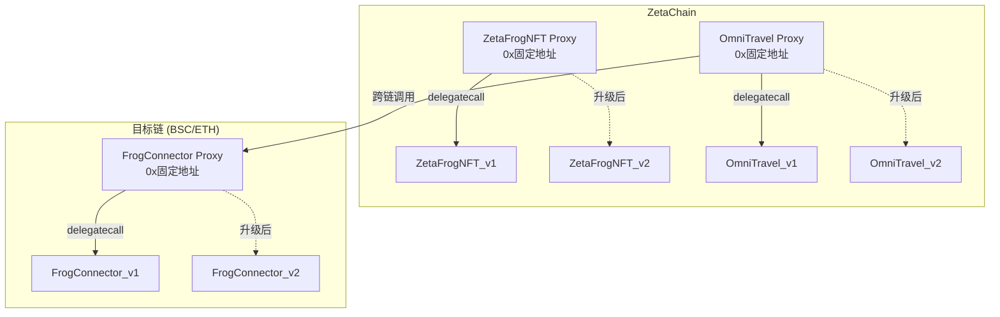
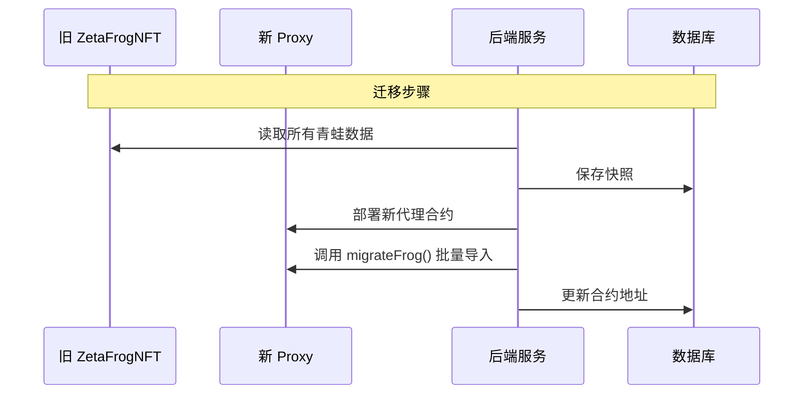

# ZetaFrog 代理合约升级模式开发文档

## 目录
1. [概述](#1-概述)
2. [代理模式原理](#2-代理模式原理)
3. [技术选型](#3-技术选型)
4. [架构设计](#4-架构设计)
5. [实施步骤](#5-实施步骤)
6. [代码实现](#6-代码实现)
7. [迁移指南](#7-迁移指南)
8. [最佳实践](#8-最佳实践)

---

## 1. 概述

### 1.1 当前问题

每次部署新合约时：
- 合约地址变化，需要更新所有配置
- 链上状态数据丢失
- 用户的青蛙、旅行记录等无法迁移
- 跨链合约需要同步更新指向新地址

### 1.2 目标

实现**无缝合约升级**，达到以下效果：
- ✅ 合约地址保持不变
- ✅ 链上状态数据完整保留
- ✅ 前端/后端无需更新地址配置
- ✅ 支持逻辑升级和数据迁移
- ✅ 保持管理员升级控制权

---

## 2. 代理模式原理

### 2.1 核心概念

```
┌─────────────────────────────────────────────────────────────┐
│                        用户调用                              │
│                           │                                  │
│                           ▼                                  │
│   ┌─────────────────────────────────────────┐              │
│   │           Proxy Contract                 │              │
│   │  (固定地址，永不变化)                     │              │
│   │                                          │              │
│   │  ┌──────────────────────────────────┐   │              │
│   │  │      Storage (状态数据)           │   │              │
│   │  │  - frogs mapping                  │   │              │
│   │  │  - travels mapping                │   │              │
│   │  │  - balances                       │   │              │
│   │  └──────────────────────────────────┘   │              │
│   │                                          │              │
│   │         delegatecall                     │              │
│   │              │                           │              │
│   └──────────────┼───────────────────────────┘              │
│                  │                                           │
│                  ▼                                           │
│   ┌─────────────────────────────────────────┐              │
│   │      Implementation Contract            │              │
│   │  (逻辑代码，可随时更换)                  │              │
│   │                                          │              │
│   │  - mintFrog()                           │              │
│   │  - startTravel()                        │              │
│   │  - emergencyReset()  ← 新增功能         │              │
│   └─────────────────────────────────────────┘              │
└─────────────────────────────────────────────────────────────┘
```

### 2.2 delegatecall 工作原理

```solidity
// 用户调用 Proxy.mintFrog("MyFrog")
// Proxy 通过 delegatecall 调用 Implementation.mintFrog("MyFrog")
// 但状态修改发生在 Proxy 的存储空间中
```

| 属性 | Proxy | Implementation |
|------|-------|----------------|
| 地址 | 固定不变 | 每次升级变化 |
| 存储 | ✅ 保存所有状态 | ❌ 无状态 |
| 代码 | 只有代理逻辑 | 所有业务逻辑 |
| 升级 | 更新指向新 Implementation | 部署新版本 |

---

## 3. 技术选型

### 3.1 代理模式对比

| 模式 | 特点 | 适用场景 | 复杂度 |
|------|------|----------|--------|
| **UUPS** | Implementation 控制升级 | 推荐，gas 更低 | ⭐⭐⭐ |
| **Transparent** | ProxyAdmin 控制升级 | 大型项目 | ⭐⭐⭐⭐ |
| **Beacon** | 多代理共享实现 | 工厂模式 | ⭐⭐⭐⭐⭐ |

### 3.2 推荐方案：UUPS (Universal Upgradeable Proxy Standard)

**选择理由**：
- OpenZeppelin 推荐
- Gas 成本更低
- 实现更简洁
- 安全性高（升级逻辑在 Implementation 中，可被移除）

### 3.3 依赖包

```bash
npm install @openzeppelin/contracts-upgradeable
npm install @openzeppelin/hardhat-upgrades
```

---

## 4. 架构设计

### 4.1 合约升级架构



### 4.2 存储布局

```solidity
// 重要：升级时必须保持存储布局兼容
// 只能在末尾添加新变量，不能删除或重排

contract ZetaFrogNFT_v1 {
    // Slot 0-100: OpenZeppelin 内部变量
    // Slot 101: _tokenIdCounter
    uint256 private _tokenIdCounter;
    // Slot 102: frogs mapping
    mapping(uint256 => Frog) public frogs;
    // Slot 103: hasMinted mapping
    mapping(address => bool) public hasMinted;
    // ...
    
    // 预留空间用于未来升级
    uint256[50] private __gap;
}

contract ZetaFrogNFT_v2 is ZetaFrogNFT_v1 {
    // 只能在 __gap 之后添加新变量
    // 或者减少 __gap 的大小来添加
    
    mapping(uint256 => EmergencyStatus) public emergencyStatus;
    uint256[49] private __gap; // 减少1个slot
}
```

---

## 5. 实施步骤

### 5.1 Phase 1: 准备工作

```bash
# 1. 安装依赖
cd contracts
npm install @openzeppelin/contracts-upgradeable @openzeppelin/hardhat-upgrades

# 2. 更新 hardhat.config.js
```

### 5.2 Phase 2: 重构合约

将现有合约重构为可升级版本：

1. 继承 `Initializable` 替代 `constructor`
2. 继承 `UUPSUpgradeable`
3. 使用 `_disableInitializers()` 保护实现合约

### 5.3 Phase 3: 部署代理

```bash
# 使用 hardhat-upgrades 部署
npx hardhat run scripts/deploy-upgradeable.js --network zetaAthens
```

### 5.4 Phase 4: 验证和测试

```bash
# 运行升级测试
npx hardhat test test/upgradeable.test.js
```

---

## 6. 代码实现

### 6.1 ZetaFrogNFT 可升级版本

```solidity
// contracts/upgradeable/ZetaFrogNFTUpgradeable.sol
// SPDX-License-Identifier: MIT
pragma solidity ^0.8.20;

import "@openzeppelin/contracts-upgradeable/token/ERC721/ERC721Upgradeable.sol";
import "@openzeppelin/contracts-upgradeable/token/ERC721/extensions/ERC721URIStorageUpgradeable.sol";
import "@openzeppelin/contracts-upgradeable/access/OwnableUpgradeable.sol";
import "@openzeppelin/contracts-upgradeable/utils/ReentrancyGuardUpgradeable.sol";
import "@openzeppelin/contracts-upgradeable/utils/PausableUpgradeable.sol";
import "@openzeppelin/contracts-upgradeable/proxy/utils/Initializable.sol";
import "@openzeppelin/contracts-upgradeable/proxy/utils/UUPSUpgradeable.sol";

/**
 * @title ZetaFrogNFTUpgradeable
 * @notice Upgradeable version of ZetaFrogNFT using UUPS pattern
 */
contract ZetaFrogNFTUpgradeable is 
    Initializable,
    ERC721Upgradeable,
    ERC721URIStorageUpgradeable,
    OwnableUpgradeable,
    ReentrancyGuardUpgradeable,
    PausableUpgradeable,
    UUPSUpgradeable 
{
    // ============ Constants ============
    uint256 public constant MAX_SUPPLY = 1000;

    // ============ Enums ============
    enum FrogStatus {
        Idle,
        Traveling,
        CrossChainLocked
    }

    // ============ Structs ============
    struct Frog {
        string name;
        uint64 birthday;
        uint32 totalTravels;
        FrogStatus status;
        uint256 xp;
        uint256 level;
    }

    // ============ State Variables ============
    uint256 private _tokenIdCounter;
    mapping(uint256 => Frog) public frogs;
    mapping(address => bool) public hasMinted;
    mapping(address => uint256) public ownerToTokenId;
    
    address public travelContract;
    address public omniTravelContract;
    
    // 预留存储空间用于未来升级
    uint256[50] private __gap;

    // ============ Events ============
    event FrogMinted(address indexed owner, uint256 indexed tokenId, string name, uint256 timestamp);
    event LevelUp(uint256 indexed tokenId, uint256 newLevel, uint256 timestamp);
    event FrogStatusUpdated(uint256 indexed tokenId, FrogStatus status);

    // ============ Modifiers ============
    modifier onlyTravelContract() {
        require(
            msg.sender == travelContract || msg.sender == omniTravelContract, 
            "Caller is not authorized"
        );
        _;
    }

    /// @custom:oz-upgrades-unsafe-allow constructor
    constructor() {
        _disableInitializers();
    }

    /**
     * @notice Initialize the contract (replaces constructor)
     */
    function initialize() public initializer {
        __ERC721_init("ZetaFrog", "ZFROG");
        __ERC721URIStorage_init();
        __Ownable_init(msg.sender);
        __ReentrancyGuard_init();
        __Pausable_init();
        __UUPSUpgradeable_init();
    }

    /**
     * @notice Authorize upgrade (required by UUPS)
     */
    function _authorizeUpgrade(address newImplementation) internal override onlyOwner {}

    // ============ Admin Functions ============
    
    function setTravelContract(address _travelContract) external onlyOwner {
        require(_travelContract != address(0), "Invalid address");
        travelContract = _travelContract;
    }

    function setOmniTravelContract(address _omniTravelContract) external onlyOwner {
        require(_omniTravelContract != address(0), "Invalid address");
        omniTravelContract = _omniTravelContract;
    }

    function pause() external onlyOwner { _pause(); }
    function unpause() external onlyOwner { _unpause(); }

    // ============ Emergency Functions (new in v2) ============
    
    function emergencyResetFrogStatus(uint256 tokenId) external onlyOwner {
        require(_ownerOf(tokenId) != address(0), "Frog does not exist");
        frogs[tokenId].status = FrogStatus.Idle;
        emit FrogStatusUpdated(tokenId, FrogStatus.Idle);
    }

    function batchResetFrogStatus(uint256[] calldata tokenIds) external onlyOwner {
        for (uint i = 0; i < tokenIds.length; i++) {
            if (_ownerOf(tokenIds[i]) != address(0)) {
                frogs[tokenIds[i]].status = FrogStatus.Idle;
                emit FrogStatusUpdated(tokenIds[i], FrogStatus.Idle);
            }
        }
    }

    // ============ Core Functions ============
    
    function mintFrog(string calldata name) external whenNotPaused nonReentrant returns (uint256) {
        bytes memory nameBytes = bytes(name);
        require(nameBytes.length >= 2 && nameBytes.length <= 16, "Name: 2-16 chars");
        require(_tokenIdCounter < MAX_SUPPLY, "Max supply reached");
        require(!hasMinted[msg.sender], "Already minted a frog");

        uint256 tokenId = _tokenIdCounter++;
        _safeMint(msg.sender, tokenId);
        
        hasMinted[msg.sender] = true;
        ownerToTokenId[msg.sender] = tokenId;

        frogs[tokenId] = Frog({
            name: name,
            birthday: uint64(block.timestamp),
            totalTravels: 0,
            status: FrogStatus.Idle,
            xp: 0,
            level: 1
        });

        emit FrogMinted(msg.sender, tokenId, name, block.timestamp);
        return tokenId;
    }

    function setFrogStatus(uint256 tokenId, FrogStatus status) external whenNotPaused onlyTravelContract {
        require(_ownerOf(tokenId) != address(0), "Frog does not exist");
        frogs[tokenId].status = status;
        if (status == FrogStatus.Idle) {
            frogs[tokenId].totalTravels++;
        }
        emit FrogStatusUpdated(tokenId, status);
    }

    function addExperience(uint256 tokenId, uint256 xpAmount) external whenNotPaused onlyTravelContract {
        require(_ownerOf(tokenId) != address(0), "Frog does not exist");
        Frog storage frog = frogs[tokenId];
        frog.xp += xpAmount;
        uint256 newLevel = (frog.xp / 100) + 1;
        if (newLevel > frog.level) {
            frog.level = newLevel;
            emit LevelUp(tokenId, newLevel, block.timestamp);
        }
    }

    // ============ View Functions ============
    
    function getFrog(uint256 tokenId) external view returns (
        string memory name, uint64 birthday, uint32 totalTravels,
        FrogStatus status, uint256 xp, uint256 level
    ) {
        Frog memory frog = frogs[tokenId];
        return (frog.name, frog.birthday, frog.totalTravels, frog.status, frog.xp, frog.level);
    }

    function getFrogStatus(uint256 tokenId) external view returns (FrogStatus) {
        return frogs[tokenId].status;
    }

    function totalSupply() external view returns (uint256) {
        return _tokenIdCounter;
    }

    function getTokenIdByOwner(address owner) external view returns (uint256) {
        require(hasMinted[owner], "No frog owned by this address");
        return ownerToTokenId[owner];
    }

    function hasFrog(address owner) external view returns (bool) {
        return hasMinted[owner];
    }

    /**
     * @notice Get contract version
     */
    function version() external pure returns (string memory) {
        return "2.0.0";
    }

    // ============ Required Overrides ============
    
    function tokenURI(uint256 tokenId) public view override(ERC721Upgradeable, ERC721URIStorageUpgradeable) returns (string memory) {
        return super.tokenURI(tokenId);
    }

    function supportsInterface(bytes4 interfaceId) public view override(ERC721Upgradeable, ERC721URIStorageUpgradeable) returns (bool) {
        return super.supportsInterface(interfaceId);
    }
}
```

### 6.2 部署脚本

```javascript
// scripts/deploy-upgradeable.js
const { ethers, upgrades } = require("hardhat");

async function main() {
    const [deployer] = await ethers.getSigners();
    console.log("Deploying with:", deployer.address);

    // Deploy ZetaFrogNFT as upgradeable
    const ZetaFrogNFT = await ethers.getContractFactory("ZetaFrogNFTUpgradeable");
    
    console.log("Deploying ZetaFrogNFT proxy...");
    const proxy = await upgrades.deployProxy(ZetaFrogNFT, [], {
        initializer: "initialize",
        kind: "uups"
    });
    await proxy.waitForDeployment();
    
    const proxyAddress = await proxy.getAddress();
    const implAddress = await upgrades.erc1967.getImplementationAddress(proxyAddress);
    
    console.log("✅ Proxy deployed to:", proxyAddress);
    console.log("   Implementation:", implAddress);
    
    // Verify version
    const version = await proxy.version();
    console.log("   Version:", version);
}

main().catch(console.error);
```

### 6.3 升级脚本

```javascript
// scripts/upgrade-zetafrognft.js
const { ethers, upgrades } = require("hardhat");

async function main() {
    const PROXY_ADDRESS = "0x..."; // 代理合约地址（固定不变）
    
    console.log("Upgrading ZetaFrogNFT...");
    
    // 获取新版本合约
    const ZetaFrogNFT_v3 = await ethers.getContractFactory("ZetaFrogNFTUpgradeable_v3");
    
    // 执行升级
    const upgraded = await upgrades.upgradeProxy(PROXY_ADDRESS, ZetaFrogNFT_v3);
    await upgraded.waitForDeployment();
    
    const newImplAddress = await upgrades.erc1967.getImplementationAddress(PROXY_ADDRESS);
    console.log("✅ Upgraded!");
    console.log("   Proxy (unchanged):", PROXY_ADDRESS);
    console.log("   New Implementation:", newImplAddress);
    
    // 验证新版本
    const version = await upgraded.version();
    console.log("   New Version:", version);
}

main().catch(console.error);
```

---

## 7. 迁移指南

### 7.1 从现有合约迁移

由于现有合约不是代理模式，需要进行数据迁移：



### 7.2 迁移函数

```solidity
/**
 * @notice Migrate frog data from old contract (owner only, one-time)
 */
function migrateFrog(
    uint256 tokenId,
    address owner,
    string calldata name,
    uint64 birthday,
    uint32 totalTravels,
    uint256 xp,
    uint256 level
) external onlyOwner {
    require(!migrationCompleted, "Migration already completed");
    
    _safeMint(owner, tokenId);
    hasMinted[owner] = true;
    ownerToTokenId[owner] = tokenId;
    
    frogs[tokenId] = Frog({
        name: name,
        birthday: birthday,
        totalTravels: totalTravels,
        status: FrogStatus.Idle,
        xp: xp,
        level: level
    });
    
    if (tokenId >= _tokenIdCounter) {
        _tokenIdCounter = tokenId + 1;
    }
}

function completeMigration() external onlyOwner {
    migrationCompleted = true;
}
```

---

## 8. 最佳实践

### 8.1 存储布局规则

> [!CAUTION]
> **绝对禁止**
> - 删除现有存储变量
> - 改变变量顺序
> - 改变变量类型

> [!TIP]
> **推荐做法**
> - 使用 `__gap` 预留空间
> - 只在末尾添加新变量
> - 使用 `@openzeppelin/hardhat-upgrades` 自动检测冲突

### 8.2 升级检查清单

```markdown
- [ ] 存储布局兼容性检查
- [ ] 新版本在测试网验证
- [ ] 备份当前状态数据
- [ ] 准备回滚方案
- [ ] 通知用户升级时间
- [ ] 执行升级
- [ ] 验证功能正常
- [ ] 更新文档
```

### 8.3 安全注意事项

1. **初始化保护**：使用 `_disableInitializers()` 防止实现合约被直接初始化
2. **升级权限**：确保只有管理员可以升级
3. **时间锁**：考虑添加 Timelock 合约增加升级透明度
4. **多签钱包**：管理员地址建议使用多签钱包

---

## 附录

### A. hardhat.config.js 配置

```javascript
require("@nomicfoundation/hardhat-toolbox");
require("@openzeppelin/hardhat-upgrades");
require("dotenv").config();

module.exports = {
    solidity: {
        version: "0.8.20",
        settings: {
            optimizer: { enabled: true, runs: 200 }
        }
    },
    networks: {
        zetaAthens: {
            url: process.env.ZETACHAIN_RPC_URL,
            chainId: 7001,
            accounts: process.env.PRIVATE_KEY ? [process.env.PRIVATE_KEY] : []
        }
    }
};
```

### B. 相关资源

- [OpenZeppelin Upgrades 文档](https://docs.openzeppelin.com/upgrades-plugins/1.x/)
- [UUPS Proxies](https://docs.openzeppelin.com/contracts/5.x/api/proxy#UUPSUpgradeable)
- [存储布局指南](https://docs.openzeppelin.com/upgrades-plugins/1.x/proxies#storage-collisions-between-implementation-versions)
