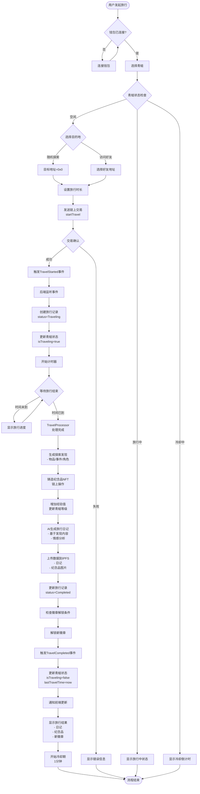
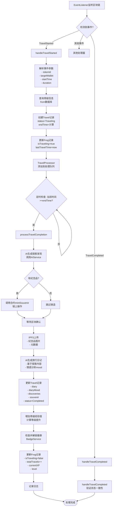
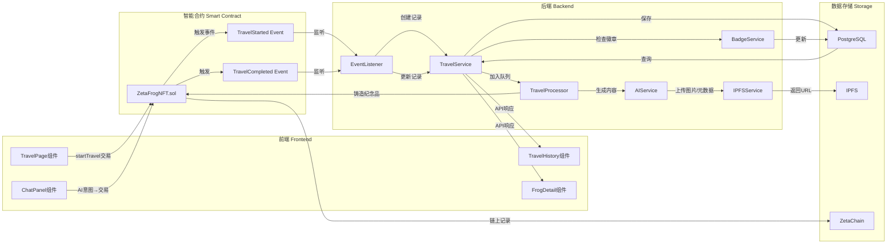
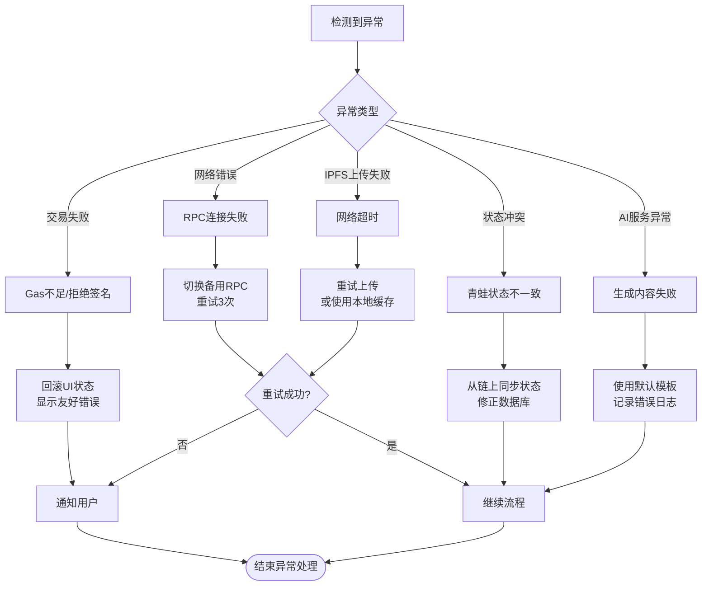
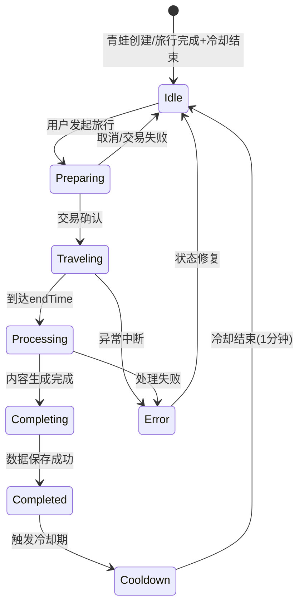

# ZetaFrog 青蛙旅行业务流程图

## 1. 完整旅行流程（端到端）



## 2. 前端交互流程

```mermaid
flowchart TD
    A[用户点击"开始旅行"] --> B{检查青蛙状态}
    B -->|空闲| C[显示旅行配置面板]
    B -->|旅行中| D[显示旅行进度界面]
    B -->|冷却中| E[显示冷却倒计时]
    
    C --> F{选择旅行类型}
    F -->|随机探索| G[目标地址=0x0<br/>选择时长: 1/5/10分钟]
    F -->|访问好友| H[从好友列表选择<br/>目标地址=好友地址<br/>选择时长]
    
    G --> I[调用wagmi usePrepareContractWrite]
    H --> I
    
    I --> J[准备交易参数<br/>- tokenId<br/>- targetWallet<br/>- duration<br/>- chainId]
    
    J --> K[调用useContractWrite<br/>执行startTravel]
    
    K --> L{交易状态监听}
    L -->|pending| M[显示交易确认中...]
    L -->|success| N[显示交易成功]
    L -->|error| O[显示错误并回滚UI]
    
    N --> P[useWaitForTransaction<br/>等待区块确认]
    P --> Q[更新本地状态<br/>frog.isTraveling=true]
    
    Q --> R[轮询后端API<br/>/api/travels/:frogId/active]
    R --> S[显示旅行倒计时]
    
    S --> T{定时检查}
    T -->|未结束| S
    T -->|已结束| U[调用/api/travels/:travelId/complete]
    
    U --> V[获取旅行结果]
    V --> W[显示结果页面<br/>- 日记内容<br/>- 纪念品图片<br/>- 经验值增长<br/>- 新解锁徽章]
```

## 3. 后端处理流程



## 4. AI聊天发起旅行流程

```mermaid
flowchart TD
    A[用户在聊天框输入] --> B[发送到后端<br/>/api/chat/message]
    B --> C[ChatService.handleMessage]
    
    C --> D[调用通义千问API<br/>意图识别]
    D --> E{识别到的意图}
    
    E -->|START_TRAVEL| F[提取参数<br/>- 目的地类型<br/>- 时长]
    E -->|GENERAL_CHAT| G[返回聊天响应]
    E -->|其他意图| H[相应处理]
    
    F --> I[获取当前青蛙信息<br/>- tokenId<br/>- 状态]
    I --> J{青蛙可旅行?}
    
    J -->|否| K[返回错误提示<br/>例如:冷却中/旅行中]
    J -->|是| L[确定目标地址<br/>随机探索=0x0<br/>访问好友=好友地址]
    
    L --> M[返回特殊响应<br/>type=START_TRAVEL<br/>data包含交易参数]
    
    M --> N[前端ChatPanel接收]
    N --> O{消息类型检查}
    
    O -->|START_TRAVEL| P[提取交易参数<br/>- tokenId<br/>- targetWallet<br/>- duration<br/>- chainId]
    
    O -->|普通消息| Q[渲染聊天消息]
    
    P --> R[调用startTravel合约方法<br/>使用wagmi]
    R --> S[显示交易状态提示]
    S --> T{交易结果}
    
    T -->|成功| U[在聊天中显示<br/>"旅行已开始!"]
    T -->|失败| V[在聊天中显示<br/>错误信息]
    
    U --> W([后续流程同普通旅行])
    V --> X([用户可重试])
    K --> X
```

## 5. 数据流转图



## 6. 关键时序说明

### 6.1 旅行开始阶段
1. **T0**: 用户发起交易
2. **T0+5s**: 交易上链确认
3. **T0+10s**: EventListener捕获事件
4. **T0+15s**: 数据库记录创建完成
5. **T0+20s**: 前端显示旅行中状态

### 6.2 旅行进行阶段
- 前端每30秒轮询一次旅行状态
- TravelProcessor每10秒检查一次待完成的旅行
- 青蛙动画状态更新(桌面宠物显示旅行中)

### 6.3 旅行完成阶段
1. **T_end**: 到达endTime
2. **T_end+10s**: TravelProcessor检测到
3. **T_end+15s**: AI生成探索内容(2-5秒)
4. **T_end+25s**: 铸造纪念品交易(如有,10-15秒)
5. **T_end+40s**: IPFS上传(5-10秒)
6. **T_end+50s**: AI生成日记(5-10秒)
7. **T_end+60s**: 数据库更新完成
8. **T_end+65s**: TravelCompleted事件触发
9. **T_end+70s**: 前端获取结果并展示

## 7. 异常处理流程



## 8. 状态机图



---

## 业务规则总结

### 旅行限制
- ✅ 同一青蛙同时只能进行一次旅行
- ✅ 旅行完成后有1分钟冷却期
- ✅ 随机探索(目标地址=0x0)和访问好友均可触发
- ✅ 支持三种时长: 1分钟/5分钟/10分钟(测试环境)

### 奖励机制
- 🎁 每次旅行必得经验值(基础10 XP)
- 🎁 30%概率获得纪念品NFT
- 🎁 探索发现类型: 物品/事件/角色
- 🏆 累计旅行次数解锁徽章

### 数据持久化
- 📝 所有旅行记录永久保存在PostgreSQL
- 🖼️ 纪念品图片和元数据存储在IPFS
- ⛓️ 纪念品NFT和旅行事件记录在ZetaChain
- 💾 日记内容支持情感分析(7种情绪)
